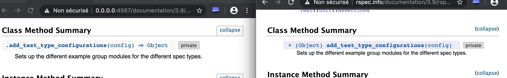
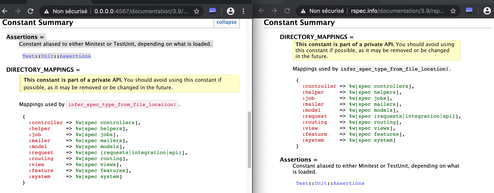
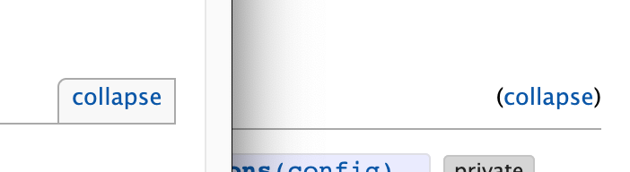
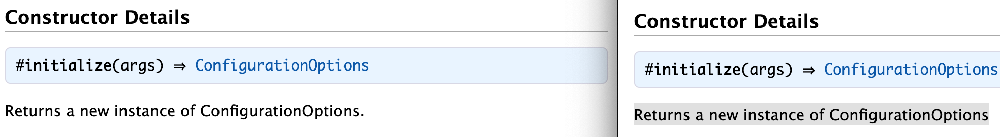
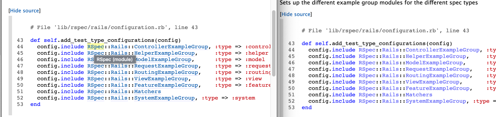

# RSpec yard doc diff

This PR is the result of Jon proposal on https://github.com/rspec/rspec.github.io/pull/131

We need to compare two versions of RSpec documentation generated by yard.

### Use the project

```sh
$ git clone https://github.com/benoittgt/sitediff_rspec
$ cd sitediff_rspec 
# I use Ruby 2.7
$ ruby nokorigi-diff.rb
```

#### CLI args

Check args available to different verbose mode with `--help`. You can also run the diff on one url
in particular

### Elements in yard doc altered

* Remove the `.summary_signatures` and `.signature` class that are different between yard version. 
  
* Remove `Assertions-constant` block because yard doc now put them in a difference place.
  
* Remove `collapse` buttons because old one include `( )`
  
* Add ending dot when missing.
  
* Don't diff new object links in source code
  

The diff output still display few artifacts but most of the time they can be ignored.

## Output

```diff
🧪 Get html for: http://rspec.info/documentation/3.9/rspec-core/_index.html
🧪 Get html for: http://rspec.info/documentation/3.9/rspec-expectations/_index.html
🧪 Get html for: http://rspec.info/documentation/3.9/rspec-mocks/_index.html
🧪 Get html for: http://rspec.info/documentation/3.9/rspec-rails/_index.html
🧪 Get html for: http://rspec.info/documentation/3.9/rspec-core/RSpec/Core/Formatters/BaseFormatter.html
🧪 Get html for: http://0.0.0.0:4567/documentation/3.9/rspec-core/RSpec/Core/Formatters/BaseFormatter.html
🏆 Diff done: export/diff/rspec-core-RSpec-Core-Formatters-BaseFormatter.html.diff

🧪 Get html for: http://rspec.info/documentation/3.9/rspec-core/RSpec/Core/Formatters/BaseTextFormatter.html
🧪 Get html for: http://0.0.0.0:4567/documentation/3.9/rspec-core/RSpec/Core/Formatters/BaseTextFormatter.html
🏆 Diff done: export/diff/rspec-core-RSpec-Core-Formatters-BaseTextFormatter.html.diff

🧪 Get html for: http://rspec.info/documentation/3.9/rspec-core/RSpec/Core/MemoizedHelpers/ClassMethods.html
🧪 Get html for: http://0.0.0.0:4567/documentation/3.9/rspec-core/RSpec/Core/MemoizedHelpers/ClassMethods.html
🏆 Diff done: export/diff/rspec-core-RSpec-Core-MemoizedHelpers-ClassMethods.html.diff

🧪 Get html for: http://rspec.info/documentation/3.9/rspec-core/RSpec/Core/Configuration.html
🧪 Get html for: http://0.0.0.0:4567/documentation/3.9/rspec-core/RSpec/Core/Configuration.html
🏆 Diff done: export/diff/rspec-core-RSpec-Core-Configuration.html.diff
diff --git a/export/rspec-core-RSpec-Core-Configuration.html.current b/export/rspec-core-RSpec-Core-Configuration.html.new
index e6c6d1a..72b090d 100644
--- a/export/rspec-core-RSpec-Core-Configuration.html.current
+++ b/export/rspec-core-RSpec-Core-Configuration.html.new
@@ -129,26 +130,41 @@ Configuration options are loaded from multiple files and joined together with co

 Precedence order (where later entries overwrite earlier entries on conflicts):.Precedence order (where later entries overwrite earlier entries on conflicts):.

+Global ($XDG_CONFIG_HOME/rspec/options, or ~/.rspec if it does not exist).Global ($XDG_CONFIG_HOME/rspec/options, or ~/.rspec if it does not exist).
+
+Global ($XDG_CONFIG_HOME/rspec/options, or ~/.rspec if it does not exist).
+
+Project-specific (./.rspec).Project-specific (./.rspec).
+
+Project-specific (./.rspec).
+
+Local (./.rspec-local).Local (./.rspec-local).
+
+Local (./.rspec-local).
+
+Command-line options.Command-line options.
+
+Command-line options.
+
+SPEC_OPTS.SPEC_OPTS.
+
+SPEC_OPTS.
+
+Global ($XDG_CONFIG_HOME/rspec/options, or ~/.rspec if it does not exist).
+
+Project-specific (./.rspec).
+
+Local (./.rspec-local).

-Global ($XDG_CONFIG_HOME/rspec/options$XDG_CONFIG_HOME/rspec/options, or ~/.rspec~/.rspec if it does
-not exist)Global ($XDG_CONFIG_HOME/rspec/options, or ~/.rspec if it does
-not exist)
-Project-specific (./.rspec./.rspec)Project-specific (./.rspec)
-Local (./.rspec-local./.rspec-local)Local (./.rspec-local)
-Command-line optionsCommand-line options
-SPEC_OPTSSPEC_OPTSSPEC_OPTS
+Command-line options.

-Global ($XDG_CONFIG_HOME/rspec/options, or ~/.rspec if it does
-not exist)
-Project-specific (./.rspec)
-Local (./.rspec-local)
-Command-line options
-SPEC_OPTS
+SPEC_OPTS.


 For example, an option set in the local file will override an option set in your global file.For example, an option set in the local file will override an option set in your global file.

-The global, project-specific and local files can all be overridden with a separate custom file using the --options command-line parameter.The global, project-specific and local files can all be overridden with a separate custom file using the --options command-line parameter.
+The global, project-specific and local files can all be overridden with a separate custom file using the –options command-line parameter.The global, project-specific and local files can all be overridden with a separate custom file using the –options command-line parameter.
+


@@ -158,18 +174,21 @@ Configuration options are loaded from multiple files and joined together with co

 Precedence order (where later entries overwrite earlier entries on conflicts):.

+Global ($XDG_CONFIG_HOME/rspec/options, or ~/.rspec if it does not exist).
+
+Project-specific (./.rspec).
+
+Local (./.rspec-local).
+
+Command-line options.

-Global ($XDG_CONFIG_HOME/rspec/options, or ~/.rspec if it does
-not exist)
-Project-specific (./.rspec)
-Local (./.rspec-local)
-Command-line options
-SPEC_OPTS
+SPEC_OPTS.


 For example, an option set in the local file will override an option set in your global file.

-The global, project-specific and local files can all be overridden with a separate custom file using the --options command-line parameter.
+The global, project-specific and local files can all be overridden with a separate custom file using the –options command-line parameter.
+


@@ -181,18 +200,20 @@ Configuration options are loaded from multiple files and joined together with co

 Precedence order (where later entries overwrite earlier entries on conflicts):.

+Global ($XDG_CONFIG_HOME/rspec/options, or ~/.rspec if it does not exist).
+
+Project-specific (./.rspec).
+
+Local (./.rspec-local).

-Global ($XDG_CONFIG_HOME/rspec/options, or ~/.rspec if it does
-not exist)
-Project-specific (./.rspec)
-Local (./.rspec-local)
-Command-line options
-SPEC_OPTS
+Command-line options.
+
+SPEC_OPTS.


 For example, an option set in the local file will override an option set in your global file.

-The global, project-specific and local files can all be overridden with a separate custom file using the --options command-line parameter.
+The global, project-specific and local files can all be overridden with a separate custom file using the –options command-line parameter.


@@ -378,9 +411,12 @@ Determines which bisect runner implementation gets used to run subsets of the su


-    Deprecated.Deprecated. No longer recommended because of complex behavior. Instead, rely on the fact that TTYs will display color by default, or set #color_mode to :on to display color on a non-TTY output.No longer recommended because of complex behavior. Instead, rely on the fact that TTYs will display color by default, or set #color_mode to :on to display color on a non-TTY output.
+    Deprecated.Deprecated.
+No longer recommended because of complex behavior. Instead, rely on the fact that TTYs will display color by default, or set #color_mode to :on to display color on a non-TTY output.No longer recommended because of complex behavior. Instead, rely on the fact that TTYs will display color by default, or set #color_mode to :on to display color on a non-TTY output.
+
+No longer recommended because of complex behavior. Instead, rely on the fact that TTYs will display color by default, or set #color_mode to :on to display color on a non-TTY output.
+Deprecated.
 No longer recommended because of complex behavior. Instead, rely on the fact that TTYs will display color by default, or set #color_mode to :on to display color on a non-TTY output.
-Deprecated. No longer recommended because of complex behavior. Instead, rely on the fact that TTYs will display color by default, or set #color_mode to :on to display color on a non-TTY output.


@@ -397,7 +433,9 @@ Deprecated. No longer recommended because of complex behavior. Instead, rely on


-    Deprecated. No longer recommended because of complex behavior. Instead, rely on the fact that TTYs will display color by default, or set #color_mode to :on to display color on a non-TTY output.
+    Deprecated.
+No longer recommended because of complex behavior. Instead, rely on the fact that TTYs will display color by default, or set #color_mode to :on to display color on a non-TTY output.
+


@@ -1209,12 +1326,12 @@ Determines where RSpec will send its output.


-    Load files matching this pattern (default: '**{,/*/**}/*_spec.rb').Load files matching this pattern (default: '**{,/*/**}/*_spec.rb').
-Load files matching this pattern (default: '**{,/*/**}/*_spec.rb').
-Load files matching this pattern (default: '**{,/*/**}/*_spec.rb').

+Load files matching this pattern (default: '**{,//*}/*_spec.rb').Load files matching this pattern (default: '**{,//*}/*_spec.rb').

+Load files matching this pattern (default: '**{,//*}/*_spec.rb').

+Load files matching this pattern (default: '**{,//*}/*_spec.rb').


@@ -1228,7 +1345,12 @@ Load files matching this pattern (default: '**{,/*/**}/*_spec.rb').


-    Load files matching this pattern (default: '**{,/*/**}/*_spec.rb').
+
+
+
+
+Load files matching this pattern (default: '**{,//*}/*_spec.rb').
+


@@ -1408,9 +1545,12 @@ Indicates files configured to be required.


-    Deprecated.Deprecated. Use #filter_run_when_matching instead for the specific filters that you want to be ignored if none match.Use #filter_run_when_matching instead for the specific filters that you want to be ignored if none match.
+    Deprecated.Deprecated.
+Use #filter_run_when_matching instead for the specific filters that you want to be ignored if none match.Use #filter_run_when_matching instead for the specific filters that you want to be ignored if none match.
+
+Use #filter_run_when_matching instead for the specific filters that you want to be ignored if none match.
+Deprecated.
 Use #filter_run_when_matching instead for the specific filters that you want to be ignored if none match.
-Deprecated. Use #filter_run_when_matching instead for the specific filters that you want to be ignored if none match.


@@ -1427,7 +1567,9 @@ Deprecated. Use #filter_run_when_matching instead for the specific filters that


-    Deprecated. Use #filter_run_when_matching instead for the specific filters that you want to be ignored if none match.
+    Deprecated.
+Use #filter_run_when_matching instead for the specific filters that you want to be ignored if none match.
+


@@ -1625,7 +1783,9 @@ Use threadsafe options where available.


-    Deprecated. No longer recommended because of complex behavior. Instead, rely on the fact that TTYs will display color by default, or set #color_mode to :on to display color on a non-TTY output.
+    Deprecated.
+No longer recommended because of complex behavior. Instead, rely on the fact that TTYs will display color by default, or set #color_mode to :on to display color on a non-TTY output.
+


@@ -2051,7 +2230,9 @@ Use threadsafe options where available.


-    Load files matching this pattern (default: '**{,/*/**}/*_spec.rb').
+
+Load files matching this pattern (default: '**{,//*}/*_spec.rb').
+


@@ -2153,7 +2337,9 @@ Use threadsafe options where available.


-    Deprecated. Use #filter_run_when_matching instead for the specific filters that you want to be ignored if none match.
+    Deprecated.
+Use #filter_run_when_matching instead for the specific filters that you want to be ignored if none match.
+


@@ -2431,9 +2640,14 @@ Creates a method that delegates to example including the submitted args.


-    Define an alias for it_should_behave_like that allows different language (like "it_has_behavior" or "it_behaves_like") to be employed when including shared examples.Define an alias for it_should_behave_like that allows different language (like "it_has_behavior" or "it_behaves_like") to be employed when including shared examples.
-Define an alias for it_should_behave_like that allows different language (like "it_has_behavior" or "it_behaves_like") to be employed when including shared examples.
-Define an alias for it_should_behave_like that allows different language (like "it_has_behavior" or "it_behaves_like") to be employed when including shared examples.
+
+Define an alias for it_should_behave_like that allows different language (like “it_has_behavior” or “it_behaves_like”) to be employed when including shared examples.Define an alias for it_should_behave_like that allows different language (like “it_has_behavior” or “it_behaves_like”) to be employed when including shared examples.
+
+Define an alias for it_should_behave_like that allows different language (like “it_has_behavior” or “it_behaves_like”) to be employed when including shared examples.
+
+Define an alias for it_should_behave_like that allows different language (like “it_has_behavior” or “it_behaves_like”) to be employed when including shared examples.
+
+


@@ -2446,8 +2660,8 @@ Define an alias for it_should_behave_like that allows different language (like "


+Define an alias for it_should_behave_like that allows different language (like “it_has_behavior” or “it_behaves_like”) to be employed when including shared examples.

-    Define an alias for it_should_behave_like that allows different language (like "it_has_behavior" or "it_behaves_like") to be employed when including shared examples.


@@ -4184,9 +4605,12 @@ Sets the seed value and sets the default global ordering to random.


-    Deprecated.Deprecated. This config option was added in RSpec 2 to pave the way for this being the default behavior in RSpec 3. Now this option is a no-op.This config option was added in RSpec 2 to pave the way for this being the default behavior in RSpec 3. Now this option is a no-op.
+    Deprecated.Deprecated.
+This config option was added in RSpec 2 to pave the way for this being the default behavior in RSpec 3. Now this option is a no-op.This config option was added in RSpec 2 to pave the way for this being the default behavior in RSpec 3. Now this option is a no-op.
+
+This config option was added in RSpec 2 to pave the way for this being the default behavior in RSpec 3. Now this option is a no-op.
+Deprecated.
 This config option was added in RSpec 2 to pave the way for this being the default behavior in RSpec 3. Now this option is a no-op.
-Deprecated. This config option was added in RSpec 2 to pave the way for this being the default behavior in RSpec 3. Now this option is a no-op.


@@ -4200,7 +4624,9 @@ Deprecated. This config option was added in RSpec 2 to pave the way for this bei


-    Deprecated. This config option was added in RSpec 2 to pave the way for this being the default behavior in RSpec 3. Now this option is a no-op.
+    Deprecated.
+This config option was added in RSpec 2 to pave the way for this being the default behavior in RSpec 3. Now this option is a no-op.
+


@@ -4403,7 +4845,9 @@ Defines a callback that runs after the first example with matching metadata is d


-    Define an alias for it_should_behave_like that allows different language (like "it_has_behavior" or "it_behaves_like") to be employed when including shared examples.
+
+Define an alias for it_should_behave_like that allows different language (like “it_has_behavior” or “it_behaves_like”) to be employed when including shared examples.
+


@@ -5306,7 +5801,9 @@ Defines a callback that runs after the first example with matching metadata is d


-    Deprecated. This config option was added in RSpec 2 to pave the way for this being the default behavior in RSpec 3. Now this option is a no-op.
+    Deprecated.
+This config option was added in RSpec 2 to pave the way for this being the default behavior in RSpec 3. Now this option is a no-op.
+


@@ -5581,12 +6083,12 @@ Defines a callback that runs after the first example with matching metadata is d

       # File 'lib/rspec/core/configuration.rb', line 500# File 'lib/rspec/core/configuration.rb', line 500

-defdef initializeinitialize
-  # rubocop:disable Style/GlobalVars
+defdef initializeinitialize  # rubocop:disable Style/GlobalVars
 # rubocop:disable Style/GlobalVars
-  @start_time@start_time == $_rspec_core_load_started_at$_rspec_core_load_started_at |||| ::::RSpecRSpec::::CoreCore::::TimeTime..nownow
-  # rubocop:enable Style/GlobalVars
+
+  @start_time@start_time == $_rspec_core_load_started_at$_rspec_core_load_started_at |||| ::::RSpecRSpec::::CoreCore::::TimeTime..nownow  # rubocop:enable Style/GlobalVars
 # rubocop:enable Style/GlobalVars
+
   @expectation_frameworks@expectation_frameworks == [[]]
   @include_modules@include_modules == FilterableItemRepositoryFilterableItemRepository::::QueryOptimizedQueryOptimized..newnew((:any?:any?))
   @extend_modules@extend_modules  == FilterableItemRepositoryFilterableItemRepository::::QueryOptimizedQueryOptimized..newnew((:any?:any?))
@@ -5639,10 +6141,10 @@ defdef initializeinitialize
   define_built_in_hooksdefine_built_in_hooks
 endend# File 'lib/rspec/core/configuration.rb', line 500

-def initialize
-  # rubocop:disable Style/GlobalVars
-  @start_time = $_rspec_core_load_started_at || ::RSpec::Core::Time.now
-  # rubocop:enable Style/GlobalVars
+def initialize  # rubocop:disable Style/GlobalVars
+
+  @start_time = $_rspec_core_load_started_at || ::RSpec::Core::Time.now  # rubocop:enable Style/GlobalVars
+
   @expectation_frameworks = []
   @include_modules = FilterableItemRepository::QueryOptimized.new(:any?)
   @extend_modules  = FilterableItemRepository::QueryOptimized.new(:any?)
@@ -5697,10 +6199,10 @@ end

       # File 'lib/rspec/core/configuration.rb', line 500

-def initialize
-  # rubocop:disable Style/GlobalVars
-  @start_time = $_rspec_core_load_started_at || ::RSpec::Core::Time.now
-  # rubocop:enable Style/GlobalVars
+def initialize  # rubocop:disable Style/GlobalVars
+
+  @start_time = $_rspec_core_load_started_at || ::RSpec::Core::Time.now  # rubocop:enable Style/GlobalVars
+
   @expectation_frameworks = []
   @include_modules = FilterableItemRepository::QueryOptimized.new(:any?)
   @extend_modules  = FilterableItemRepository::QueryOptimized.new(:any?)
@@ -5817,10 +6319,10 @@ end

       # File 'lib/rspec/core/configuration.rb', line 500

-def initialize
-  # rubocop:disable Style/GlobalVars
-  @start_time = $_rspec_core_load_started_at || ::RSpec::Core::Time.now
-  # rubocop:enable Style/GlobalVars
+def initialize  # rubocop:disable Style/GlobalVars
+
+  @start_time = $_rspec_core_load_started_at || ::RSpec::Core::Time.now  # rubocop:enable Style/GlobalVars
+
   @expectation_frameworks = []
   @include_modules = FilterableItemRepository::QueryOptimized.new(:any?)
   @extend_modules  = FilterableItemRepository::QueryOptimized.new(:any?)
@@ -5939,10 +6441,10 @@ end

       # File 'lib/rspec/core/configuration.rb', line 500

-def initialize
-  # rubocop:disable Style/GlobalVars
-  @start_time = $_rspec_core_load_started_at || ::RSpec::Core::Time.now
-  # rubocop:enable Style/GlobalVars
+def initialize  # rubocop:disable Style/GlobalVars
+
+  @start_time = $_rspec_core_load_started_at || ::RSpec::Core::Time.now  # rubocop:enable Style/GlobalVars
+
   @expectation_frameworks = []
   @include_modules = FilterableItemRepository::QueryOptimized.new(:any?)
   @extend_modules  = FilterableItemRepository::QueryOptimized.new(:any?)
@@ -6073,10 +6576,10 @@ end

       # File 'lib/rspec/core/configuration.rb', line 500

-def initialize
-  # rubocop:disable Style/GlobalVars
-  @start_time = $_rspec_core_load_started_at || ::RSpec::Core::Time.now
-  # rubocop:enable Style/GlobalVars
+def initialize  # rubocop:disable Style/GlobalVars
+
+  @start_time = $_rspec_core_load_started_at || ::RSpec::Core::Time.now  # rubocop:enable Style/GlobalVars
+
   @expectation_frameworks = []
   @include_modules = FilterableItemRepository::QueryOptimized.new(:any?)
   @extend_modules  = FilterableItemRepository::QueryOptimized.new(:any?)
@@ -6212,10 +6716,10 @@ end

       # File 'lib/rspec/core/configuration.rb', line 500

-def initialize
-  # rubocop:disable Style/GlobalVars
-  @start_time = $_rspec_core_load_started_at || ::RSpec::Core::Time.now
-  # rubocop:enable Style/GlobalVars
+def initialize  # rubocop:disable Style/GlobalVars
+
+  @start_time = $_rspec_core_load_started_at || ::RSpec::Core::Time.now  # rubocop:enable Style/GlobalVars
+
   @expectation_frameworks = []
   @include_modules = FilterableItemRepository::QueryOptimized.new(:any?)
   @extend_modules  = FilterableItemRepository::QueryOptimized.new(:any?)
@@ -6294,41 +6801,20 @@ This option will only be used by --bisect if you set it in a file loaded via --r


+
 Determines which bisect runner implementation gets used to run subsets of the suite during a bisection. Your choices are:.Determines which bisect runner implementation gets used to run subsets of the suite during a bisection. Your choices are:.

+:shell: Performs a spec run by shelling out, booting RSpec and your application environment each time. This runner is the most widely compatible runner, but is not as fast. On platforms that do not support forking, this is the default.:shell: Performs a spec run by shelling out, booting RSpec and your application environment each time. This runner is the most widely compatible runner, but is not as fast. On platforms that do not support forking, this is the default.
+
+:shell: Performs a spec run by shelling out, booting RSpec and your application environment each time. This runner is the most widely compatible runner, but is not as fast. On platforms that do not support forking, this is the default.
+
+:fork: Pre-boots RSpec and your application environment in a parent process, and then forks a child process for each spec run. This runner tends to be significantly faster than the :shell runner but cannot be used in some situations. On platforms that support forking, this is the default. If you use this runner, you should ensure that all of your one-time setup logic goes in a before(:suite) hook instead of getting run at the top-level of a file loaded by --require.:fork: Pre-boots RSpec and your application environment in a parent process, and then forks a child process for each spec run. This runner tends to be significantly faster than the :shell runner but cannot be used in some situations. On platforms that support forking, this is the default. If you use this runner, you should ensure that all of your one-time setup logic goes in a before(:suite) hook instead of getting run at the top-level of a file loaded by --require.

-:shell:shell: Performs a spec run by shelling out, booting RSpec and your
-application environment each time. This runner is the most widely
-compatible runner, but is not as fast. On platforms that do not
-support forking, this is the default.:shell: Performs a spec run by shelling out, booting RSpec and your
-application environment each time. This runner is the most widely
-compatible runner, but is not as fast. On platforms that do not
-support forking, this is the default.
-:fork:fork: Pre-boots RSpec and your application environment in a parent
-process, and then forks a child process for each spec run. This runner
-tends to be significantly faster than the :shell:shell runner but cannot
-be used in some situations. On platforms that support forking, this
-is the default. If you use this runner, you should ensure that all
-of your one-time setup logic goes in a before(:suite)before(:suite) hook instead
-of getting run at the top-level of a file loaded by --require--require.:fork: Pre-boots RSpec and your application environment in a parent
-process, and then forks a child process for each spec run. This runner
-tends to be significantly faster than the :shell runner but cannot
-be used in some situations. On platforms that support forking, this
-is the default. If you use this runner, you should ensure that all
-of your one-time setup logic goes in a before(:suite) hook instead
-of getting run at the top-level of a file loaded by --require.
-
-:shell: Performs a spec run by shelling out, booting RSpec and your
-application environment each time. This runner is the most widely
-compatible runner, but is not as fast. On platforms that do not
-support forking, this is the default.
-:fork: Pre-boots RSpec and your application environment in a parent
-process, and then forks a child process for each spec run. This runner
-tends to be significantly faster than the :shell runner but cannot
-be used in some situations. On platforms that support forking, this
-is the default. If you use this runner, you should ensure that all
-of your one-time setup logic goes in a before(:suite) hook instead
-of getting run at the top-level of a file loaded by --require.
+:fork: Pre-boots RSpec and your application environment in a parent process, and then forks a child process for each spec run. This runner tends to be significantly faster than the :shell runner but cannot be used in some situations. On platforms that support forking, this is the default. If you use this runner, you should ensure that all of your one-time setup logic goes in a before(:suite) hook instead of getting run at the top-level of a file loaded by --require.
+
+:shell: Performs a spec run by shelling out, booting RSpec and your application environment each time. This runner is the most widely compatible runner, but is not as fast. On platforms that do not support forking, this is the default.
+
+:fork: Pre-boots RSpec and your application environment in a parent process, and then forks a child process for each spec run. This runner tends to be significantly faster than the :shell runner but cannot be used in some situations. On platforms that support forking, this is the default. If you use this runner, you should ensure that all of your one-time setup logic goes in a before(:suite) hook instead of getting run at the top-level of a file loaded by --require.


@@ -6340,20 +6827,12 @@ of getting run at the top-level of a file loaded by --require.


+
 Determines which bisect runner implementation gets used to run subsets of the suite during a bisection. Your choices are:.

+:shell: Performs a spec run by shelling out, booting RSpec and your application environment each time. This runner is the most widely compatible runner, but is not as fast. On platforms that do not support forking, this is the default.

-:shell: Performs a spec run by shelling out, booting RSpec and your
-application environment each time. This runner is the most widely
-compatible runner, but is not as fast. On platforms that do not
-support forking, this is the default.
-:fork: Pre-boots RSpec and your application environment in a parent
-process, and then forks a child process for each spec run. This runner
-tends to be significantly faster than the :shell runner but cannot
-be used in some situations. On platforms that support forking, this
-is the default. If you use this runner, you should ensure that all
-of your one-time setup logic goes in a before(:suite) hook instead
-of getting run at the top-level of a file loaded by --require.
+:fork: Pre-boots RSpec and your application environment in a parent process, and then forks a child process for each spec run. This runner tends to be significantly faster than the :shell runner but cannot be used in some situations. On platforms that support forking, this is the default. If you use this runner, you should ensure that all of your one-time setup logic goes in a before(:suite) hook instead of getting run at the top-level of a file loaded by --require.


@@ -6367,20 +6847,12 @@ of getting run at the top-level of a file loaded by --require.


+
 Determines which bisect runner implementation gets used to run subsets of the suite during a bisection. Your choices are:.

+:shell: Performs a spec run by shelling out, booting RSpec and your application environment each time. This runner is the most widely compatible runner, but is not as fast. On platforms that do not support forking, this is the default.

-:shell: Performs a spec run by shelling out, booting RSpec and your
-application environment each time. This runner is the most widely
-compatible runner, but is not as fast. On platforms that do not
-support forking, this is the default.
-:fork: Pre-boots RSpec and your application environment in a parent
-process, and then forks a child process for each spec run. This runner
-tends to be significantly faster than the :shell runner but cannot
-be used in some situations. On platforms that support forking, this
-is the default. If you use this runner, you should ensure that all
-of your one-time setup logic goes in a before(:suite) hook instead
-of getting run at the top-level of a file loaded by --require.
+:fork: Pre-boots RSpec and your application environment in a parent process, and then forks a child process for each spec run. This runner tends to be significantly faster than the :shell runner but cannot be used in some situations. On platforms that support forking, this is the default. If you use this runner, you should ensure that all of your one-time setup logic goes in a before(:suite) hook instead of getting run at the top-level of a file loaded by --require.


@@ -6521,20 +6994,12 @@ end


+
 Determines which bisect runner implementation gets used to run subsets of the suite during a bisection. Your choices are:.

+:shell: Performs a spec run by shelling out, booting RSpec and your application environment each time. This runner is the most widely compatible runner, but is not as fast. On platforms that do not support forking, this is the default.

-:shell: Performs a spec run by shelling out, booting RSpec and your
-application environment each time. This runner is the most widely
-compatible runner, but is not as fast. On platforms that do not
-support forking, this is the default.
-:fork: Pre-boots RSpec and your application environment in a parent
-process, and then forks a child process for each spec run. This runner
-tends to be significantly faster than the :shell runner but cannot
-be used in some situations. On platforms that support forking, this
-is the default. If you use this runner, you should ensure that all
-of your one-time setup logic goes in a before(:suite) hook instead
-of getting run at the top-level of a file loaded by --require.
+:fork: Pre-boots RSpec and your application environment in a parent process, and then forks a child process for each spec run. This runner tends to be significantly faster than the :shell runner but cannot be used in some situations. On platforms that support forking, this is the default. If you use this runner, you should ensure that all of your one-time setup logic goes in a before(:suite) hook instead of getting run at the top-level of a file loaded by --require.


@@ -6582,15 +7047,21 @@ end


-    Deprecated.Deprecated. No longer recommended because of complex behavior. Instead, rely on the fact that TTYs will display color by default, or set #color_mode to :on to display color on a non-TTY output.No longer recommended because of complex behavior. Instead, rely on the fact that TTYs will display color by default, or set #color_mode to :on to display color on a non-TTY output.
+    Deprecated.Deprecated.
+No longer recommended because of complex behavior. Instead, rely on the fact that TTYs will display color by default, or set #color_mode to :on to display color on a non-TTY output.No longer recommended because of complex behavior. Instead, rely on the fact that TTYs will display color by default, or set #color_mode to :on to display color on a non-TTY output.
+
+No longer recommended because of complex behavior. Instead, rely on the fact that TTYs will display color by default, or set #color_mode to :on to display color on a non-TTY output.
+Deprecated.
 No longer recommended because of complex behavior. Instead, rely on the fact that TTYs will display color by default, or set #color_mode to :on to display color on a non-TTY output.
-Deprecated. No longer recommended because of complex behavior. Instead, rely on the fact that TTYs will display color by default, or set #color_mode to :on to display color on a non-TTY output.
+

 Enables color output if the output is a TTY. As of RSpec 3.6, this is the default behavior and this option is retained only for backwards compatibility.Enables color output if the output is a TTY. As of RSpec 3.6, this is the default behavior and this option is retained only for backwards compatibility.


-    Deprecated. No longer recommended because of complex behavior. Instead, rely on the fact that TTYs will display color by default, or set #color_mode to :on to display color on a non-TTY output.
+    Deprecated.
+No longer recommended because of complex behavior. Instead, rely on the fact that TTYs will display color by default, or set #color_mode to :on to display color on a non-TTY output.
+

 Enables color output if the output is a TTY. As of RSpec 3.6, this is the default behavior and this option is retained only for backwards compatibility.

@@ -6598,7 +7069,9 @@ Enables color output if the output is a TTY.  As of RSpec 3.6, this is the defau


-    Deprecated. No longer recommended because of complex behavior. Instead, rely on the fact that TTYs will display color by default, or set #color_mode to :on to display color on a non-TTY output.
+    Deprecated.
+No longer recommended because of complex behavior. Instead, rely on the fact that TTYs will display color by default, or set #color_mode to :on to display color on a non-TTY output.
+

 Enables color output if the output is a TTY. As of RSpec 3.6, this is the default behavior and this option is retained only for backwards compatibility.

@@ -6757,7 +7230,9 @@ end


-    Deprecated. No longer recommended because of complex behavior. Instead, rely on the fact that TTYs will display color by default, or set #color_mode to :on to display color on a non-TTY output.
+    Deprecated.
+No longer recommended because of complex behavior. Instead, rely on the fact that TTYs will display color by default, or set #color_mode to :on to display color on a non-TTY output.
+

 Enables color output if the output is a TTY. As of RSpec 3.6, this is the default behavior and this option is retained only for backwards compatibility.

@@ -6815,30 +7290,39 @@ end


+
 The mode for determining whether to display output in color. One of:.The mode for determining whether to display output in color. One of:.

+:automatic - the output will be in color if the output is a TTY (the  default).:automatic - the output will be in color if the output is a TTY (the  default).
+
+:automatic - the output will be in color if the output is a TTY (the  default).
+
+:on - the output will be in color, whether or not the output is a TTY.:on - the output will be in color, whether or not the output is a TTY.
+
+:on - the output will be in color, whether or not the output is a TTY.
+
+:off - the output will not be in color.:off - the output will not be in color.

-:automatic - the output will be in color if the output is a TTY (the
-default):automatic - the output will be in color if the output is a TTY (the
-default)
-:on - the output will be in color, whether or not the output is a TTY:on - the output will be in color, whether or not the output is a TTY
-:off - the output will not be in color:off - the output will not be in color
+:off - the output will not be in color.
+
+:automatic - the output will be in color if the output is a TTY (the  default).
+
+:on - the output will be in color, whether or not the output is a TTY.
+
+:off - the output will not be in color.

-:automatic - the output will be in color if the output is a TTY (the
-default)
-:on - the output will be in color, whether or not the output is a TTY
-:off - the output will not be in color


 The mode for determining whether to display output in color. One of:.

+:automatic - the output will be in color if the output is a TTY (the  default).
+
+:on - the output will be in color, whether or not the output is a TTY.
+
+:off - the output will not be in color.

-:automatic - the output will be in color if the output is a TTY (the
-default)
-:on - the output will be in color, whether or not the output is a TTY
-:off - the output will not be in color


@@ -6847,11 +7331,11 @@ default)

 The mode for determining whether to display output in color. One of:.

+:automatic - the output will be in color if the output is a TTY (the  default).
+
+:on - the output will be in color, whether or not the output is a TTY.

-:automatic - the output will be in color if the output is a TTY (the
-default)
-:on - the output will be in color, whether or not the output is a TTY
-:off - the output will not be in color
+:off - the output will not be in color.


@@ -7003,13 +7487,14 @@ end


+
 The mode for determining whether to display output in color. One of:.

+:automatic - the output will be in color if the output is a TTY (the  default).
+
+:on - the output will be in color, whether or not the output is a TTY.

-:automatic - the output will be in color if the output is a TTY (the
-default)
-:on - the output will be in color, whether or not the output is a TTY
-:off - the output will not be in color
+:off - the output will not be in color.


@@ -10361,17 +10959,20 @@ define_reader :output_stream


-    Load files matching this pattern (default: '**{,/*/**}/*_spec.rb').Load files matching this pattern (default: '**{,/*/**}/*_spec.rb').

+Load files matching this pattern (default: '**{,//*}/*_spec.rb').Load files matching this pattern (default: '**{,//*}/*_spec.rb').


-    Load files matching this pattern (default: '**{,/*/**}/*_spec.rb').


+Load files matching this pattern (default: '**{,//*}/*_spec.rb').


-    Load files matching this pattern (default: '**{,/*/**}/*_spec.rb').
+
+
+
+Load files matching this pattern (default: '**{,//*}/*_spec.rb').


@@ -10484,7 +11085,8 @@ define_reader :pattern


-    Load files matching this pattern (default: '**{,/*/**}/*_spec.rb').
+
+Load files matching this pattern (default: '**{,//*}/*_spec.rb').


@@ -11138,15 +11756,21 @@ define_reader :requires


-    Deprecated.Deprecated. Use #filter_run_when_matching instead for the specific filters that you want to be ignored if none match.Use #filter_run_when_matching instead for the specific filters that you want to be ignored if none match.
+    Deprecated.Deprecated.
+Use #filter_run_when_matching instead for the specific filters that you want to be ignored if none match.Use #filter_run_when_matching instead for the specific filters that you want to be ignored if none match.
+
+Use #filter_run_when_matching instead for the specific filters that you want to be ignored if none match.
+Deprecated.
 Use #filter_run_when_matching instead for the specific filters that you want to be ignored if none match.
-Deprecated. Use #filter_run_when_matching instead for the specific filters that you want to be ignored if none match.
+

 Run all examples if none match the configured filters (default: false).Run all examples if none match the configured filters (default: false).


-    Deprecated. Use #filter_run_when_matching instead for the specific filters that you want to be ignored if none match.
+    Deprecated.
+Use #filter_run_when_matching instead for the specific filters that you want to be ignored if none match.
+

 Run all examples if none match the configured filters (default: false).

@@ -11154,7 +11778,9 @@ Run all examples if none match the configured filters (default: false).


-    Deprecated. Use #filter_run_when_matching instead for the specific filters that you want to be ignored if none match.
+    Deprecated.
+Use #filter_run_when_matching instead for the specific filters that you want to be ignored if none match.
+

 Run all examples if none match the configured filters (default: false).

@@ -11225,7 +11851,9 @@ add_setting :run_all_when_everything_filtered


-    Deprecated. Use #filter_run_when_matching instead for the specific filters that you want to be ignored if none match.
+    Deprecated.
+Use #filter_run_when_matching instead for the specific filters that you want to be ignored if none match.
+

 Run all examples if none match the configured filters (default: false).

@@ -11276,20 +11905,19 @@ RSpec.shared_context "uses DB", :db => true do
 end


-...there are two ways RSpec can treat the :db => true metadata, each of which has a corresponding config option:....there are two ways RSpec can treat the :db => true metadata, each of which has a corresponding config option:.
+…there are two ways RSpec can treat the :db => true metadata, each of which has a corresponding config option:.…there are two ways RSpec can treat the :db => true metadata, each of which has a corresponding config option:.
+
+:trigger_inclusion: this shared context will be implicitly included  in any groups (or examples) that have :db => true metadata.:trigger_inclusion: this shared context will be implicitly included  in any groups (or examples) that have :db => true metadata.
+
+:trigger_inclusion: this shared context will be implicitly included  in any groups (or examples) that have :db => true metadata.

+:apply_to_host_groups: the metadata will be inherited by the metadata  hash of all host groups and examples.:apply_to_host_groups: the metadata will be inherited by the metadata  hash of all host groups and examples.

-:trigger_inclusion:trigger_inclusion: this shared context will be implicitly included
-in any groups (or examples) that have :db => true:db => true metadata.:trigger_inclusion: this shared context will be implicitly included
-in any groups (or examples) that have :db => true metadata.
-:apply_to_host_groups:apply_to_host_groups: the metadata will be inherited by the metadata
-hash of all host groups and examples.:apply_to_host_groups: the metadata will be inherited by the metadata
-hash of all host groups and examples.
+:apply_to_host_groups: the metadata will be inherited by the metadata  hash of all host groups and examples.

-:trigger_inclusion: this shared context will be implicitly included
-in any groups (or examples) that have :db => true metadata.
-:apply_to_host_groups: the metadata will be inherited by the metadata
-hash of all host groups and examples.
+:trigger_inclusion: this shared context will be implicitly included  in any groups (or examples) that have :db => true metadata.
+
+:apply_to_host_groups: the metadata will be inherited by the metadata  hash of all host groups and examples.


 :trigger_inclusion is the legacy behavior from before RSpec 3.5 but should be considered deprecated. Instead, you can explicitly include a group with include_context:.:trigger_inclusion is the legacy behavior from before RSpec 3.5 but should be considered deprecated. Instead, you can explicitly include a group with include_context:.
@@ -11305,7 +11933,7 @@ RSpec.describe "My model" do
 end


-...or you can configure RSpec to include the context based on matching metadata using an API that mirrors configured module inclusion:....or you can configure RSpec to include the context based on matching metadata using an API that mirrors configured module inclusion:.
+…or you can configure RSpec to include the context based on matching metadata using an API that mirrors configured module inclusion:.…or you can configure RSpec to include the context based on matching metadata using an API that mirrors configured module inclusion:.

 RSpecRSpec..configureconfigure dodo ||rspecrspec||
   rspecrspec..include_contextinclude_context ""uses DBuses DB"""uses DB",, :db:db =>=> truetrue
@@ -11331,13 +11960,11 @@ RSpec.shared_context "uses DB", :db => true do
 end


-...there are two ways RSpec can treat the :db => true metadata, each of which has a corresponding config option:.
+…there are two ways RSpec can treat the :db => true metadata, each of which has a corresponding config option:.

+:trigger_inclusion: this shared context will be implicitly included  in any groups (or examples) that have :db => true metadata.

-:trigger_inclusion: this shared context will be implicitly included
-in any groups (or examples) that have :db => true metadata.
-:apply_to_host_groups: the metadata will be inherited by the metadata
-hash of all host groups and examples.
+:apply_to_host_groups: the metadata will be inherited by the metadata  hash of all host groups and examples.


 :trigger_inclusion is the legacy behavior from before RSpec 3.5 but should be considered deprecated. Instead, you can explicitly include a group with include_context:.
@@ -11347,7 +11974,7 @@ RSpec.describe "My model" do
 end


-...or you can configure RSpec to include the context based on matching metadata using an API that mirrors configured module inclusion:.
+…or you can configure RSpec to include the context based on matching metadata using an API that mirrors configured module inclusion:.

 RSpec.configure do |rspec|
   rspec.include_context "uses DB", :db => true
@@ -11369,13 +11997,11 @@ RSpec.shared_context "uses DB", :db => true do
 end


-...there are two ways RSpec can treat the :db => true metadata, each of which has a corresponding config option:.
+…there are two ways RSpec can treat the :db => true metadata, each of which has a corresponding config option:.

+:trigger_inclusion: this shared context will be implicitly included  in any groups (or examples) that have :db => true metadata.

-:trigger_inclusion: this shared context will be implicitly included
-in any groups (or examples) that have :db => true metadata.
-:apply_to_host_groups: the metadata will be inherited by the metadata
-hash of all host groups and examples.
+:apply_to_host_groups: the metadata will be inherited by the metadata  hash of all host groups and examples.


 :trigger_inclusion is the legacy behavior from before RSpec 3.5 but should be considered deprecated. Instead, you can explicitly include a group with include_context:.
@@ -11385,7 +12011,7 @@ RSpec.describe "My model" do
 end


-...or you can configure RSpec to include the context based on matching metadata using an API that mirrors configured module inclusion:.
+…or you can configure RSpec to include the context based on matching metadata using an API that mirrors configured module inclusion:.

 RSpec.configure do |rspec|
   rspec.include_context "uses DB", :db => true
@@ -11862,13 +12511,11 @@ RSpec.shared_context "uses DB", :db => true do
 end


-...there are two ways RSpec can treat the :db => true metadata, each of which has a corresponding config option:.
+…there are two ways RSpec can treat the :db => true metadata, each of which has a corresponding config option:.

+:trigger_inclusion: this shared context will be implicitly included  in any groups (or examples) that have :db => true metadata.

-:trigger_inclusion: this shared context will be implicitly included
-in any groups (or examples) that have :db => true metadata.
-:apply_to_host_groups: the metadata will be inherited by the metadata
-hash of all host groups and examples.
+:apply_to_host_groups: the metadata will be inherited by the metadata  hash of all host groups and examples.


 :trigger_inclusion is the legacy behavior from before RSpec 3.5 but should be considered deprecated. Instead, you can explicitly include a group with include_context:.
@@ -11878,7 +12525,7 @@ RSpec.describe "My model" do
 end


-...or you can configure RSpec to include the context based on matching metadata using an API that mirrors configured module inclusion:.
+…or you can configure RSpec to include the context based on matching metadata using an API that mirrors configured module inclusion:.

 RSpec.configure do |rspec|
   rspec.include_context "uses DB", :db => true
@@ -11987,17 +12637,20 @@ define_reader :shared_context_metadata_behavior


-    Don't print filter info i.e. "Run options: include :focus=>true" (default false). return [Boolean].Don't print filter info i.e. "Run options: include :focus=>true" (default false). return [Boolean].
+
+Don't print filter info i.e. “Run options: include :focus=>true” (default false). return [Boolean].Don't print filter info i.e. “Run options: include :focus=>true” (default false). return [Boolean].
+
+


+Don't print filter info i.e. “Run options: include :focus=>true” (default false). return [Boolean].

-    Don't print filter info i.e. "Run options: include :focus=>true" (default false). return [Boolean].


-    Don't print filter info i.e. "Run options: include :focus=>true" (default false). return [Boolean].
+Don't print filter info i.e. “Run options: include :focus=>true” (default false). return [Boolean].


@@ -12066,7 +12719,8 @@ add_setting :silence_filter_announcements


-    Don't print filter info i.e. "Run options: include :focus=>true" (default false). return [Boolean].
+
+Don't print filter info i.e. “Run options: include :focus=>true” (default false). return [Boolean].


@@ -12381,20 +13044,12 @@ add_setting :threadsafe


+
 Determines which bisect runner implementation gets used to run subsets of the suite during a bisection. Your choices are:.

+:shell: Performs a spec run by shelling out, booting RSpec and your application environment each time. This runner is the most widely compatible runner, but is not as fast. On platforms that do not support forking, this is the default.

-:shell: Performs a spec run by shelling out, booting RSpec and your
-application environment each time. This runner is the most widely
-compatible runner, but is not as fast. On platforms that do not
-support forking, this is the default.
-:fork: Pre-boots RSpec and your application environment in a parent
-process, and then forks a child process for each spec run. This runner
-tends to be significantly faster than the :shell runner but cannot
-be used in some situations. On platforms that support forking, this
-is the default. If you use this runner, you should ensure that all
-of your one-time setup logic goes in a before(:suite) hook instead
-of getting run at the top-level of a file loaded by --require.
+:fork: Pre-boots RSpec and your application environment in a parent process, and then forks a child process for each spec run. This runner tends to be significantly faster than the :shell runner but cannot be used in some situations. On platforms that support forking, this is the default. If you use this runner, you should ensure that all of your one-time setup logic goes in a before(:suite) hook instead of getting run at the top-level of a file loaded by --require.


@@ -12442,7 +13097,9 @@ end


-    Deprecated. No longer recommended because of complex behavior. Instead, rely on the fact that TTYs will display color by default, or set #color_mode to :on to display color on a non-TTY output.
+    Deprecated.
+No longer recommended because of complex behavior. Instead, rely on the fact that TTYs will display color by default, or set #color_mode to :on to display color on a non-TTY output.
+

 Enables color output if the output is a TTY. As of RSpec 3.6, this is the default behavior and this option is retained only for backwards compatibility.

@@ -12500,13 +13157,14 @@ end


+
 The mode for determining whether to display output in color. One of:.

+:automatic - the output will be in color if the output is a TTY (the  default).
+
+:on - the output will be in color, whether or not the output is a TTY.

-:automatic - the output will be in color if the output is a TTY (the
-default)
-:on - the output will be in color, whether or not the output is a TTY
-:off - the output will not be in color
+:off - the output will not be in color.


@@ -13374,7 +14056,8 @@ define_reader :output_stream


-    Load files matching this pattern (default: '**{,/*/**}/*_spec.rb').
+
+Load files matching this pattern (default: '**{,//*}/*_spec.rb').


@@ -13577,7 +14264,9 @@ define_reader :requires


-    Deprecated. Use #filter_run_when_matching instead for the specific filters that you want to be ignored if none match.
+    Deprecated.
+Use #filter_run_when_matching instead for the specific filters that you want to be ignored if none match.
+

 Run all examples if none match the configured filters (default: false).

@@ -13618,13 +14308,11 @@ RSpec.shared_context "uses DB", :db => true do
 end


-...there are two ways RSpec can treat the :db => true metadata, each of which has a corresponding config option:.
+…there are two ways RSpec can treat the :db => true metadata, each of which has a corresponding config option:.

+:trigger_inclusion: this shared context will be implicitly included  in any groups (or examples) that have :db => true metadata.

-:trigger_inclusion: this shared context will be implicitly included
-in any groups (or examples) that have :db => true metadata.
-:apply_to_host_groups: the metadata will be inherited by the metadata
-hash of all host groups and examples.
+:apply_to_host_groups: the metadata will be inherited by the metadata  hash of all host groups and examples.


 :trigger_inclusion is the legacy behavior from before RSpec 3.5 but should be considered deprecated. Instead, you can explicitly include a group with include_context:.
@@ -13634,7 +14322,7 @@ RSpec.describe "My model" do
 end


-...or you can configure RSpec to include the context based on matching metadata using an API that mirrors configured module inclusion:.
+…or you can configure RSpec to include the context based on matching metadata using an API that mirrors configured module inclusion:.

 RSpec.configure do |rspec|
   rspec.include_context "uses DB", :db => true
@@ -13743,7 +14434,8 @@ define_reader :shared_context_metadata_behavior


-    Don't print filter info i.e. "Run options: include :focus=>true" (default false). return [Boolean].
+
+Don't print filter info i.e. “Run options: include :focus=>true” (default false). return [Boolean].


@@ -14345,7 +15062,8 @@ a customizable set of options


-            — Set a default value for the generated getter and predicate methods:Set a default value for the generated getter and predicate methods:
+            —
+Set a default value for the generated getter and predicate methods:Set a default value for the generated getter and predicate methods:

 add_settingadd_setting((:foo:foo,, :default:default =>=> ""default valuedefault value"""default value"))
 add_setting(:foo, :default => "default value")
@@ -14364,7 +15083,8 @@ add_setting(:foo, :default => "default value")


-            — Set a default value for the generated getter and predicate methods:
+            —
+Set a default value for the generated getter and predicate methods:

 add_setting(:foo, :default => "default value")

@@ -14381,7 +15101,8 @@ add_setting(:foo, :default => "default value")


-            — Use :alias_with to alias the setter, getter, and predicate to another name, or names:Use :alias_with to alias the setter, getter, and predicate to another name, or names:
+            —
+Use :alias_with to alias the setter, getter, and predicate to another name, or names:Use :alias_with to alias the setter, getter, and predicate to another name, or names:

 add_settingadd_setting((:foo:foo,, :alias_with:alias_with =>=> :bar:bar))
 add_settingadd_setting((:foo:foo,, :alias_with:alias_with =>=> [[:bar:bar,, :baz:baz]]))
@@ -14404,7 +15126,8 @@ add_setting(:foo, :alias_with => [:bar, :baz])


-            — Use :alias_with to alias the setter, getter, and predicate to another name, or names:
+            —
+Use :alias_with to alias the setter, getter, and predicate to another name, or names:

 add_setting(:foo, :alias_with => :bar)
 add_setting(:foo, :alias_with => [:bar, :baz])
@@ -14422,7 +15145,8 @@ add_setting(:foo, :alias_with => [:bar, :baz])


-            — Set a default value for the generated getter and predicate methods:
+            —
+Set a default value for the generated getter and predicate methods:

 add_setting(:foo, :default => "default value")

@@ -14437,7 +15161,8 @@ add_setting(:foo, :default => "default value")


-            — Use :alias_with to alias the setter, getter, and predicate to another name, or names:
+            —
+Use :alias_with to alias the setter, getter, and predicate to another name, or names:

 add_setting(:foo, :alias_with => :bar)
 add_setting(:foo, :alias_with => [:bar, :baz])
@@ -14488,7 +15214,8 @@ add_setting(:foo, :alias_with => [:bar, :baz])


-            — Set a default value for the generated getter and predicate methods:
+            —
+Set a default value for the generated getter and predicate methods:

 add_setting(:foo, :default => "default value")

@@ -14503,7 +15230,8 @@ add_setting(:foo, :default => "default value")


-            — Use :alias_with to alias the setter, getter, and predicate to another name, or names:
+            —
+Use :alias_with to alias the setter, getter, and predicate to another name, or names:

 add_setting(:foo, :alias_with => :bar)
 add_setting(:foo, :alias_with => [:bar, :baz])
@@ -14696,7 +15426,8 @@ RSpec.configuration.foo? # Returns true if foo returns anything but nil or false


-            — Set a default value for the generated getter and predicate methods:
+            —
+Set a default value for the generated getter and predicate methods:

 add_setting(:foo, :default => "default value")

@@ -14711,7 +15442,8 @@ add_setting(:foo, :default => "default value")


-            — Use :alias_with to alias the setter, getter, and predicate to another name, or names:
+            —
+Use :alias_with to alias the setter, getter, and predicate to another name, or names:

 add_setting(:foo, :alias_with => :bar)
 add_setting(:foo, :alias_with => [:bar, :baz])
@@ -15929,7 +16706,8 @@ Use with caution. This extends the language used in your specs, but does not add


-Define an alias for it_should_behave_like that allows different language (like "it_has_behavior" or "it_behaves_like") to be employed when including shared examples.Define an alias for it_should_behave_like that allows different language (like "it_has_behavior" or "it_behaves_like") to be employed when including shared examples.
+
+Define an alias for it_should_behave_like that allows different language (like “it_has_behavior” or “it_behaves_like”) to be employed when including shared examples.Define an alias for it_should_behave_like that allows different language (like “it_has_behavior” or “it_behaves_like”) to be employed when including shared examples.


@@ -15940,7 +16719,8 @@ Define an alias for it_should_behave_like that allows different language (like "


-Define an alias for it_should_behave_like that allows different language (like "it_has_behavior" or "it_behaves_like") to be employed when including shared examples.
+
+Define an alias for it_should_behave_like that allows different language (like “it_has_behavior” or “it_behaves_like”) to be employed when including shared examples.


@@ -15953,7 +16734,8 @@ Define an alias for it_should_behave_like that allows different language (like "


-Define an alias for it_should_behave_like that allows different language (like "it_has_behavior" or "it_behaves_like") to be employed when including shared examples.
+
+Define an alias for it_should_behave_like that allows different language (like “it_has_behavior” or “it_behaves_like”) to be employed when including shared examples.


@@ -16150,7 +16933,8 @@ end


-Define an alias for it_should_behave_like that allows different language (like "it_has_behavior" or "it_behaves_like") to be employed when including shared examples.
+
+Define an alias for it_should_behave_like that allows different language (like “it_has_behavior” or “it_behaves_like”) to be employed when including shared examples.


@@ -16756,9 +17548,10 @@ end


+
 Regexps used to exclude lines from backtraces.Regexps used to exclude lines from backtraces.

-Excludes lines from ruby (and jruby) source, installed gems, anything in any "bin" directory, and any of the RSpec libs (outside gem installs) by default.Excludes lines from ruby (and jruby) source, installed gems, anything in any "bin" directory, and any of the RSpec libs (outside gem installs) by default.
+Excludes lines from ruby (and jruby) source, installed gems, anything in any “bin” directory, and any of the RSpec libs (outside gem installs) by default.Excludes lines from ruby (and jruby) source, installed gems, anything in any “bin” directory, and any of the RSpec libs (outside gem installs) by default.

 You can modify the list via the getter, or replace it with the setter.You can modify the list via the getter, or replace it with the setter.

@@ -16766,9 +17559,10 @@ To override this behaviour and display a full backtrace, use --backtrace on the


+
 Regexps used to exclude lines from backtraces.

-Excludes lines from ruby (and jruby) source, installed gems, anything in any "bin" directory, and any of the RSpec libs (outside gem installs) by default.
+Excludes lines from ruby (and jruby) source, installed gems, anything in any “bin” directory, and any of the RSpec libs (outside gem installs) by default.

 You can modify the list via the getter, or replace it with the setter.

@@ -16778,9 +17572,10 @@ To override this behaviour and display a full backtrace, use --backtrace on the


+
 Regexps used to exclude lines from backtraces.

-Excludes lines from ruby (and jruby) source, installed gems, anything in any "bin" directory, and any of the RSpec libs (outside gem installs) by default.
+Excludes lines from ruby (and jruby) source, installed gems, anything in any “bin” directory, and any of the RSpec libs (outside gem installs) by default.

 You can modify the list via the getter, or replace it with the setter.

@@ -16917,9 +17712,10 @@ end


+
 Regexps used to exclude lines from backtraces.

-Excludes lines from ruby (and jruby) source, installed gems, anything in any "bin" directory, and any of the RSpec libs (outside gem installs) by default.
+Excludes lines from ruby (and jruby) source, installed gems, anything in any “bin” directory, and any of the RSpec libs (outside gem installs) by default.

 You can modify the list via the getter, or replace it with the setter.

@@ -21870,9 +22799,9 @@ Similar to include, but behavior is added to example groups, which are classes,


 modulemodule UiHelpersUiHelpers
-  defdef run_in_browserrun_in_browser
-    # ...
+  defdef run_in_browserrun_in_browser    # ...
 # ...
+
   endend
 endend

@@ -21889,8 +22818,8 @@ describedescribe ""edit profileedit profile"""edit profile",, :type:type =>=> :r
   endend
 endend
 module UiHelpers
-  def run_in_browser
-    # ...
+  def run_in_browser    # ...
+
   end
 end

@@ -21906,8 +22835,8 @@ describe "edit profile", :type => :request do
   end
 end
 module UiHelpers
-  def run_in_browser
-    # ...
+  def run_in_browser    # ...
+
   end
 end

@@ -21929,8 +22858,8 @@ end


 module UiHelpers
-  def run_in_browser
-    # ...
+  def run_in_browser    # ...
+
   end
 end

@@ -21972,8 +22901,8 @@ end


 module UiHelpers
-  def run_in_browser
-    # ...
+  def run_in_browser    # ...
+
   end
 end

@@ -22114,8 +23044,8 @@ Similar to include, but behavior is added to example groups, which are classes,


 module UiHelpers
-  def run_in_browser
-    # ...
+  def run_in_browser    # ...
+
   end
 end

@@ -28782,8 +29898,7 @@ Returns:

       # File 'lib/rspec/core/configuration.rb', line 1024# File 'lib/rspec/core/configuration.rb', line 1024

-defdef reporterreporter
-  # @reporter_buffer should only ever be set in this method to cover
+defdef reporterreporter  # @reporter_buffer should only ever be set in this method to cover
 # @reporter_buffer should only ever be set in this method to cover
   # initialization of @reporter.
 # initialization of @reporter.
@@ -28797,9 +29913,9 @@ defdef reporterreporter
     endend
 endend# File 'lib/rspec/core/configuration.rb', line 1024

-def reporter
-  # @reporter_buffer should only ever be set in this method to cover
+def reporter  # @reporter_buffer should only ever be set in this method to cover
   # initialization of @reporter.
+
   @reporter_buffer || @reporter ||=
     begin
       @reporter_buffer = DeprecationReporterBuffer.new
@@ -28812,9 +29928,9 @@ end

       # File 'lib/rspec/core/configuration.rb', line 1024

-def reporter
-  # @reporter_buffer should only ever be set in this method to cover
+def reporter  # @reporter_buffer should only ever be set in this method to cover
   # initialization of @reporter.
+
   @reporter_buffer || @reporter ||=
     begin
       @reporter_buffer = DeprecationReporterBuffer.new
@@ -28846,9 +29962,9 @@ end

       # File 'lib/rspec/core/configuration.rb', line 1024

-def reporter
-  # @reporter_buffer should only ever be set in this method to cover
+def reporter  # @reporter_buffer should only ever be set in this method to cover
   # initialization of @reporter.
+
   @reporter_buffer || @reporter ||=
     begin
       @reporter_buffer = DeprecationReporterBuffer.new
@@ -28882,9 +29998,9 @@ end

       # File 'lib/rspec/core/configuration.rb', line 1024

-def reporter
-  # @reporter_buffer should only ever be set in this method to cover
+def reporter  # @reporter_buffer should only ever be set in this method to cover
   # initialization of @reporter.
+
   @reporter_buffer || @reporter ||=
     begin
       @reporter_buffer = DeprecationReporterBuffer.new
@@ -28947,9 +30065,9 @@ Returns:

       # File 'lib/rspec/core/configuration.rb', line 1024

-def reporter
-  # @reporter_buffer should only ever be set in this method to cover
+def reporter  # @reporter_buffer should only ever be set in this method to cover
   # initialization of @reporter.
+
   @reporter_buffer || @reporter ||=
     begin
       @reporter_buffer = DeprecationReporterBuffer.new
@@ -29197,21 +30323,26 @@ delegate_to_ordering_manager :seed=


-    Deprecated.Deprecated. This config option was added in RSpec 2 to pave the way for this being the default behavior in RSpec 3. Now this option is a no-op.This config option was added in RSpec 2 to pave the way for this being the default behavior in RSpec 3. Now this option is a no-op.
+    Deprecated.Deprecated.
+This config option was added in RSpec 2 to pave the way for this being the default behavior in RSpec 3. Now this option is a no-op.This config option was added in RSpec 2 to pave the way for this being the default behavior in RSpec 3. Now this option is a no-op.
+
+This config option was added in RSpec 2 to pave the way for this being the default behavior in RSpec 3. Now this option is a no-op.
+Deprecated.
 This config option was added in RSpec 2 to pave the way for this being the default behavior in RSpec 3. Now this option is a no-op.
-Deprecated. This config option was added in RSpec 2 to pave the way for this being the default behavior in RSpec 3. Now this option is a no-op.


-    Deprecated. This config option was added in RSpec 2 to pave the way for this being the default behavior in RSpec 3. Now this option is a no-op.
+    Deprecated.
+This config option was added in RSpec 2 to pave the way for this being the default behavior in RSpec 3. Now this option is a no-op.


-    Deprecated. This config option was added in RSpec 2 to pave the way for this being the default behavior in RSpec 3. Now this option is a no-op.
+    Deprecated.
+This config option was added in RSpec 2 to pave the way for this being the default behavior in RSpec 3. Now this option is a no-op.


@@ -29351,7 +30482,8 @@ end


-    Deprecated. This config option was added in RSpec 2 to pave the way for this being the default behavior in RSpec 3. Now this option is a no-op.
+    Deprecated.
+This config option was added in RSpec 2 to pave the way for this being the default behavior in RSpec 3. Now this option is a no-op.


@@ -30248,7 +31403,8 @@ RSpec.configuration.foo? # Returns true if foo returns anything but nil or false


-            — Set a default value for the generated getter and predicate methods:
+            —
+Set a default value for the generated getter and predicate methods:

 add_setting(:foo, :default => "default value")

@@ -30263,7 +31419,8 @@ add_setting(:foo, :default => "default value")


-            — Use :alias_with to alias the setter, getter, and predicate to another name, or names:
+            —
+Use :alias_with to alias the setter, getter, and predicate to another name, or names:

 add_setting(:foo, :alias_with => :bar)
 add_setting(:foo, :alias_with => [:bar, :baz])
@@ -30563,7 +31729,8 @@ end


-Define an alias for it_should_behave_like that allows different language (like "it_has_behavior" or "it_behaves_like") to be employed when including shared examples.
+
+Define an alias for it_should_behave_like that allows different language (like “it_has_behavior” or “it_behaves_like”) to be employed when including shared examples.


@@ -30735,9 +31904,10 @@ end


+
 Regexps used to exclude lines from backtraces.

-Excludes lines from ruby (and jruby) source, installed gems, anything in any "bin" directory, and any of the RSpec libs (outside gem installs) by default.
+Excludes lines from ruby (and jruby) source, installed gems, anything in any “bin” directory, and any of the RSpec libs (outside gem installs) by default.

 You can modify the list via the getter, or replace it with the setter.

@@ -31872,8 +33071,8 @@ Similar to include, but behavior is added to example groups, which are classes,


 module UiHelpers
-  def run_in_browser
-    # ...
+  def run_in_browser    # ...
+
   end
 end

@@ -33412,9 +34651,9 @@ Returns:

       # File 'lib/rspec/core/configuration.rb', line 1024

-def reporter
-  # @reporter_buffer should only ever be set in this method to cover
+def reporter  # @reporter_buffer should only ever be set in this method to cover
   # initialization of @reporter.
+
   @reporter_buffer || @reporter ||=
     begin
       @reporter_buffer = DeprecationReporterBuffer.new
@@ -33492,7 +34733,8 @@ delegate_to_ordering_manager :seed=


-    Deprecated. This config option was added in RSpec 2 to pave the way for this being the default behavior in RSpec 3. Now this option is a no-op.
+    Deprecated.
+This config option was added in RSpec 2 to pave the way for this being the default behavior in RSpec 3. Now this option is a no-op.


@@ -33743,18 +34990,20 @@ Configuration options are loaded from multiple files and joined together with co

 Precedence order (where later entries overwrite earlier entries on conflicts):.

+Global ($XDG_CONFIG_HOME/rspec/options, or ~/.rspec if it does not exist).
+
+Project-specific (./.rspec).
+
+Local (./.rspec-local).

-Global ($XDG_CONFIG_HOME/rspec/options, or ~/.rspec if it does
-not exist)
-Project-specific (./.rspec)
-Local (./.rspec-local)
-Command-line options
-SPEC_OPTS
+Command-line options.
+
+SPEC_OPTS.


 For example, an option set in the local file will override an option set in your global file.

-The global, project-specific and local files can all be overridden with a separate custom file using the --options command-line parameter.
+The global, project-specific and local files can all be overridden with a separate custom file using the –options command-line parameter.


@@ -33837,7 +35089,9 @@ end


-    Deprecated. No longer recommended because of complex behavior. Instead, rely on the fact that TTYs will display color by default, or set #color_mode to :on to display color on a non-TTY output.
+    Deprecated.
+No longer recommended because of complex behavior. Instead, rely on the fact that TTYs will display color by default, or set #color_mode to :on to display color on a non-TTY output.
+


@@ -34263,7 +35536,9 @@ end


-    Load files matching this pattern (default: '**{,/*/**}/*_spec.rb').
+
+Load files matching this pattern (default: '**{,//*}/*_spec.rb').
+


@@ -34365,7 +35643,9 @@ end


-    Deprecated. Use #filter_run_when_matching instead for the specific filters that you want to be ignored if none match.
+    Deprecated.
+Use #filter_run_when_matching instead for the specific filters that you want to be ignored if none match.
+


@@ -34560,7 +35848,9 @@ end


-    Define an alias for it_should_behave_like that allows different language (like "it_has_behavior" or "it_behaves_like") to be employed when including shared examples.
+
+Define an alias for it_should_behave_like that allows different language (like “it_has_behavior” or “it_behaves_like”) to be employed when including shared examples.
+


@@ -35463,7 +36804,9 @@ end


-    Deprecated. This config option was added in RSpec 2 to pave the way for this being the default behavior in RSpec 3. Now this option is a no-op.
+    Deprecated.
+This config option was added in RSpec 2 to pave the way for this being the default behavior in RSpec 3. Now this option is a no-op.
+


@@ -35609,10 +36955,10 @@ end

       # File 'lib/rspec/core/configuration.rb', line 500

-def initialize
-  # rubocop:disable Style/GlobalVars
-  @start_time = $_rspec_core_load_started_at || ::RSpec::Core::Time.now
-  # rubocop:enable Style/GlobalVars
+def initialize  # rubocop:disable Style/GlobalVars
+
+  @start_time = $_rspec_core_load_started_at || ::RSpec::Core::Time.now  # rubocop:enable Style/GlobalVars
+
   @expectation_frameworks = []
   @include_modules = FilterableItemRepository::QueryOptimized.new(:any?)
   @extend_modules  = FilterableItemRepository::QueryOptimized.new(:any?)
@@ -35686,20 +37033,12 @@ end


+
 Determines which bisect runner implementation gets used to run subsets of the suite during a bisection. Your choices are:.

+:shell: Performs a spec run by shelling out, booting RSpec and your application environment each time. This runner is the most widely compatible runner, but is not as fast. On platforms that do not support forking, this is the default.

-:shell: Performs a spec run by shelling out, booting RSpec and your
-application environment each time. This runner is the most widely
-compatible runner, but is not as fast. On platforms that do not
-support forking, this is the default.
-:fork: Pre-boots RSpec and your application environment in a parent
-process, and then forks a child process for each spec run. This runner
-tends to be significantly faster than the :shell runner but cannot
-be used in some situations. On platforms that support forking, this
-is the default. If you use this runner, you should ensure that all
-of your one-time setup logic goes in a before(:suite) hook instead
-of getting run at the top-level of a file loaded by --require.
+:fork: Pre-boots RSpec and your application environment in a parent process, and then forks a child process for each spec run. This runner tends to be significantly faster than the :shell runner but cannot be used in some situations. On platforms that support forking, this is the default. If you use this runner, you should ensure that all of your one-time setup logic goes in a before(:suite) hook instead of getting run at the top-level of a file loaded by --require.


@@ -35747,7 +37086,9 @@ end


-    Deprecated. No longer recommended because of complex behavior. Instead, rely on the fact that TTYs will display color by default, or set #color_mode to :on to display color on a non-TTY output.
+    Deprecated.
+No longer recommended because of complex behavior. Instead, rely on the fact that TTYs will display color by default, or set #color_mode to :on to display color on a non-TTY output.
+

 Enables color output if the output is a TTY. As of RSpec 3.6, this is the default behavior and this option is retained only for backwards compatibility.

@@ -35805,13 +37146,14 @@ end


+
 The mode for determining whether to display output in color. One of:.

+:automatic - the output will be in color if the output is a TTY (the  default).
+
+:on - the output will be in color, whether or not the output is a TTY.

-:automatic - the output will be in color if the output is a TTY (the
-default)
-:on - the output will be in color, whether or not the output is a TTY
-:off - the output will not be in color
+:off - the output will not be in color.


@@ -36679,7 +38045,8 @@ define_reader :output_stream


-    Load files matching this pattern (default: '**{,/*/**}/*_spec.rb').
+
+Load files matching this pattern (default: '**{,//*}/*_spec.rb').


@@ -36882,7 +38253,9 @@ define_reader :requires


-    Deprecated. Use #filter_run_when_matching instead for the specific filters that you want to be ignored if none match.
+    Deprecated.
+Use #filter_run_when_matching instead for the specific filters that you want to be ignored if none match.
+

 Run all examples if none match the configured filters (default: false).

@@ -36923,13 +38297,11 @@ RSpec.shared_context "uses DB", :db => true do
 end


-...there are two ways RSpec can treat the :db => true metadata, each of which has a corresponding config option:.
+…there are two ways RSpec can treat the :db => true metadata, each of which has a corresponding config option:.

+:trigger_inclusion: this shared context will be implicitly included  in any groups (or examples) that have :db => true metadata.

-:trigger_inclusion: this shared context will be implicitly included
-in any groups (or examples) that have :db => true metadata.
-:apply_to_host_groups: the metadata will be inherited by the metadata
-hash of all host groups and examples.
+:apply_to_host_groups: the metadata will be inherited by the metadata  hash of all host groups and examples.


 :trigger_inclusion is the legacy behavior from before RSpec 3.5 but should be considered deprecated. Instead, you can explicitly include a group with include_context:.
@@ -36939,7 +38311,7 @@ RSpec.describe "My model" do
 end


-...or you can configure RSpec to include the context based on matching metadata using an API that mirrors configured module inclusion:.
+…or you can configure RSpec to include the context based on matching metadata using an API that mirrors configured module inclusion:.

 RSpec.configure do |rspec|
   rspec.include_context "uses DB", :db => true
@@ -37048,7 +38423,8 @@ define_reader :shared_context_metadata_behavior


-    Don't print filter info i.e. "Run options: include :focus=>true" (default false). return [Boolean].
+
+Don't print filter info i.e. “Run options: include :focus=>true” (default false). return [Boolean].


@@ -37293,7 +38676,8 @@ RSpec.configuration.foo? # Returns true if foo returns anything but nil or false


-            — Set a default value for the generated getter and predicate methods:
+            —
+Set a default value for the generated getter and predicate methods:

 add_setting(:foo, :default => "default value")

@@ -37308,7 +38692,8 @@ add_setting(:foo, :default => "default value")


-            — Use :alias_with to alias the setter, getter, and predicate to another name, or names:
+            —
+Use :alias_with to alias the setter, getter, and predicate to another name, or names:

 add_setting(:foo, :alias_with => :bar)
 add_setting(:foo, :alias_with => [:bar, :baz])
@@ -37608,7 +39002,8 @@ end


-Define an alias for it_should_behave_like that allows different language (like "it_has_behavior" or "it_behaves_like") to be employed when including shared examples.
+
+Define an alias for it_should_behave_like that allows different language (like “it_has_behavior” or “it_behaves_like”) to be employed when including shared examples.


@@ -37780,9 +39177,10 @@ end


+
 Regexps used to exclude lines from backtraces.

-Excludes lines from ruby (and jruby) source, installed gems, anything in any "bin" directory, and any of the RSpec libs (outside gem installs) by default.
+Excludes lines from ruby (and jruby) source, installed gems, anything in any “bin” directory, and any of the RSpec libs (outside gem installs) by default.

 You can modify the list via the getter, or replace it with the setter.

@@ -38917,8 +40344,8 @@ Similar to include, but behavior is added to example groups, which are classes,


 module UiHelpers
-  def run_in_browser
-    # ...
+  def run_in_browser    # ...
+
   end
 end

@@ -40457,9 +41924,9 @@ Returns:

       # File 'lib/rspec/core/configuration.rb', line 1024

-def reporter
-  # @reporter_buffer should only ever be set in this method to cover
+def reporter  # @reporter_buffer should only ever be set in this method to cover
   # initialization of @reporter.
+
   @reporter_buffer || @reporter ||=
     begin
       @reporter_buffer = DeprecationReporterBuffer.new
@@ -40537,7 +42006,8 @@ delegate_to_ordering_manager :seed=


-    Deprecated. This config option was added in RSpec 2 to pave the way for this being the default behavior in RSpec 3. Now this option is a no-op.
+    Deprecated.
+This config option was added in RSpec 2 to pave the way for this being the default behavior in RSpec 3. Now this option is a no-op.


🧪 Get html for: http://rspec.info/documentation/3.9/rspec-core/RSpec/Core/ConfigurationOptions.html
🧪 Get html for: http://0.0.0.0:4567/documentation/3.9/rspec-core/RSpec/Core/ConfigurationOptions.html
🏆 Diff done: export/diff/rspec-core-RSpec-Core-ConfigurationOptions.html.diff

🧪 Get html for: http://rspec.info/documentation/3.9/rspec-core/RSpec/Core/Formatters/ConsoleCodes.html
🧪 Get html for: http://0.0.0.0:4567/documentation/3.9/rspec-core/RSpec/Core/Formatters/ConsoleCodes.html
🏆 Diff done: export/diff/rspec-core-RSpec-Core-Formatters-ConsoleCodes.html.diff

🧪 Get html for: http://rspec.info/documentation/3.9/rspec-core/RSpec/Core.html
🧪 Get html for: http://0.0.0.0:4567/documentation/3.9/rspec-core/RSpec/Core.html
🏆 Diff done: export/diff/rspec-core-RSpec-Core.html.diff

🧪 Get html for: http://rspec.info/documentation/3.9/rspec-core/RSpec/Core/Notifications/CustomNotification.html
🧪 Get html for: http://0.0.0.0:4567/documentation/3.9/rspec-core/RSpec/Core/Notifications/CustomNotification.html
🏆 Diff done: export/diff/rspec-core-RSpec-Core-Notifications-CustomNotification.html.diff

🧪 Get html for: http://rspec.info/documentation/3.9/rspec-core/RSpec/Core/DSL.html
🧪 Get html for: http://0.0.0.0:4567/documentation/3.9/rspec-core/RSpec/Core/DSL.html
🏆 Diff done: export/diff/rspec-core-RSpec-Core-DSL.html.diff

🧪 Get html for: http://rspec.info/documentation/3.9/rspec-core/RSpec/Core/Notifications/DeprecationNotification.html
🧪 Get html for: http://0.0.0.0:4567/documentation/3.9/rspec-core/RSpec/Core/Notifications/DeprecationNotification.html
🏆 Diff done: export/diff/rspec-core-RSpec-Core-Notifications-DeprecationNotification.html.diff

🧪 Get html for: http://rspec.info/documentation/3.9/rspec-core/RSpec/Core/Example.html
🧪 Get html for: http://0.0.0.0:4567/documentation/3.9/rspec-core/RSpec/Core/Example.html
🏆 Diff done: export/diff/rspec-core-RSpec-Core-Example.html.diff
diff --git a/export/rspec-core-RSpec-Core-Example.html.current b/export/rspec-core-RSpec-Core-Example.html.new
index fa3f612..7d8a7a3 100644
--- a/export/rspec-core-RSpec-Core-Example.html.current
+++ b/export/rspec-core-RSpec-Core-Example.html.new
@@ -996,9 +1071,12 @@ Flag that indicates that the example is not expected to pass.


-    Deprecated.Deprecated. Use #location_rerun_argument instead.Use #location_rerun_argument instead.
+    Deprecated.Deprecated.
+Use #location_rerun_argument instead.Use #location_rerun_argument instead.
+
+Use #location_rerun_argument instead.
+Deprecated.
 Use #location_rerun_argument instead.
-Deprecated. Use #location_rerun_argument instead.


@@ -1012,7 +1090,8 @@ Deprecated. Use #location_rerun_argument instead.


-    Deprecated. Use #location_rerun_argument instead.
+    Deprecated.
+Use #location_rerun_argument instead.


@@ -1320,7 +1420,8 @@ Flag that will cause the example to not run.


-    Deprecated. Use #location_rerun_argument instead.
+    Deprecated.
+Use #location_rerun_argument instead.


@@ -5378,9 +5632,12 @@ delegate_to_metadata :pending


-    Deprecated.Deprecated. Use #location_rerun_argument instead.Use #location_rerun_argument instead.
+    Deprecated.Deprecated.
+Use #location_rerun_argument instead.Use #location_rerun_argument instead.
+
+Use #location_rerun_argument instead.
+Deprecated.
 Use #location_rerun_argument instead.
-Deprecated. Use #location_rerun_argument instead.


@@ -5398,7 +5659,8 @@ Returns the location-based argument that can be passed to the rspec command to r


-    Deprecated. Use #location_rerun_argument instead.
+    Deprecated.
+Use #location_rerun_argument instead.


@@ -5413,7 +5677,8 @@ Returns the location-based argument that can be passed to the rspec command to r


-    Deprecated. Use #location_rerun_argument instead.
+    Deprecated.
+Use #location_rerun_argument instead.


@@ -5511,7 +5778,8 @@ end


-    Deprecated. Use #location_rerun_argument instead.
+    Deprecated.
+Use #location_rerun_argument instead.


@@ -5836,8 +6114,7 @@ defdef runrun((example_group_instanceexample_group_instance,, reporterreporter))
                   ''Expected example to fail since it is pending, but it passed.Expected example to fail since it is pending, but it passed.'''Expected example to fail since it is pending, but it passed.',,
                   [[locationlocation]]
           endend
-        rescuerescue PendingPending::::SkipDeclaredInExampleSkipDeclaredInExample =>=> __
-          # The "=> _" is normally useless but on JRuby it is a workaround
+        rescuerescue PendingPending::::SkipDeclaredInExampleSkipDeclaredInExample =>=> __          # The "=> _" is normally useless but on JRuby it is a workaround
 # The "=> _" is normally useless but on JRuby it is a workaround
           # for a bug that prevents us from getting backtraces:
 # for a bug that prevents us from getting backtraces:
@@ -5894,8 +6172,7 @@ def run(example_group_instance, reporter)
                   'Expected example to fail since it is pending, but it passed.',
                   [location]
           end
-        rescue Pending::SkipDeclaredInExample => _
-          # The "=> _" is normally useless but on JRuby it is a workaround
+        rescue Pending::SkipDeclaredInExample => _          # The "=> _" is normally useless but on JRuby it is a workaround
           # for a bug that prevents us from getting backtraces:
           # https://github.com/jruby/jruby/issues/4467
           #
@@ -5947,8 +6225,7 @@ def run(example_group_instance, reporter)
                   'Expected example to fail since it is pending, but it passed.',
                   [location]
           end
-        rescue Pending::SkipDeclaredInExample => _
-          # The "=> _" is normally useless but on JRuby it is a workaround
+        rescue Pending::SkipDeclaredInExample => _          # The "=> _" is normally useless but on JRuby it is a workaround
           # for a bug that prevents us from getting backtraces:
           # https://github.com/jruby/jruby/issues/4467
           #
@@ -6057,8 +6335,7 @@ def run(example_group_instance, reporter)
                   'Expected example to fail since it is pending, but it passed.',
                   [location]
           end
-        rescue Pending::SkipDeclaredInExample => _
-          # The "=> _" is normally useless but on JRuby it is a workaround
+        rescue Pending::SkipDeclaredInExample => _          # The "=> _" is normally useless but on JRuby it is a workaround
           # for a bug that prevents us from getting backtraces:
           # https://github.com/jruby/jruby/issues/4467
           #
@@ -6169,8 +6447,7 @@ def run(example_group_instance, reporter)
                   'Expected example to fail since it is pending, but it passed.',
                   [location]
           end
-        rescue Pending::SkipDeclaredInExample => _
-          # The "=> _" is normally useless but on JRuby it is a workaround
+        rescue Pending::SkipDeclaredInExample => _          # The "=> _" is normally useless but on JRuby it is a workaround
           # for a bug that prevents us from getting backtraces:
           # https://github.com/jruby/jruby/issues/4467
           #
@@ -6313,8 +6593,7 @@ def run(example_group_instance, reporter)
                   'Expected example to fail since it is pending, but it passed.',
                   [location]
           end
-        rescue Pending::SkipDeclaredInExample => _
-          # The "=> _" is normally useless but on JRuby it is a workaround
+        rescue Pending::SkipDeclaredInExample => _          # The "=> _" is normally useless but on JRuby it is a workaround
           # for a bug that prevents us from getting backtraces:
           # https://github.com/jruby/jruby/issues/4467
           #
@@ -7093,7 +7403,8 @@ delegate_to_metadata :pending


-    Deprecated. Use #location_rerun_argument instead.
+    Deprecated.
+Use #location_rerun_argument instead.


@@ -7247,8 +7562,7 @@ def run(example_group_instance, reporter)
                   'Expected example to fail since it is pending, but it passed.',
                   [location]
           end
-        rescue Pending::SkipDeclaredInExample => _
-          # The "=> _" is normally useless but on JRuby it is a workaround
+        rescue Pending::SkipDeclaredInExample => _          # The "=> _" is normally useless but on JRuby it is a workaround
           # for a bug that prevents us from getting backtraces:
           # https://github.com/jruby/jruby/issues/4467
           #
@@ -7751,7 +8086,8 @@ Defined Under Namespace


-    Deprecated. Use #location_rerun_argument instead.
+    Deprecated.
+Use #location_rerun_argument instead.


@@ -8646,7 +9013,8 @@ delegate_to_metadata :pending


-    Deprecated. Use #location_rerun_argument instead.
+    Deprecated.
+Use #location_rerun_argument instead.


@@ -8800,8 +9172,7 @@ def run(example_group_instance, reporter)
                   'Expected example to fail since it is pending, but it passed.',
                   [location]
           end
-        rescue Pending::SkipDeclaredInExample => _
-          # The "=> _" is normally useless but on JRuby it is a workaround
+        rescue Pending::SkipDeclaredInExample => _          # The "=> _" is normally useless but on JRuby it is a workaround
           # for a bug that prevents us from getting backtraces:
           # https://github.com/jruby/jruby/issues/4467
           #

🧪 Get html for: http://rspec.info/documentation/3.9/rspec-core/RSpec/Core/ExampleGroup.html
🧪 Get html for: http://0.0.0.0:4567/documentation/3.9/rspec-core/RSpec/Core/ExampleGroup.html
🏆 Diff done: export/diff/rspec-core-RSpec-Core-ExampleGroup.html.diff

🧪 Get html for: http://rspec.info/documentation/3.9/rspec-core/RSpec/Core/Notifications/ExampleNotification.html
🧪 Get html for: http://0.0.0.0:4567/documentation/3.9/rspec-core/RSpec/Core/Notifications/ExampleNotification.html
🏆 Diff done: export/diff/rspec-core-RSpec-Core-Notifications-ExampleNotification.html.diff

🧪 Get html for: http://rspec.info/documentation/3.9/rspec-core/RSpec/Core/Notifications/ExamplesNotification.html
🧪 Get html for: http://0.0.0.0:4567/documentation/3.9/rspec-core/RSpec/Core/Notifications/ExamplesNotification.html
🏆 Diff done: export/diff/rspec-core-RSpec-Core-Notifications-ExamplesNotification.html.diff

🧪 Get html for: http://rspec.info/documentation/3.9/rspec-core/RSpec/Core/Example/ExecutionResult.html
🧪 Get html for: http://0.0.0.0:4567/documentation/3.9/rspec-core/RSpec/Core/Example/ExecutionResult.html
🏆 Diff done: export/diff/rspec-core-RSpec-Core-Example-ExecutionResult.html.diff

🧪 Get html for: http://rspec.info/documentation/3.9/rspec-core/RSpec/Core/Notifications/FailedExampleNotification.html
🧪 Get html for: http://0.0.0.0:4567/documentation/3.9/rspec-core/RSpec/Core/Notifications/FailedExampleNotification.html
🏆 Diff done: export/diff/rspec-core-RSpec-Core-Notifications-FailedExampleNotification.html.diff
diff --git a/export/rspec-core-RSpec-Core-Notifications-FailedExampleNotification.html.current b/export/rspec-core-RSpec-Core-Notifications-FailedExampleNotification.html.new
index 6a03261..aebe5db 100644
--- a/export/rspec-core-RSpec-Core-Notifications-FailedExampleNotification.html.current
+++ b/export/rspec-core-RSpec-Core-Notifications-FailedExampleNotification.html.new
@@ -130,17 +130,20 @@ Class: RSpec::Core::Notifications::FailedExampleNotification

 OverviewOverview

-    The FailedExampleNotification extends ExampleNotification with things useful for examples that have failure info -- typically a failed or pending spec.The FailedExampleNotification extends ExampleNotification with things useful for examples that have failure info -- typically a failed or pending spec.

+The FailedExampleNotification extends ExampleNotification with things useful for examples that have failure info – typically a failed or pending spec.The FailedExampleNotification extends ExampleNotification with things useful for examples that have failure info – typically a failed or pending spec.


-    The FailedExampleNotification extends ExampleNotification with things useful for examples that have failure info -- typically a failed or pending spec.


+The FailedExampleNotification extends ExampleNotification with things useful for examples that have failure info – typically a failed or pending spec.


-    The FailedExampleNotification extends ExampleNotification with things useful for examples that have failure info -- typically a failed or pending spec.
+
+
+
+The FailedExampleNotification extends ExampleNotification with things useful for examples that have failure info – typically a failed or pending spec.


@@ -3344,7 +3514,8 @@ Class: RSpec::Core::Notifications::FailedExampleNotification

 Overview

-    The FailedExampleNotification extends ExampleNotification with things useful for examples that have failure info -- typically a failed or pending spec.
+
+The FailedExampleNotification extends ExampleNotification with things useful for examples that have failure info – typically a failed or pending spec.


🧪 Get html for: http://rspec.info/documentation/3.9/rspec-core/RSpec/Core/Formatters/FallbackMessageFormatter.html
🧪 Get html for: http://0.0.0.0:4567/documentation/3.9/rspec-core/RSpec/Core/Formatters/FallbackMessageFormatter.html
🏆 Diff done: export/diff/rspec-core-RSpec-Core-Formatters-FallbackMessageFormatter.html.diff

🧪 Get html for: http://rspec.info/documentation/3.9/rspec-core/RSpec/Core/Formatters.html
🧪 Get html for: http://0.0.0.0:4567/documentation/3.9/rspec-core/RSpec/Core/Formatters.html
🏆 Diff done: export/diff/rspec-core-RSpec-Core-Formatters.html.diff
diff --git a/export/rspec-core-RSpec-Core-Formatters.html.current b/export/rspec-core-RSpec-Core-Formatters.html.new
index 096d1e6..616a10b 100644
--- a/export/rspec-core-RSpec-Core-Formatters.html.current
+++ b/export/rspec-core-RSpec-Core-Formatters.html.new
@@ -52,354 +52,14 @@ lib/rspec/core/formatters.rb

 OverviewOverview

-    Built-in FormattersBuilt-in Formatters


-progress (default) - Prints dots for passing examples, FF for failures, **
-                   for pending.progress (default) - Prints dots for passing examples, F for failures, *
-                   for pending.
-documentation - Prints the docstrings passed to describedescribe and itit methods
-              (and their aliases).documentation - Prints the docstrings passed to describe and it methods
-              (and their aliases).
-htmlhtml
-json - Useful for archiving data for subsequent analysis.json - Useful for archiving data for subsequent analysis.

-progress (default) - Prints dots for passing examples, F for failures, *
-                   for pending.
-documentation - Prints the docstrings passed to describe and it methods
-              (and their aliases).
-html
-json - Useful for archiving data for subsequent analysis.


-The progress formatter is the default, but you can choose any one or more of the other formatters by passing with the --format (or -f for short) command-line option, e.g.The progress formatter is the default, but you can choose any one or more of the other formatters by passing with the --format (or -f for short) command-line option, e.g.

-rspec --format documentation
-rspec --format documentation
-rspec --format documentation


-You can also send the output of multiple formatters to different streams, e.g.You can also send the output of multiple formatters to different streams, e.g.
-
-rspec --format documentation --format html --out results.html
-rspec --format documentation --format html --out results.html
-rspec --format documentation --format html --out results.html
-
-
-This example sends the output of the documentation formatter to $stdout, and the output of the html formatter to results.html.This example sends the output of the documentation formatter to $stdout, and the output of the html formatter to results.html.
-
-Custom FormattersCustom Formatters
-
-You can tell RSpec to use a custom formatter by passing its path and name to the rspec command. For example, if you define MyCustomFormatter in path/to/my_custom_formatter.rb, you would type this command:.You can tell RSpec to use a custom formatter by passing its path and name to the rspec command. For example, if you define MyCustomFormatter in path/to/my_custom_formatter.rb, you would type this command:.
-
-rspec --require path/to/my_custom_formatter.rb --format MyCustomFormatter
-rspec --require path/to/my_custom_formatter.rb --format MyCustomFormatter
-rspec --require path/to/my_custom_formatter.rb --format MyCustomFormatter
-
-
-The reporter calls every formatter with this protocol:.The reporter calls every formatter with this protocol:.
-
-
-To start
-
-
-start(StartNotification)start(StartNotification)start(StartNotification)
-
-start(StartNotification)
-To start
-
-
-start(StartNotification)
-
-Once per example group
-
-
-example_group_started(GroupNotification)example_group_started(GroupNotification)example_group_started(GroupNotification)
-
-example_group_started(GroupNotification)
-Once per example group
-
-
-example_group_started(GroupNotification)
-
-Once per example
-
-
-example_started(ExampleNotification)example_started(ExampleNotification)example_started(ExampleNotification)
-
-example_started(ExampleNotification)
-Once per example
-
-
-example_started(ExampleNotification)
-
-One of these per example, depending on outcome
-
-
-example_passed(ExampleNotification)example_passed(ExampleNotification)example_passed(ExampleNotification)
-example_failed(FailedExampleNotification)example_failed(FailedExampleNotification)example_failed(FailedExampleNotification)
-example_pending(ExampleNotification)example_pending(ExampleNotification)example_pending(ExampleNotification)
-
-example_passed(ExampleNotification)
-example_failed(FailedExampleNotification)
-example_pending(ExampleNotification)
-One of these per example, depending on outcome
-
-
-example_passed(ExampleNotification)
-example_failed(FailedExampleNotification)
-example_pending(ExampleNotification)
-
-Optionally at any time
-
-
-message(MessageNotification)message(MessageNotification)message(MessageNotification)
-
-message(MessageNotification)
-Optionally at any time
-
-
-message(MessageNotification)
-
-At the end of the suite
-
-
-stop(ExamplesNotification)stop(ExamplesNotification)stop(ExamplesNotification)
-start_dump(NullNotification)start_dump(NullNotification)start_dump(NullNotification)
-dump_pending(ExamplesNotification)dump_pending(ExamplesNotification)dump_pending(ExamplesNotification)
-dump_failures(ExamplesNotification)dump_failures(ExamplesNotification)dump_failures(ExamplesNotification)
-dump_summary(SummaryNotification)dump_summary(SummaryNotification)dump_summary(SummaryNotification)
-seed(SeedNotification)seed(SeedNotification)seed(SeedNotification)
-close(NullNotification)close(NullNotification)close(NullNotification)
-
-stop(ExamplesNotification)
-start_dump(NullNotification)
-dump_pending(ExamplesNotification)
-dump_failures(ExamplesNotification)
-dump_summary(SummaryNotification)
-seed(SeedNotification)
-close(NullNotification)
-At the end of the suite
-
-
-stop(ExamplesNotification)
-start_dump(NullNotification)
-dump_pending(ExamplesNotification)
-dump_failures(ExamplesNotification)
-dump_summary(SummaryNotification)
-seed(SeedNotification)
-close(NullNotification)
-
-
-To start
-
-
-start(StartNotification)
-
-Once per example group
-
-
-example_group_started(GroupNotification)
-
-Once per example
-
-
-example_started(ExampleNotification)
-
-One of these per example, depending on outcome
-
-
-example_passed(ExampleNotification)
-example_failed(FailedExampleNotification)
-example_pending(ExampleNotification)
-
-Optionally at any time
-
-
-message(MessageNotification)
-
-At the end of the suite
-
-
-stop(ExamplesNotification)
-start_dump(NullNotification)
-dump_pending(ExamplesNotification)
-dump_failures(ExamplesNotification)
-dump_summary(SummaryNotification)
-seed(SeedNotification)
-close(NullNotification)
-
-
-
-Only the notifications to which you subscribe your formatter will be called on your formatter. To subscribe your formatter use: RSpec::Core::Formatters#register e.g.Only the notifications to which you subscribe your formatter will be called on your formatter. To subscribe your formatter use: RSpec::Core::Formatters#register e.g.
-
-RSpec::Core::Formatters.register FormatterClassName, :example_passed, :example_failed.RSpec::Core::Formatters.register FormatterClassName, :example_passed, :example_failed.
-
-We recommend you implement the methods yourself; for simplicity we provide the default formatter output via our notification objects but if you prefer you can subclass RSpec::Core::Formatters::BaseTextFormatter and override the methods you wish to enhance.We recommend you implement the methods yourself; for simplicity we provide the default formatter output via our notification objects but if you prefer you can subclass RSpec::Core::Formatters::BaseTextFormatter and override the methods you wish to enhance.
-
-
-
-    Built-in Formatters
-
-
-progress (default) - Prints dots for passing examples, F for failures, *
-                   for pending.
-documentation - Prints the docstrings passed to describe and it methods
-              (and their aliases).
-html
-json - Useful for archiving data for subsequent analysis.
-
-
-The progress formatter is the default, but you can choose any one or more of the other formatters by passing with the --format (or -f for short) command-line option, e.g.
-
-rspec --format documentation
-
-
-You can also send the output of multiple formatters to different streams, e.g.
-
-rspec --format documentation --format html --out results.html
-
-
-This example sends the output of the documentation formatter to $stdout, and the output of the html formatter to results.html.
-
-Custom Formatters
-
-You can tell RSpec to use a custom formatter by passing its path and name to the rspec command. For example, if you define MyCustomFormatter in path/to/my_custom_formatter.rb, you would type this command:.
-
-rspec --require path/to/my_custom_formatter.rb --format MyCustomFormatter
-
-
-The reporter calls every formatter with this protocol:.
-
-
-To start
-
-
-start(StartNotification)
-
-Once per example group
-
-
-example_group_started(GroupNotification)
-
-Once per example
-
-
-example_started(ExampleNotification)
-
-One of these per example, depending on outcome
-
-
-example_passed(ExampleNotification)
-example_failed(FailedExampleNotification)
-example_pending(ExampleNotification)
-
-Optionally at any time
-
-
-message(MessageNotification)
-
-At the end of the suite
-
-
-stop(ExamplesNotification)
-start_dump(NullNotification)
-dump_pending(ExamplesNotification)
-dump_failures(ExamplesNotification)
-dump_summary(SummaryNotification)
-seed(SeedNotification)
-close(NullNotification)
-
-
-
-Only the notifications to which you subscribe your formatter will be called on your formatter. To subscribe your formatter use: RSpec::Core::Formatters#register e.g.
-
-RSpec::Core::Formatters.register FormatterClassName, :example_passed, :example_failed.
-
-We recommend you implement the methods yourself; for simplicity we provide the default formatter output via our notification objects but if you prefer you can subclass RSpec::Core::Formatters::BaseTextFormatter and override the methods you wish to enhance.
-
-
-
-
-
-    Built-in Formatters
-
-
-progress (default) - Prints dots for passing examples, F for failures, *
-                   for pending.
-documentation - Prints the docstrings passed to describe and it methods
-              (and their aliases).
-html
-json - Useful for archiving data for subsequent analysis.
-
-
-The progress formatter is the default, but you can choose any one or more of the other formatters by passing with the --format (or -f for short) command-line option, e.g.
-
-rspec --format documentation
-
-
-You can also send the output of multiple formatters to different streams, e.g.
-
-rspec --format documentation --format html --out results.html
-
-
-This example sends the output of the documentation formatter to $stdout, and the output of the html formatter to results.html.
-
-Custom Formatters
-
-You can tell RSpec to use a custom formatter by passing its path and name to the rspec command. For example, if you define MyCustomFormatter in path/to/my_custom_formatter.rb, you would type this command:.
-
-rspec --require path/to/my_custom_formatter.rb --format MyCustomFormatter
-
-
-The reporter calls every formatter with this protocol:.
-
-
-To start
-
-
-start(StartNotification)
-
-Once per example group
-
-
-example_group_started(GroupNotification)
-
-Once per example
-
-
-example_started(ExampleNotification)
-
-One of these per example, depending on outcome
-
-
-example_passed(ExampleNotification)
-example_failed(FailedExampleNotification)
-example_pending(ExampleNotification)
-
-Optionally at any time
-
-
-message(MessageNotification)
-
-At the end of the suite
-
-
-stop(ExamplesNotification)
-start_dump(NullNotification)
-dump_pending(ExamplesNotification)
-dump_failures(ExamplesNotification)
-dump_summary(SummaryNotification)
-seed(SeedNotification)
-close(NullNotification)
-
-
-
-Only the notifications to which you subscribe your formatter will be called on your formatter. To subscribe your formatter use: RSpec::Core::Formatters#register e.g.
-
-RSpec::Core::Formatters.register FormatterClassName, :example_passed, :example_failed.
-
-We recommend you implement the methods yourself; for simplicity we provide the default formatter output via our notification objects but if you prefer you can subclass RSpec::Core::Formatters::BaseTextFormatter and override the methods you wish to enhance.


@@ -410,14 +70,10 @@ We recommend you implement the methods yourself; for simplicity we provide the d
   See Also:See Also:


-      BaseTextFormatterBaseTextFormatter
-
       ReporterReporter


-      BaseTextFormatter
-
       Reporter


@@ -428,8 +84,6 @@ We recommend you implement the methods yourself; for simplicity we provide the d
   See Also:


-      BaseTextFormatter
-
       Reporter


@@ -959,84 +637,6 @@ Module: RSpec::Core::Formatters

 Overview

-    Built-in Formatters
-
-
-progress (default) - Prints dots for passing examples, F for failures, *
-                   for pending.
-documentation - Prints the docstrings passed to describe and it methods
-              (and their aliases).
-html
-json - Useful for archiving data for subsequent analysis.
-
-
-The progress formatter is the default, but you can choose any one or more of the other formatters by passing with the --format (or -f for short) command-line option, e.g.
-
-rspec --format documentation
-
-
-You can also send the output of multiple formatters to different streams, e.g.
-
-rspec --format documentation --format html --out results.html
-
-
-This example sends the output of the documentation formatter to $stdout, and the output of the html formatter to results.html.
-
-Custom Formatters
-
-You can tell RSpec to use a custom formatter by passing its path and name to the rspec command. For example, if you define MyCustomFormatter in path/to/my_custom_formatter.rb, you would type this command:.
-
-rspec --require path/to/my_custom_formatter.rb --format MyCustomFormatter
-
-
-The reporter calls every formatter with this protocol:.
-
-
-To start
-
-
-start(StartNotification)
-
-Once per example group
-
-
-example_group_started(GroupNotification)
-
-Once per example
-
-
-example_started(ExampleNotification)
-
-One of these per example, depending on outcome
-
-
-example_passed(ExampleNotification)
-example_failed(FailedExampleNotification)
-example_pending(ExampleNotification)
-
-Optionally at any time
-
-
-message(MessageNotification)
-
-At the end of the suite
-
-
-stop(ExamplesNotification)
-start_dump(NullNotification)
-dump_pending(ExamplesNotification)
-dump_failures(ExamplesNotification)
-dump_summary(SummaryNotification)
-seed(SeedNotification)
-close(NullNotification)
-
-
-
-Only the notifications to which you subscribe your formatter will be called on your formatter. To subscribe your formatter use: RSpec::Core::Formatters#register e.g.
-
-RSpec::Core::Formatters.register FormatterClassName, :example_passed, :example_failed.
-
-We recommend you implement the methods yourself; for simplicity we provide the default formatter output via our notification objects but if you prefer you can subclass RSpec::Core::Formatters::BaseTextFormatter and override the methods you wish to enhance.


@@ -1047,8 +647,6 @@ We recommend you implement the methods yourself; for simplicity we provide the d
   See Also:


-      BaseTextFormatter
-
       Reporter


🧪 Get html for: http://rspec.info/documentation/3.9/rspec-core/RSpec/Core/Notifications/GroupNotification.html
🧪 Get html for: http://0.0.0.0:4567/documentation/3.9/rspec-core/RSpec/Core/Notifications/GroupNotification.html
🏆 Diff done: export/diff/rspec-core-RSpec-Core-Notifications-GroupNotification.html.diff

🧪 Get html for: http://rspec.info/documentation/3.9/rspec-core/RSpec/Core/Formatters/Helpers.html
🧪 Get html for: http://0.0.0.0:4567/documentation/3.9/rspec-core/RSpec/Core/Formatters/Helpers.html
🏆 Diff done: export/diff/rspec-core-RSpec-Core-Formatters-Helpers.html.diff

🧪 Get html for: http://rspec.info/documentation/3.9/rspec-core/RSpec/Core/Hooks.html
🧪 Get html for: http://0.0.0.0:4567/documentation/3.9/rspec-core/RSpec/Core/Hooks.html
🏆 Diff done: export/diff/rspec-core-RSpec-Core-Hooks.html.diff
diff --git a/export/rspec-core-RSpec-Core-Hooks.html.current b/export/rspec-core-RSpec-Core-Hooks.html.new
index 86175ff..e528040 100644
--- a/export/rspec-core-RSpec-Core-Hooks.html.current
+++ b/export/rspec-core-RSpec-Core-Hooks.html.new
@@ -1710,19 +1801,19 @@ Declare a block of code, parts of which will be run before and parts after the e
 aroundaround((:example:example)) dodo ||exex||
   # Do some stuff before.
 # Do some stuff before.
-  exex..runrun
-  # Do some stuff after.
+  exex..runrun  # Do some stuff after.
 # Do some stuff after.
+
 endend
 around(:example) do |ex|
   # Do some stuff before.
-  ex.run
-  # Do some stuff after.
+  ex.run  # Do some stuff after.
+
 end
 around(:example) do |ex|
   # Do some stuff before.
-  ex.run
-  # Do some stuff after.
+  ex.run  # Do some stuff after.
+
 end


@@ -1761,8 +1855,8 @@ Declare a block of code, parts of which will be run before and parts after the e

 around(:example) do |ex|
   # Do some stuff before.
-  ex.run
-  # Do some stuff after.
+  ex.run  # Do some stuff after.
+
 end


@@ -1799,8 +1896,8 @@ Declare a block of code, parts of which will be run before and parts after the e

 around(:example) do |ex|
   # Do some stuff before.
-  ex.run
-  # Do some stuff after.
+  ex.run  # Do some stuff after.
+
 end


@@ -2682,8 +2819,8 @@ Declare a block of code, parts of which will be run before and parts after the e

 around(:example) do |ex|
   # Do some stuff before.
-  ex.run
-  # Do some stuff after.
+  ex.run  # Do some stuff after.
+
 end


@@ -3030,14 +3179,23 @@ Unsupported RSpec constructsUnsupported RSpec constructs

 RSpec has several constructs that reset state between each example automatically. These are not intended for use from within before(:context):.RSpec has several constructs that reset state between each example automatically. These are not intended for use from within before(:context):.

+let declarations.let declarations.
+
+let declarations.
+
+subject declarations.subject declarations.
+
+subject declarations.
+
+Any mocking, stubbing or test double declaration.Any mocking, stubbing or test double declaration.
+
+Any mocking, stubbing or test double declaration.

-letlet declarationslet declarations
-subjectsubject declarationssubject declarations
-Any mocking, stubbing or test double declarationAny mocking, stubbing or test double declaration
+let declarations.

-let declarations
-subject declarations
-Any mocking, stubbing or test double declaration
+subject declarations.
+
+Any mocking, stubbing or test double declaration.


 other frameworksother frameworks
@@ -3137,10 +3298,11 @@ Unsupported RSpec constructs

 RSpec has several constructs that reset state between each example automatically. These are not intended for use from within before(:context):.

+let declarations.
+
+subject declarations.

-let declarations
-subject declarations
-Any mocking, stubbing or test double declaration
+Any mocking, stubbing or test double declaration.


 other frameworks
@@ -3242,10 +3407,11 @@ Unsupported RSpec constructs

 RSpec has several constructs that reset state between each example automatically. These are not intended for use from within before(:context):.

+let declarations.
+
+subject declarations.

-let declarations
-subject declarations
-Any mocking, stubbing or test double declaration
+Any mocking, stubbing or test double declaration.


 other frameworks
@@ -4363,10 +4572,11 @@ Unsupported RSpec constructs

 RSpec has several constructs that reset state between each example automatically. These are not intended for use from within before(:context):.

+let declarations.

-let declarations
-subject declarations
-Any mocking, stubbing or test double declaration
+subject declarations.
+
+Any mocking, stubbing or test double declaration.


 other frameworks
@@ -4986,8 +5217,8 @@ Declare a block of code, parts of which will be run before and parts after the e

 around(:example) do |ex|
   # Do some stuff before.
-  ex.run
-  # Do some stuff after.
+  ex.run  # Do some stuff after.
+
 end


@@ -5262,10 +5501,11 @@ Unsupported RSpec constructs

 RSpec has several constructs that reset state between each example automatically. These are not intended for use from within before(:context):.

+let declarations.
+
+subject declarations.

-let declarations
-subject declarations
-Any mocking, stubbing or test double declaration
+Any mocking, stubbing or test double declaration.


 other frameworks
@@ -5926,8 +6190,8 @@ Declare a block of code, parts of which will be run before and parts after the e

 around(:example) do |ex|
   # Do some stuff before.
-  ex.run
-  # Do some stuff after.
+  ex.run  # Do some stuff after.
+
 end


@@ -6202,10 +6474,11 @@ Unsupported RSpec constructs

 RSpec has several constructs that reset state between each example automatically. These are not intended for use from within before(:context):.

+let declarations.
+
+subject declarations.

-let declarations
-subject declarations
-Any mocking, stubbing or test double declaration
+Any mocking, stubbing or test double declaration.


 other frameworks

🧪 Get html for: http://rspec.info/documentation/3.9/rspec-core/RSpec/Core/Formatters/HtmlSnippetExtractor.html
🧪 Get html for: http://0.0.0.0:4567/documentation/3.9/rspec-core/RSpec/Core/Formatters/HtmlSnippetExtractor.html
🏆 Diff done: export/diff/rspec-core-RSpec-Core-Formatters-HtmlSnippetExtractor.html.diff

🧪 Get html for: http://rspec.info/documentation/3.9/rspec-core/RSpec/Core/Formatters/Loader.html
🧪 Get html for: http://0.0.0.0:4567/documentation/3.9/rspec-core/RSpec/Core/Formatters/Loader.html
🏆 Diff done: export/diff/rspec-core-RSpec-Core-Formatters-Loader.html.diff

🧪 Get html for: http://rspec.info/documentation/3.9/rspec-core/RSpec/Core/MemoizedHelpers.html
🧪 Get html for: http://0.0.0.0:4567/documentation/3.9/rspec-core/RSpec/Core/MemoizedHelpers.html
🏆 Diff done: export/diff/rspec-core-RSpec-Core-MemoizedHelpers.html.diff
diff --git a/export/rspec-core-RSpec-Core-MemoizedHelpers.html.current b/export/rspec-core-RSpec-Core-MemoizedHelpers.html.new
index 0bced67..eabb800 100644
--- a/export/rspec-core-RSpec-Core-MemoizedHelpers.html.current
+++ b/export/rspec-core-RSpec-Core-MemoizedHelpers.html.new
@@ -1158,19 +1219,19 @@ end
 subject was contributed by Joe Ferris to support the one-liner syntax embraced by shoulda matchers:.subject was contributed by Joe Ferris to support the one-liner syntax embraced by shoulda matchers:.

 RSpecRSpec..describedescribe WidgetWidget dodo
-  itit {{ is_expectedis_expected..toto validate_presence_ofvalidate_presence_of((:name:name)) }}
-  # or
+  itit {{ is_expectedis_expected..toto validate_presence_ofvalidate_presence_of((:name:name)) }}  # or
 # or
+
   itit {{ shouldshould validate_presence_ofvalidate_presence_of((:name:name)) }}
 endend
 RSpec.describe Widget do
-  it { is_expected.to validate_presence_of(:name) }
-  # or
+  it { is_expected.to validate_presence_of(:name) }  # or
+
   it { should validate_presence_of(:name) }
 end
 RSpec.describe Widget do
-  it { is_expected.to validate_presence_of(:name) }
-  # or
+  it { is_expected.to validate_presence_of(:name) }  # or
+
   it { should validate_presence_of(:name) }
 end

@@ -1179,8 +1241,8 @@ While the examples below demonstrate how to use subject explicitly in examples,
 subject was contributed by Joe Ferris to support the one-liner syntax embraced by shoulda matchers:.

 RSpec.describe Widget do
-  it { is_expected.to validate_presence_of(:name) }
-  # or
+  it { is_expected.to validate_presence_of(:name) }  # or
+
   it { should validate_presence_of(:name) }
 end

@@ -1192,8 +1255,8 @@ While the examples below demonstrate how to use subject explicitly in examples,
 subject was contributed by Joe Ferris to support the one-liner syntax embraced by shoulda matchers:.

 RSpec.describe Widget do
-  it { is_expected.to validate_presence_of(:name) }
-  # or
+  it { is_expected.to validate_presence_of(:name) }  # or
+
   it { should validate_presence_of(:name) }
 end

@@ -1222,8 +1289,8 @@ Because subject is designed to create state that is reset between each example,
 subject was contributed by Joe Ferris to support the one-liner syntax embraced by shoulda matchers:.

 RSpec.describe Widget do
-  it { is_expected.to validate_presence_of(:name) }
-  # or
+  it { is_expected.to validate_presence_of(:name) }  # or
+
   it { should validate_presence_of(:name) }
 end

@@ -1249,8 +1318,8 @@ While the examples below demonstrate how to use subject explicitly in examples,
 subject was contributed by Joe Ferris to support the one-liner syntax embraced by shoulda matchers:.

 RSpec.describe Widget do
-  it { is_expected.to validate_presence_of(:name) }
-  # or
+  it { is_expected.to validate_presence_of(:name) }  # or
+
   it { should validate_presence_of(:name) }
 end

@@ -1281,9 +1351,9 @@ While the examples below demonstrate how to use subject explicitly in examples,
 RSpecRSpec..describedescribe PersonPerson dodo
   subjectsubject {{ PersonPerson..newnew((:birthdate:birthdate =>=> 1919..yearsyears..agoago)) }}
   itit ""should be eligible to voteshould be eligible to vote"""should be eligible to vote" dodo
-    subjectsubject..shouldshould be_eligible_to_votebe_eligible_to_vote
-    # ^ ^ explicit reference to subject not recommended
+    subjectsubject..shouldshould be_eligible_to_votebe_eligible_to_vote    # ^ ^ explicit reference to subject not recommended
 # ^ ^ explicit reference to subject not recommended
+
   endend
 endend

@@ -1291,64 +1361,64 @@ endend
 # Implicit subject => { Person.new }.
 RSpecRSpec..describedescribe PersonPerson dodo
   itit ""should be eligible to voteshould be eligible to vote"""should be eligible to vote" dodo
-    subjectsubject..shouldshould be_eligible_to_votebe_eligible_to_vote
-    # ^ ^ explicit reference to subject not recommended
+    subjectsubject..shouldshould be_eligible_to_votebe_eligible_to_vote    # ^ ^ explicit reference to subject not recommended
 # ^ ^ explicit reference to subject not recommended
+
   endend
 endend

 # One-liner syntax - expectation is set on the subject.
 # One-liner syntax - expectation is set on the subject.
 RSpecRSpec..describedescribe PersonPerson dodo
-  itit {{ is_expectedis_expected..toto be_eligible_to_votebe_eligible_to_vote }}
-  # or
+  itit {{ is_expectedis_expected..toto be_eligible_to_votebe_eligible_to_vote }}  # or
 # or
+
   itit {{ shouldshould be_eligible_to_votebe_eligible_to_vote }}
 endend
 # Explicit declaration of subject.
 RSpec.describe Person do
   subject { Person.new(:birthdate => 19.years.ago) }
   it "should be eligible to vote" do
-    subject.should be_eligible_to_vote
-    # ^ ^ explicit reference to subject not recommended
+    subject.should be_eligible_to_vote    # ^ ^ explicit reference to subject not recommended
+
   end
 end

 # Implicit subject => { Person.new }.
 RSpec.describe Person do
   it "should be eligible to vote" do
-    subject.should be_eligible_to_vote
-    # ^ ^ explicit reference to subject not recommended
+    subject.should be_eligible_to_vote    # ^ ^ explicit reference to subject not recommended
+
   end
 end

 # One-liner syntax - expectation is set on the subject.
 RSpec.describe Person do
-  it { is_expected.to be_eligible_to_vote }
-  # or
+  it { is_expected.to be_eligible_to_vote }  # or
+
   it { should be_eligible_to_vote }
 end
 # Explicit declaration of subject.
 RSpec.describe Person do
   subject { Person.new(:birthdate => 19.years.ago) }
   it "should be eligible to vote" do
-    subject.should be_eligible_to_vote
-    # ^ ^ explicit reference to subject not recommended
+    subject.should be_eligible_to_vote    # ^ ^ explicit reference to subject not recommended
+
   end
 end

 # Implicit subject => { Person.new }.
 RSpec.describe Person do
   it "should be eligible to vote" do
-    subject.should be_eligible_to_vote
-    # ^ ^ explicit reference to subject not recommended
+    subject.should be_eligible_to_vote    # ^ ^ explicit reference to subject not recommended
+
   end
 end

 # One-liner syntax - expectation is set on the subject.
 RSpec.describe Person do
-  it { is_expected.to be_eligible_to_vote }
-  # or
+  it { is_expected.to be_eligible_to_vote }  # or
+
   it { should be_eligible_to_vote }
 end

@@ -1361,23 +1431,23 @@ end
 RSpec.describe Person do
   subject { Person.new(:birthdate => 19.years.ago) }
   it "should be eligible to vote" do
-    subject.should be_eligible_to_vote
-    # ^ ^ explicit reference to subject not recommended
+    subject.should be_eligible_to_vote    # ^ ^ explicit reference to subject not recommended
+
   end
 end

 # Implicit subject => { Person.new }.
 RSpec.describe Person do
   it "should be eligible to vote" do
-    subject.should be_eligible_to_vote
-    # ^ ^ explicit reference to subject not recommended
+    subject.should be_eligible_to_vote    # ^ ^ explicit reference to subject not recommended
+
   end
 end

 # One-liner syntax - expectation is set on the subject.
 RSpec.describe Person do
-  it { is_expected.to be_eligible_to_vote }
-  # or
+  it { is_expected.to be_eligible_to_vote }  # or
+
   it { should be_eligible_to_vote }
 end

@@ -1414,23 +1484,23 @@ end
 RSpec.describe Person do
   subject { Person.new(:birthdate => 19.years.ago) }
   it "should be eligible to vote" do
-    subject.should be_eligible_to_vote
-    # ^ ^ explicit reference to subject not recommended
+    subject.should be_eligible_to_vote    # ^ ^ explicit reference to subject not recommended
+
   end
 end

 # Implicit subject => { Person.new }.
 RSpec.describe Person do
   it "should be eligible to vote" do
-    subject.should be_eligible_to_vote
-    # ^ ^ explicit reference to subject not recommended
+    subject.should be_eligible_to_vote    # ^ ^ explicit reference to subject not recommended
+
   end
 end

 # One-liner syntax - expectation is set on the subject.
 RSpec.describe Person do
-  it { is_expected.to be_eligible_to_vote }
-  # or
+  it { is_expected.to be_eligible_to_vote }  # or
+
   it { should be_eligible_to_vote }
 end

@@ -1562,8 +1633,8 @@ end
 subject was contributed by Joe Ferris to support the one-liner syntax embraced by shoulda matchers:.

 RSpec.describe Widget do
-  it { is_expected.to validate_presence_of(:name) }
-  # or
+  it { is_expected.to validate_presence_of(:name) }  # or
+
   it { should validate_presence_of(:name) }
 end

@@ -1593,23 +1665,23 @@ While the examples below demonstrate how to use subject explicitly in examples,
 RSpec.describe Person do
   subject { Person.new(:birthdate => 19.years.ago) }
   it "should be eligible to vote" do
-    subject.should be_eligible_to_vote
-    # ^ ^ explicit reference to subject not recommended
+    subject.should be_eligible_to_vote    # ^ ^ explicit reference to subject not recommended
+
   end
 end

 # Implicit subject => { Person.new }.
 RSpec.describe Person do
   it "should be eligible to vote" do
-    subject.should be_eligible_to_vote
-    # ^ ^ explicit reference to subject not recommended
+    subject.should be_eligible_to_vote    # ^ ^ explicit reference to subject not recommended
+
   end
 end

 # One-liner syntax - expectation is set on the subject.
 RSpec.describe Person do
-  it { is_expected.to be_eligible_to_vote }
-  # or
+  it { is_expected.to be_eligible_to_vote }  # or
+
   it { should be_eligible_to_vote }
 end

@@ -1859,8 +1940,8 @@ end
 subject was contributed by Joe Ferris to support the one-liner syntax embraced by shoulda matchers:.

 RSpec.describe Widget do
-  it { is_expected.to validate_presence_of(:name) }
-  # or
+  it { is_expected.to validate_presence_of(:name) }  # or
+
   it { should validate_presence_of(:name) }
 end

@@ -1890,23 +1972,23 @@ While the examples below demonstrate how to use subject explicitly in examples,
 RSpec.describe Person do
   subject { Person.new(:birthdate => 19.years.ago) }
   it "should be eligible to vote" do
-    subject.should be_eligible_to_vote
-    # ^ ^ explicit reference to subject not recommended
+    subject.should be_eligible_to_vote    # ^ ^ explicit reference to subject not recommended
+
   end
 end

 # Implicit subject => { Person.new }.
 RSpec.describe Person do
   it "should be eligible to vote" do
-    subject.should be_eligible_to_vote
-    # ^ ^ explicit reference to subject not recommended
+    subject.should be_eligible_to_vote    # ^ ^ explicit reference to subject not recommended
+
   end
 end

 # One-liner syntax - expectation is set on the subject.
 RSpec.describe Person do
-  it { is_expected.to be_eligible_to_vote }
-  # or
+  it { is_expected.to be_eligible_to_vote }  # or
+
   it { should be_eligible_to_vote }
 end

@@ -2301,8 +2396,8 @@ end
 subject was contributed by Joe Ferris to support the one-liner syntax embraced by shoulda matchers:.

 RSpec.describe Widget do
-  it { is_expected.to validate_presence_of(:name) }
-  # or
+  it { is_expected.to validate_presence_of(:name) }  # or
+
   it { should validate_presence_of(:name) }
 end

@@ -2332,23 +2428,23 @@ While the examples below demonstrate how to use subject explicitly in examples,
 RSpec.describe Person do
   subject { Person.new(:birthdate => 19.years.ago) }
   it "should be eligible to vote" do
-    subject.should be_eligible_to_vote
-    # ^ ^ explicit reference to subject not recommended
+    subject.should be_eligible_to_vote    # ^ ^ explicit reference to subject not recommended
+
   end
 end

 # Implicit subject => { Person.new }.
 RSpec.describe Person do
   it "should be eligible to vote" do
-    subject.should be_eligible_to_vote
-    # ^ ^ explicit reference to subject not recommended
+    subject.should be_eligible_to_vote    # ^ ^ explicit reference to subject not recommended
+
   end
 end

 # One-liner syntax - expectation is set on the subject.
 RSpec.describe Person do
-  it { is_expected.to be_eligible_to_vote }
-  # or
+  it { is_expected.to be_eligible_to_vote }  # or
+
   it { should be_eligible_to_vote }
 end


🧪 Get html for: http://rspec.info/documentation/3.9/rspec-core/RSpec/Core/Notifications/MessageNotification.html
🧪 Get html for: http://0.0.0.0:4567/documentation/3.9/rspec-core/RSpec/Core/Notifications/MessageNotification.html
🏆 Diff done: export/diff/rspec-core-RSpec-Core-Notifications-MessageNotification.html.diff

🧪 Get html for: http://rspec.info/documentation/3.9/rspec-core/RSpec/Core/Metadata.html
🧪 Get html for: http://0.0.0.0:4567/documentation/3.9/rspec-core/RSpec/Core/Metadata.html
🏆 Diff done: export/diff/rspec-core-RSpec-Core-Metadata.html.diff
diff --git a/export/rspec-core-RSpec-Core-Metadata.html.current b/export/rspec-core-RSpec-Core-Metadata.html.new
index 3bbe39f..0dae2a2 100644
--- a/export/rspec-core-RSpec-Core-Metadata.html.current
+++ b/export/rspec-core-RSpec-Core-Metadata.html.new
@@ -492,12 +518,12 @@ defdef selfself..relative_pathrelative_path((lineline))
   lineline == lineline..subsub((//\A([^:]+:\d+)$\A([^:]+:\d+)$///\A([^:]+:\d+)$/,, ''\\1\\1'''\\1'..freezefreeze))
   returnreturn nilnil ifif lineline ==== ''-e:1-e:1'''-e:1'..freezefreeze
   lineline
-rescuerescue SecurityErrorSecurityError
-  # :nocov:
-# :nocov:
-  nilnil
+rescuerescue SecurityErrorSecurityError  # :nocov:
 # :nocov:
+
+  nilnil  # :nocov:
 # :nocov:
+
 endend# File 'lib/rspec/core/metadata.rb', line 44

 def self.relative_path(line)
@@ -505,10 +531,10 @@ def self.relative_path(line)
   line = line.sub(/\A([^:]+:\d+)$/, '\\1'.freeze)
   return nil if line == '-e:1'.freeze
   line
-rescue SecurityError
-  # :nocov:
-  nil
-  # :nocov:
+rescue SecurityError  # :nocov:
+
+  nil  # :nocov:
+
 end

       # File 'lib/rspec/core/metadata.rb', line 44
@@ -518,10 +544,10 @@ def self.relative_path(line)
   line = line.sub(/\A([^:]+:\d+)$/, '\\1'.freeze)
   return nil if line == '-e:1'.freeze
   line
-rescue SecurityError
-  # :nocov:
-  nil
-  # :nocov:
+rescue SecurityError  # :nocov:
+
+  nil  # :nocov:
+
 end


@@ -548,10 +574,10 @@ def self.relative_path(line)
   line = line.sub(/\A([^:]+:\d+)$/, '\\1'.freeze)
   return nil if line == '-e:1'.freeze
   line
-rescue SecurityError
-  # :nocov:
-  nil
-  # :nocov:
+rescue SecurityError  # :nocov:
+
+  nil  # :nocov:
+
 end


@@ -580,10 +606,10 @@ def self.relative_path(line)
   line = line.sub(/\A([^:]+:\d+)$/, '\\1'.freeze)
   return nil if line == '-e:1'.freeze
   line
-rescue SecurityError
-  # :nocov:
-  nil
-  # :nocov:
+rescue SecurityError  # :nocov:
+
+  nil  # :nocov:
+
 end


@@ -661,10 +690,10 @@ def self.relative_path(line)
   line = line.sub(/\A([^:]+:\d+)$/, '\\1'.freeze)
   return nil if line == '-e:1'.freeze
   line
-rescue SecurityError
-  # :nocov:
-  nil
-  # :nocov:
+rescue SecurityError  # :nocov:
+
+  nil  # :nocov:
+
 end


@@ -674,15 +703,18 @@ end


+
 Matches strings either at the beginning of the input or prefixed with a whitespace, containing the current path, either postfixed with the separator, or at the end of the string. Match groups are the character before and the character after the string if any.Matches strings either at the beginning of the input or prefixed with a whitespace, containing the current path, either postfixed with the separator, or at the end of the string. Match groups are the character before and the character after the string if any.

-http://rubular.com/r/fT0gmX6VJX http://rubular.com/r/duOrD4i3wb http://rubular.com/r/sbAMHFrOx1.http://rubular.com/r/fT0gmX6VJX http://rubular.com/r/duOrD4i3wb http://rubular.com/r/sbAMHFrOx1.
+rubular.com/r/fT0gmX6VJX rubular.com/r/duOrD4i3wb rubular.com/r/sbAMHFrOx1.rubular.com/r/fT0gmX6VJX rubular.com/r/duOrD4i3wb rubular.com/r/sbAMHFrOx1.
+


 Matches strings either at the beginning of the input or prefixed with a whitespace, containing the current path, either postfixed with the separator, or at the end of the string. Match groups are the character before and the character after the string if any.

-http://rubular.com/r/fT0gmX6VJX http://rubular.com/r/duOrD4i3wb http://rubular.com/r/sbAMHFrOx1.
+rubular.com/r/fT0gmX6VJX rubular.com/r/duOrD4i3wb rubular.com/r/sbAMHFrOx1.
+


@@ -690,7 +722,7 @@ http://rubular.com/r/fT0gmX6VJX http://rubular.com/r/duOrD4i3wb http://rubular.c

 Matches strings either at the beginning of the input or prefixed with a whitespace, containing the current path, either postfixed with the separator, or at the end of the string. Match groups are the character before and the character after the string if any.

-http://rubular.com/r/fT0gmX6VJX http://rubular.com/r/duOrD4i3wb http://rubular.com/r/sbAMHFrOx1.
+rubular.com/r/fT0gmX6VJX rubular.com/r/duOrD4i3wb rubular.com/r/sbAMHFrOx1.


@@ -779,9 +811,10 @@ end


+
 Matches strings either at the beginning of the input or prefixed with a whitespace, containing the current path, either postfixed with the separator, or at the end of the string. Match groups are the character before and the character after the string if any.

-http://rubular.com/r/fT0gmX6VJX http://rubular.com/r/duOrD4i3wb http://rubular.com/r/sbAMHFrOx1.
+rubular.com/r/fT0gmX6VJX rubular.com/r/duOrD4i3wb rubular.com/r/sbAMHFrOx1.


@@ -887,10 +923,10 @@ def self.relative_path(line)
   line = line.sub(/\A([^:]+:\d+)$/, '\\1'.freeze)
   return nil if line == '-e:1'.freeze
   line
-rescue SecurityError
-  # :nocov:
-  nil
-  # :nocov:
+rescue SecurityError  # :nocov:
+
+  nil  # :nocov:
+
 end


@@ -900,9 +936,10 @@ end


+
 Matches strings either at the beginning of the input or prefixed with a whitespace, containing the current path, either postfixed with the separator, or at the end of the string. Match groups are the character before and the character after the string if any.

-http://rubular.com/r/fT0gmX6VJX http://rubular.com/r/duOrD4i3wb http://rubular.com/r/sbAMHFrOx1.
+rubular.com/r/fT0gmX6VJX rubular.com/r/duOrD4i3wb rubular.com/r/sbAMHFrOx1.


@@ -1124,10 +1167,10 @@ def self.relative_path(line)
   line = line.sub(/\A([^:]+:\d+)$/, '\\1'.freeze)
   return nil if line == '-e:1'.freeze
   line
-rescue SecurityError
-  # :nocov:
-  nil
-  # :nocov:
+rescue SecurityError  # :nocov:
+
+  nil  # :nocov:
+
 end


@@ -1137,9 +1180,10 @@ end


+
 Matches strings either at the beginning of the input or prefixed with a whitespace, containing the current path, either postfixed with the separator, or at the end of the string. Match groups are the character before and the character after the string if any.

-http://rubular.com/r/fT0gmX6VJX http://rubular.com/r/duOrD4i3wb http://rubular.com/r/sbAMHFrOx1.
+rubular.com/r/fT0gmX6VJX rubular.com/r/duOrD4i3wb rubular.com/r/sbAMHFrOx1.


🧪 Get html for: http://rspec.info/documentation/3.9/rspec-core/RSpec/Core/MetadataFilter.html
🧪 Get html for: http://0.0.0.0:4567/documentation/3.9/rspec-core/RSpec/Core/MetadataFilter.html
🏆 Diff done: export/diff/rspec-core-RSpec-Core-MetadataFilter.html.diff

🧪 Get html for: http://rspec.info/documentation/3.9/rspec-core/RSpec/Core/MultipleExceptionError.html
🧪 Get html for: http://0.0.0.0:4567/documentation/3.9/rspec-core/RSpec/Core/MultipleExceptionError.html
🏆 Diff done: export/diff/rspec-core-RSpec-Core-MultipleExceptionError.html.diff
diff --git a/export/rspec-core-RSpec-Core-MultipleExceptionError.html.current b/export/rspec-core-RSpec-Core-MultipleExceptionError.html.new
index 7ac5bc8..a472aab 100644
--- a/export/rspec-core-RSpec-Core-MultipleExceptionError.html.current
+++ b/export/rspec-core-RSpec-Core-MultipleExceptionError.html.new
@@ -2595,12 +2719,16 @@ end


     Note:Note:
-    RSpec does not actually use this -- instead it formats each exception individually.RSpec does not actually use this -- instead it formats each exception individually.
-RSpec does not actually use this -- instead it formats each exception individually.
+
+RSpec does not actually use this – instead it formats each exception individually.RSpec does not actually use this – instead it formats each exception individually.
+
+RSpec does not actually use this – instead it formats each exception individually.


     Note:
-    RSpec does not actually use this -- instead it formats each exception individually.
+
+RSpec does not actually use this – instead it formats each exception individually.
+


@@ -2611,7 +2739,9 @@ Returns Combines all the exception messages into a single string.Returns Combine


     Note:
-    RSpec does not actually use this -- instead it formats each exception individually.
+
+RSpec does not actually use this – instead it formats each exception individually.
+


@@ -2624,7 +2754,9 @@ Returns Combines all the exception messages into a single string.


     Note:
-    RSpec does not actually use this -- instead it formats each exception individually.
+
+RSpec does not actually use this – instead it formats each exception individually.
+


@@ -2781,7 +2918,9 @@ end


     Note:
-    RSpec does not actually use this -- instead it formats each exception individually.
+
+RSpec does not actually use this – instead it formats each exception individually.
+


@@ -3088,7 +3239,9 @@ end


     Note:
-    RSpec does not actually use this -- instead it formats each exception individually.
+
+RSpec does not actually use this – instead it formats each exception individually.
+


@@ -3832,7 +4011,9 @@ end


     Note:
-    RSpec does not actually use this -- instead it formats each exception individually.
+
+RSpec does not actually use this – instead it formats each exception individually.
+


🧪 Get html for: http://rspec.info/documentation/3.9/rspec-core/RSpec/Core/Notifications.html
🧪 Get html for: http://0.0.0.0:4567/documentation/3.9/rspec-core/RSpec/Core/Notifications.html
🏆 Diff done: export/diff/rspec-core-RSpec-Core-Notifications.html.diff

🧪 Get html for: http://rspec.info/documentation/3.9/rspec-core/RSpec/Core/Notifications/NullNotification.html
🧪 Get html for: http://0.0.0.0:4567/documentation/3.9/rspec-core/RSpec/Core/Notifications/NullNotification.html
🏆 Diff done: export/diff/rspec-core-RSpec-Core-Notifications-NullNotification.html.diff

🧪 Get html for: http://rspec.info/documentation/3.9/rspec-core/RSpec/Core/Pending.html
🧪 Get html for: http://0.0.0.0:4567/documentation/3.9/rspec-core/RSpec/Core/Pending.html
🏆 Diff done: export/diff/rspec-core-RSpec-Core-Pending.html.diff

🧪 Get html for: http://rspec.info/documentation/3.9/rspec-core/RSpec/Core/Notifications/PendingExampleFailedAsExpectedNotification.html
🧪 Get html for: http://0.0.0.0:4567/documentation/3.9/rspec-core/RSpec/Core/Notifications/PendingExampleFailedAsExpectedNotification.html
🏆 Diff done: export/diff/rspec-core-RSpec-Core-Notifications-PendingExampleFailedAsExpectedNotification.html.diff
diff --git a/export/rspec-core-RSpec-Core-Notifications-PendingExampleFailedAsExpectedNotification.html.current b/export/rspec-core-RSpec-Core-Notifications-PendingExampleFailedAsExpectedNotification.html.new
index 9825170..0f145d9 100644
--- a/export/rspec-core-RSpec-Core-Notifications-PendingExampleFailedAsExpectedNotification.html.current
+++ b/export/rspec-core-RSpec-Core-Notifications-PendingExampleFailedAsExpectedNotification.html.new
@@ -140,21 +140,26 @@ Class: RSpec::Core::Notifications::PendingExampleFailedAsExpectedNotification

 OverviewOverview

-    Deprecated.Deprecated. Use FailedExampleNotification instead.Use FailedExampleNotification instead.
+    Deprecated.Deprecated.
+Use FailedExampleNotification instead.Use FailedExampleNotification instead.
+
+Use FailedExampleNotification instead.
+Deprecated.
 Use FailedExampleNotification instead.
-Deprecated. Use FailedExampleNotification instead.


-    Deprecated. Use FailedExampleNotification instead.
+    Deprecated.
+Use FailedExampleNotification instead.


-    Deprecated. Use FailedExampleNotification instead.
+    Deprecated.
+Use FailedExampleNotification instead.


@@ -251,7 +256,8 @@ Class: RSpec::Core::Notifications::PendingExampleFailedAsExpectedNotification

 Overview

-    Deprecated. Use FailedExampleNotification instead.
+    Deprecated.
+Use FailedExampleNotification instead.


🧪 Get html for: http://rspec.info/documentation/3.9/rspec-core/RSpec/Core/Notifications/PendingExampleFixedNotification.html
🧪 Get html for: http://0.0.0.0:4567/documentation/3.9/rspec-core/RSpec/Core/Notifications/PendingExampleFixedNotification.html
🏆 Diff done: export/diff/rspec-core-RSpec-Core-Notifications-PendingExampleFixedNotification.html.diff
diff --git a/export/rspec-core-RSpec-Core-Notifications-PendingExampleFixedNotification.html.current b/export/rspec-core-RSpec-Core-Notifications-PendingExampleFixedNotification.html.new
index c6744ab..5dc9f0a 100644
--- a/export/rspec-core-RSpec-Core-Notifications-PendingExampleFixedNotification.html.current
+++ b/export/rspec-core-RSpec-Core-Notifications-PendingExampleFixedNotification.html.new
@@ -140,21 +140,26 @@ Class: RSpec::Core::Notifications::PendingExampleFixedNotification

 OverviewOverview

-    Deprecated.Deprecated. Use FailedExampleNotification instead.Use FailedExampleNotification instead.
+    Deprecated.Deprecated.
+Use FailedExampleNotification instead.Use FailedExampleNotification instead.
+
+Use FailedExampleNotification instead.
+Deprecated.
 Use FailedExampleNotification instead.
-Deprecated. Use FailedExampleNotification instead.


-    Deprecated. Use FailedExampleNotification instead.
+    Deprecated.
+Use FailedExampleNotification instead.


-    Deprecated. Use FailedExampleNotification instead.
+    Deprecated.
+Use FailedExampleNotification instead.


@@ -251,7 +256,8 @@ Class: RSpec::Core::Notifications::PendingExampleFixedNotification

 Overview

-    Deprecated. Use FailedExampleNotification instead.
+    Deprecated.
+Use FailedExampleNotification instead.


🧪 Get html for: http://rspec.info/documentation/3.9/rspec-core/RSpec/Core/Example/Procsy.html
🧪 Get html for: http://0.0.0.0:4567/documentation/3.9/rspec-core/RSpec/Core/Example/Procsy.html
🏆 Diff done: export/diff/rspec-core-RSpec-Core-Example-Procsy.html.diff

🧪 Get html for: http://rspec.info/documentation/3.9/rspec-core/RSpec/Core/Formatters/ProfileFormatter.html
🧪 Get html for: http://0.0.0.0:4567/documentation/3.9/rspec-core/RSpec/Core/Formatters/ProfileFormatter.html
🏆 Diff done: export/diff/rspec-core-RSpec-Core-Formatters-ProfileFormatter.html.diff

🧪 Get html for: http://rspec.info/documentation/3.9/rspec-core/RSpec/Core/Notifications/ProfileNotification.html
🧪 Get html for: http://0.0.0.0:4567/documentation/3.9/rspec-core/RSpec/Core/Notifications/ProfileNotification.html
🏆 Diff done: export/diff/rspec-core-RSpec-Core-Notifications-ProfileNotification.html.diff

🧪 Get html for: http://rspec.info/documentation/3.9/rspec-core/RSpec/Core/Formatters/Protocol.html
🧪 Get html for: http://0.0.0.0:4567/documentation/3.9/rspec-core/RSpec/Core/Formatters/Protocol.html
🏆 Diff done: export/diff/rspec-core-RSpec-Core-Formatters-Protocol.html.diff

🧪 Get html for: http://rspec.info/documentation/3.9/rspec-core/RSpec.html
🧪 Get html for: http://0.0.0.0:4567/documentation/3.9/rspec-core/RSpec.html
🏆 Diff done: export/diff/rspec-core-RSpec.html.diff
diff --git a/export/rspec-core-RSpec.html.current b/export/rspec-core-RSpec.html.new
index dee3f0a..5e3679c 100644
--- a/export/rspec-core-RSpec.html.current
+++ b/export/rspec-core-RSpec.html.new
@@ -52,17 +52,20 @@ lib/rspec/core.rb

 OverviewOverview

-    This is borrowed (slightly modified) from Scott Taylor's project_path project:   http://github.com/smtlaissezfaire/project_path.This is borrowed (slightly modified) from Scott Taylor's project_path project:   http://github.com/smtlaissezfaire/project_path.

+This is borrowed (slightly modified) from Scott Taylor's project_path project:  github.com/smtlaissezfaire/project_path.This is borrowed (slightly modified) from Scott Taylor's project_path project:  github.com/smtlaissezfaire/project_path.


-    This is borrowed (slightly modified) from Scott Taylor's project_path project:   http://github.com/smtlaissezfaire/project_path.


+This is borrowed (slightly modified) from Scott Taylor's project_path project:  github.com/smtlaissezfaire/project_path.


-    This is borrowed (slightly modified) from Scott Taylor's project_path project:   http://github.com/smtlaissezfaire/project_path.
+
+
+
+This is borrowed (slightly modified) from Scott Taylor's project_path project:  github.com/smtlaissezfaire/project_path.


@@ -2191,7 +2271,8 @@ Module: RSpec

 Overview

-    This is borrowed (slightly modified) from Scott Taylor's project_path project:   http://github.com/smtlaissezfaire/project_path.
+
+This is borrowed (slightly modified) from Scott Taylor's project_path project:  github.com/smtlaissezfaire/project_path.


🧪 Get html for: http://rspec.info/documentation/3.9/rspec-core/RSpec/Core/RakeTask.html
🧪 Get html for: http://0.0.0.0:4567/documentation/3.9/rspec-core/RSpec/Core/RakeTask.html
🏆 Diff done: export/diff/rspec-core-RSpec-Core-RakeTask.html.diff
diff --git a/export/rspec-core-RSpec-Core-RakeTask.html.current b/export/rspec-core-RSpec-Core-RakeTask.html.new
index 17b9ce9..4a9919f 100644
--- a/export/rspec-core-RSpec-Core-RakeTask.html.current
+++ b/export/rspec-core-RSpec-Core-RakeTask.html.new
@@ -1805,17 +1894,20 @@ end


-    Files matching this pattern will be loaded. Defaults to 'spec/**{,/*/**}/*_spec.rb'.Files matching this pattern will be loaded. Defaults to 'spec/**{,/*/**}/*_spec.rb'.

+Files matching this pattern will be loaded. Defaults to 'spec/**{,//*}/*_spec.rb'.Files matching this pattern will be loaded. Defaults to 'spec/**{,//*}/*_spec.rb'.


-    Files matching this pattern will be loaded. Defaults to 'spec/**{,/*/**}/*_spec.rb'.


+Files matching this pattern will be loaded. Defaults to 'spec/**{,//*}/*_spec.rb'.


-    Files matching this pattern will be loaded. Defaults to 'spec/**{,/*/**}/*_spec.rb'.
+
+
+
+Files matching this pattern will be loaded. Defaults to 'spec/**{,//*}/*_spec.rb'.


@@ -1904,7 +1996,8 @@ end


-    Files matching this pattern will be loaded. Defaults to 'spec/**{,/*/**}/*_spec.rb'.
+
+Files matching this pattern will be loaded. Defaults to 'spec/**{,//*}/*_spec.rb'.


@@ -2742,7 +2859,8 @@ end


-    Files matching this pattern will be loaded. Defaults to 'spec/**{,/*/**}/*_spec.rb'.
+
+Files matching this pattern will be loaded. Defaults to 'spec/**{,//*}/*_spec.rb'.


@@ -3496,7 +3638,8 @@ end


-    Files matching this pattern will be loaded. Defaults to 'spec/**{,/*/**}/*_spec.rb'.
+
+Files matching this pattern will be loaded. Defaults to 'spec/**{,//*}/*_spec.rb'.


🧪 Get html for: http://rspec.info/documentation/3.9/rspec-core/RSpec/Core/Reporter.html
🧪 Get html for: http://0.0.0.0:4567/documentation/3.9/rspec-core/RSpec/Core/Reporter.html
🏆 Diff done: export/diff/rspec-core-RSpec-Core-Reporter.html.diff

🧪 Get html for: http://rspec.info/documentation/3.9/rspec-core/RSpec/Core/Runner.html
🧪 Get html for: http://0.0.0.0:4567/documentation/3.9/rspec-core/RSpec/Core/Runner.html
🏆 Diff done: export/diff/rspec-core-RSpec-Core-Runner.html.diff

🧪 Get html for: http://rspec.info/documentation/3.9/rspec-core/RSpec/Core/Sandbox.html
🧪 Get html for: http://0.0.0.0:4567/documentation/3.9/rspec-core/RSpec/Core/Sandbox.html
🏆 Diff done: export/diff/rspec-core-RSpec-Core-Sandbox.html.diff

🧪 Get html for: http://rspec.info/documentation/3.9/rspec-core/RSpec/Core/Notifications/SeedNotification.html
🧪 Get html for: http://0.0.0.0:4567/documentation/3.9/rspec-core/RSpec/Core/Notifications/SeedNotification.html
🏆 Diff done: export/diff/rspec-core-RSpec-Core-Notifications-SeedNotification.html.diff

🧪 Get html for: http://rspec.info/documentation/3.9/rspec-core/RSpec/Core/SharedContext.html
🧪 Get html for: http://0.0.0.0:4567/documentation/3.9/rspec-core/RSpec/Core/SharedContext.html
🏆 Diff done: export/diff/rspec-core-RSpec-Core-SharedContext.html.diff
diff --git a/export/rspec-core-RSpec-Core-SharedContext.html.current b/export/rspec-core-RSpec-Core-SharedContext.html.new
index 9c45e4d..1c02d19 100644
--- a/export/rspec-core-RSpec-Core-SharedContext.html.current
+++ b/export/rspec-core-RSpec-Core-SharedContext.html.new
@@ -78,9 +81,9 @@ modulemodule LoggedInAsAdminLoggedInAsAdmin
 endend

 describedescribe ""admin sectionadmin section"""admin section" dodo
-  includeinclude LoggedInAsAdminLoggedInAsAdmin
-  # ...
+  includeinclude LoggedInAsAdminLoggedInAsAdmin  # ...
 # ...
+
 endend
 module LoggedInAsAdmin
   extend RSpec::Core::SharedContext
@@ -90,8 +93,8 @@ module LoggedInAsAdmin
 end

 describe "admin section" do
-  include LoggedInAsAdmin
-  # ...
+  include LoggedInAsAdmin  # ...
+
 end
 module LoggedInAsAdmin
   extend RSpec::Core::SharedContext
@@ -101,8 +104,8 @@ module LoggedInAsAdmin
 end

 describe "admin section" do
-  include LoggedInAsAdmin
-  # ...
+  include LoggedInAsAdmin  # ...
+
 end


@@ -118,8 +121,8 @@ module LoggedInAsAdmin
 end

 describe "admin section" do
-  include LoggedInAsAdmin
-  # ...
+  include LoggedInAsAdmin  # ...
+
 end


@@ -140,8 +143,8 @@ module LoggedInAsAdmin
 end

 describe "admin section" do
-  include LoggedInAsAdmin
-  # ...
+  include LoggedInAsAdmin  # ...
+
 end


@@ -202,8 +206,8 @@ module LoggedInAsAdmin
 end

 describe "admin section" do
-  include LoggedInAsAdmin
-  # ...
+  include LoggedInAsAdmin  # ...
+
 end


🧪 Get html for: http://rspec.info/documentation/3.9/rspec-core/RSpec/Core/SharedExampleGroup.html
🧪 Get html for: http://0.0.0.0:4567/documentation/3.9/rspec-core/RSpec/Core/SharedExampleGroup.html
🏆 Diff done: export/diff/rspec-core-RSpec-Core-SharedExampleGroup.html.diff

🧪 Get html for: http://rspec.info/documentation/3.9/rspec-core/RSpec/Core/SharedExampleGroupInclusionStackFrame.html
🧪 Get html for: http://0.0.0.0:4567/documentation/3.9/rspec-core/RSpec/Core/SharedExampleGroupInclusionStackFrame.html
🏆 Diff done: export/diff/rspec-core-RSpec-Core-SharedExampleGroupInclusionStackFrame.html.diff

🧪 Get html for: http://rspec.info/documentation/3.9/rspec-core/RSpec/Core/SharedExampleGroupModule.html
🧪 Get html for: http://0.0.0.0:4567/documentation/3.9/rspec-core/RSpec/Core/SharedExampleGroupModule.html
🏆 Diff done: export/diff/rspec-core-RSpec-Core-SharedExampleGroupModule.html.diff

🧪 Get html for: http://rspec.info/documentation/3.9/rspec-core/RSpec/Core/Pending/SkipDeclaredInExample.html
🧪 Get html for: http://0.0.0.0:4567/documentation/3.9/rspec-core/RSpec/Core/Pending/SkipDeclaredInExample.html
🏆 Diff done: export/diff/rspec-core-RSpec-Core-Pending-SkipDeclaredInExample.html.diff

🧪 Get html for: http://rspec.info/documentation/3.9/rspec-core/RSpec/Core/Notifications/SkippedExampleNotification.html
🧪 Get html for: http://0.0.0.0:4567/documentation/3.9/rspec-core/RSpec/Core/Notifications/SkippedExampleNotification.html
🏆 Diff done: export/diff/rspec-core-RSpec-Core-Notifications-SkippedExampleNotification.html.diff

🧪 Get html for: http://rspec.info/documentation/3.9/rspec-core/RSpec/Core/Notifications/StartNotification.html
🧪 Get html for: http://0.0.0.0:4567/documentation/3.9/rspec-core/RSpec/Core/Notifications/StartNotification.html
🏆 Diff done: export/diff/rspec-core-RSpec-Core-Notifications-StartNotification.html.diff

🧪 Get html for: http://rspec.info/documentation/3.9/rspec-core/RSpec/Core/Notifications/SummaryNotification.html
🧪 Get html for: http://0.0.0.0:4567/documentation/3.9/rspec-core/RSpec/Core/Notifications/SummaryNotification.html
🏆 Diff done: export/diff/rspec-core-RSpec-Core-Notifications-SummaryNotification.html.diff

🧪 Get html for: http://rspec.info/documentation/3.9/rspec-core/RSpec/Core/SharedExampleGroup/TopLevelDSL.html
🧪 Get html for: http://0.0.0.0:4567/documentation/3.9/rspec-core/RSpec/Core/SharedExampleGroup/TopLevelDSL.html
🏆 Diff done: export/diff/rspec-core-RSpec-Core-SharedExampleGroup-TopLevelDSL.html.diff

🧪 Get html for: http://rspec.info/documentation/3.9/rspec-core/RSpec/Core/Version.html
🧪 Get html for: http://0.0.0.0:4567/documentation/3.9/rspec-core/RSpec/Core/Version.html
🏆 Diff done: export/diff/rspec-core-RSpec-Core-Version.html.diff
diff --git a/export/rspec-core-RSpec-Core-Version.html.current b/export/rspec-core-RSpec-Core-Version.html.new
index 7b86d5a..bef94d2 100644
--- a/export/rspec-core-RSpec-Core-Version.html.current
+++ b/export/rspec-core-RSpec-Core-Version.html.new
@@ -119,7 +126,7 @@ OverviewOverview


-        ''3.9.03.9.0'''3.9.0''3.9.0''3.9.0'
+        ''3.9.13.9.1'''3.9.1''3.9.1''3.9.1'


@@ -136,7 +144,7 @@ OverviewOverview


-        '3.9.0'
+        '3.9.1'


@@ -205,7 +215,7 @@ Overview


-        '3.9.0'
+        '3.9.1'


🧪 Get html for: http://rspec.info/documentation/3.9/rspec-core/RSpec/Core/World.html
🧪 Get html for: http://0.0.0.0:4567/documentation/3.9/rspec-core/RSpec/Core/World.html
🏆 Diff done: export/diff/rspec-core-RSpec-Core-World.html.diff

🧪 Get html for: http://rspec.info/documentation/3.9/rspec-expectations/RSpec/Matchers/AliasedMatcher.html
🧪 Get html for: http://0.0.0.0:4567/documentation/3.9/rspec-expectations/RSpec/Matchers/AliasedMatcher.html
🏆 Diff done: export/diff/rspec-expectations-RSpec-Matchers-AliasedMatcher.html.diff

🧪 Get html for: http://rspec.info/documentation/3.9/rspec-expectations/RSpec/Matchers/BuiltIn/All.html
🧪 Get html for: http://0.0.0.0:4567/documentation/3.9/rspec-expectations/RSpec/Matchers/BuiltIn/All.html
🏆 Diff done: export/diff/rspec-expectations-RSpec-Matchers-BuiltIn-All.html.diff

🧪 Get html for: http://rspec.info/documentation/3.9/rspec-expectations/RSpec/Matchers/BuiltIn/Compound/And.html
🧪 Get html for: http://0.0.0.0:4567/documentation/3.9/rspec-expectations/RSpec/Matchers/BuiltIn/Compound/And.html
🏆 Diff done: export/diff/rspec-expectations-RSpec-Matchers-BuiltIn-Compound-And.html.diff

🧪 Get html for: http://rspec.info/documentation/3.9/rspec-expectations/RSpec/Matchers/BuiltIn/BaseMatcher.html
🧪 Get html for: http://0.0.0.0:4567/documentation/3.9/rspec-expectations/RSpec/Matchers/BuiltIn/BaseMatcher.html
🏆 Diff done: export/diff/rspec-expectations-RSpec-Matchers-BuiltIn-BaseMatcher.html.diff

🧪 Get html for: http://rspec.info/documentation/3.9/rspec-expectations/BasicObject.html
🧪 Get html for: http://0.0.0.0:4567/documentation/3.9/rspec-expectations/BasicObject.html
🏆 Diff done: export/diff/rspec-expectations-BasicObject.html.diff

🧪 Get html for: http://rspec.info/documentation/3.9/rspec-expectations/RSpec/Matchers/BuiltIn/Be.html
🧪 Get html for: http://0.0.0.0:4567/documentation/3.9/rspec-expectations/RSpec/Matchers/BuiltIn/Be.html
🏆 Diff done: export/diff/rspec-expectations-RSpec-Matchers-BuiltIn-Be.html.diff

🧪 Get html for: http://rspec.info/documentation/3.9/rspec-expectations/RSpec/Matchers/BuiltIn/BeAKindOf.html
🧪 Get html for: http://0.0.0.0:4567/documentation/3.9/rspec-expectations/RSpec/Matchers/BuiltIn/BeAKindOf.html
🏆 Diff done: export/diff/rspec-expectations-RSpec-Matchers-BuiltIn-BeAKindOf.html.diff

🧪 Get html for: http://rspec.info/documentation/3.9/rspec-expectations/RSpec/Matchers/BuiltIn/BeAnInstanceOf.html
🧪 Get html for: http://0.0.0.0:4567/documentation/3.9/rspec-expectations/RSpec/Matchers/BuiltIn/BeAnInstanceOf.html
🏆 Diff done: export/diff/rspec-expectations-RSpec-Matchers-BuiltIn-BeAnInstanceOf.html.diff

🧪 Get html for: http://rspec.info/documentation/3.9/rspec-expectations/RSpec/Matchers/BuiltIn/BeBetween.html
🧪 Get html for: http://0.0.0.0:4567/documentation/3.9/rspec-expectations/RSpec/Matchers/BuiltIn/BeBetween.html
🏆 Diff done: export/diff/rspec-expectations-RSpec-Matchers-BuiltIn-BeBetween.html.diff

🧪 Get html for: http://rspec.info/documentation/3.9/rspec-expectations/RSpec/Matchers/BuiltIn/BeComparedTo.html
🧪 Get html for: http://0.0.0.0:4567/documentation/3.9/rspec-expectations/RSpec/Matchers/BuiltIn/BeComparedTo.html
🏆 Diff done: export/diff/rspec-expectations-RSpec-Matchers-BuiltIn-BeComparedTo.html.diff

🧪 Get html for: http://rspec.info/documentation/3.9/rspec-expectations/RSpec/Matchers/BuiltIn/BeFalsey.html
🧪 Get html for: http://0.0.0.0:4567/documentation/3.9/rspec-expectations/RSpec/Matchers/BuiltIn/BeFalsey.html
🏆 Diff done: export/diff/rspec-expectations-RSpec-Matchers-BuiltIn-BeFalsey.html.diff

🧪 Get html for: http://rspec.info/documentation/3.9/rspec-expectations/RSpec/Matchers/BuiltIn/BeNil.html
🧪 Get html for: http://0.0.0.0:4567/documentation/3.9/rspec-expectations/RSpec/Matchers/BuiltIn/BeNil.html
🏆 Diff done: export/diff/rspec-expectations-RSpec-Matchers-BuiltIn-BeNil.html.diff

🧪 Get html for: http://rspec.info/documentation/3.9/rspec-expectations/RSpec/Matchers/BuiltIn/BePredicate.html
🧪 Get html for: http://0.0.0.0:4567/documentation/3.9/rspec-expectations/RSpec/Matchers/BuiltIn/BePredicate.html
🏆 Diff done: export/diff/rspec-expectations-RSpec-Matchers-BuiltIn-BePredicate.html.diff

🧪 Get html for: http://rspec.info/documentation/3.9/rspec-expectations/RSpec/Matchers/BuiltIn/BeTruthy.html
🧪 Get html for: http://0.0.0.0:4567/documentation/3.9/rspec-expectations/RSpec/Matchers/BuiltIn/BeTruthy.html
🏆 Diff done: export/diff/rspec-expectations-RSpec-Matchers-BuiltIn-BeTruthy.html.diff

🧪 Get html for: http://rspec.info/documentation/3.9/rspec-expectations/RSpec/Matchers/BuiltIn/BeWithin.html
🧪 Get html for: http://0.0.0.0:4567/documentation/3.9/rspec-expectations/RSpec/Matchers/BuiltIn/BeWithin.html
🏆 Diff done: export/diff/rspec-expectations-RSpec-Matchers-BuiltIn-BeWithin.html.diff

🧪 Get html for: http://rspec.info/documentation/3.9/rspec-expectations/RSpec/Matchers/BuiltIn.html
🧪 Get html for: http://0.0.0.0:4567/documentation/3.9/rspec-expectations/RSpec/Matchers/BuiltIn.html
🏆 Diff done: export/diff/rspec-expectations-RSpec-Matchers-BuiltIn.html.diff

🧪 Get html for: http://rspec.info/documentation/3.9/rspec-expectations/RSpec/Matchers/BuiltIn/Change.html
🧪 Get html for: http://0.0.0.0:4567/documentation/3.9/rspec-expectations/RSpec/Matchers/BuiltIn/Change.html
🏆 Diff done: export/diff/rspec-expectations-RSpec-Matchers-BuiltIn-Change.html.diff

🧪 Get html for: http://rspec.info/documentation/3.9/rspec-expectations/RSpec/Matchers/BuiltIn/ChangeFromValue.html
🧪 Get html for: http://0.0.0.0:4567/documentation/3.9/rspec-expectations/RSpec/Matchers/BuiltIn/ChangeFromValue.html
🏆 Diff done: export/diff/rspec-expectations-RSpec-Matchers-BuiltIn-ChangeFromValue.html.diff

🧪 Get html for: http://rspec.info/documentation/3.9/rspec-expectations/RSpec/Matchers/BuiltIn/ChangeRelatively.html
🧪 Get html for: http://0.0.0.0:4567/documentation/3.9/rspec-expectations/RSpec/Matchers/BuiltIn/ChangeRelatively.html
🏆 Diff done: export/diff/rspec-expectations-RSpec-Matchers-BuiltIn-ChangeRelatively.html.diff

🧪 Get html for: http://rspec.info/documentation/3.9/rspec-expectations/RSpec/Matchers/BuiltIn/ChangeToValue.html
🧪 Get html for: http://0.0.0.0:4567/documentation/3.9/rspec-expectations/RSpec/Matchers/BuiltIn/ChangeToValue.html
🏆 Diff done: export/diff/rspec-expectations-RSpec-Matchers-BuiltIn-ChangeToValue.html.diff

🧪 Get html for: http://rspec.info/documentation/3.9/rspec-expectations/RSpec/Matchers/Composable.html
🧪 Get html for: http://0.0.0.0:4567/documentation/3.9/rspec-expectations/RSpec/Matchers/Composable.html
🏆 Diff done: export/diff/rspec-expectations-RSpec-Matchers-Composable.html.diff

🧪 Get html for: http://rspec.info/documentation/3.9/rspec-expectations/RSpec/Matchers/BuiltIn/Compound.html
🧪 Get html for: http://0.0.0.0:4567/documentation/3.9/rspec-expectations/RSpec/Matchers/BuiltIn/Compound.html
🏆 Diff done: export/diff/rspec-expectations-RSpec-Matchers-BuiltIn-Compound.html.diff

🧪 Get html for: http://rspec.info/documentation/3.9/rspec-expectations/RSpec/Expectations/Configuration.html
🧪 Get html for: http://0.0.0.0:4567/documentation/3.9/rspec-expectations/RSpec/Expectations/Configuration.html
🏆 Diff done: export/diff/rspec-expectations-RSpec-Expectations-Configuration.html.diff
diff --git a/export/rspec-expectations-RSpec-Expectations-Configuration.html.current b/export/rspec-expectations-RSpec-Expectations-Configuration.html.new
index c44fda6..57fa072 100644
--- a/export/rspec-expectations-RSpec-Expectations-Configuration.html.current
+++ b/export/rspec-expectations-RSpec-Expectations-Configuration.html.new
@@ -3142,28 +3142,28 @@ end

       RSpecRSpec..configureconfigure dodo ||rspecrspec||
   rspecrspec..expect_withexpect_with :rspec:rspec dodo ||cc||
-    cc..syntaxsyntax == :should:should
-    # or
-# or
-    cc..syntaxsyntax == :expect:expect
+    cc..syntaxsyntax == :should:should    # or
 # or
+
+    cc..syntaxsyntax == :expect:expect    # or
 # or
+
     cc..syntaxsyntax == [[:should:should,, :expect:expect]]
   endend
 endendRSpec.configure do |rspec|
   rspec.expect_with :rspec do |c|
-    c.syntax = :should
-    # or
-    c.syntax = :expect
-    # or
+    c.syntax = :should    # or
+
+    c.syntax = :expect    # or
+
     c.syntax = [:should, :expect]
   end
 endRSpec.configure do |rspec|
   rspec.expect_with :rspec do |c|
-    c.syntax = :should
-    # or
-    c.syntax = :expect
-    # or
+    c.syntax = :should    # or
+
+    c.syntax = :expect    # or
+
     c.syntax = [:should, :expect]
   end
 end
@@ -3174,10 +3174,10 @@ end

       RSpec.configure do |rspec|
   rspec.expect_with :rspec do |c|
-    c.syntax = :should
-    # or
-    c.syntax = :expect
-    # or
+    c.syntax = :should    # or
+
+    c.syntax = :expect    # or
+
     c.syntax = [:should, :expect]
   end
 end
@@ -3243,10 +3243,10 @@ the syntaxes to enable

       RSpec.configure do |rspec|
   rspec.expect_with :rspec do |c|
-    c.syntax = :should
-    # or
-    c.syntax = :expect
-    # or
+    c.syntax = :should    # or
+
+    c.syntax = :expect    # or
+
     c.syntax = [:should, :expect]
   end
 end
@@ -3464,10 +3464,10 @@ end

       RSpec.configure do |rspec|
   rspec.expect_with :rspec do |c|
-    c.syntax = :should
-    # or
-    c.syntax = :expect
-    # or
+    c.syntax = :should    # or
+
+    c.syntax = :expect    # or
+
     c.syntax = [:should, :expect]
   end
 end
@@ -4287,10 +4287,10 @@ end

       RSpec.configure do |rspec|
   rspec.expect_with :rspec do |c|
-    c.syntax = :should
-    # or
-    c.syntax = :expect
-    # or
+    c.syntax = :should    # or
+
+    c.syntax = :expect    # or
+
     c.syntax = [:should, :expect]
   end
 end
@@ -5308,10 +5308,10 @@ end

       RSpec.configure do |rspec|
   rspec.expect_with :rspec do |c|
-    c.syntax = :should
-    # or
-    c.syntax = :expect
-    # or
+    c.syntax = :should    # or
+
+    c.syntax = :expect    # or
+
     c.syntax = [:should, :expect]
   end
 end

🧪 Get html for: http://rspec.info/documentation/3.9/rspec-expectations/RSpec/Matchers/BuiltIn/ContainExactly.html
🧪 Get html for: http://0.0.0.0:4567/documentation/3.9/rspec-expectations/RSpec/Matchers/BuiltIn/ContainExactly.html
🏆 Diff done: export/diff/rspec-expectations-RSpec-Matchers-BuiltIn-ContainExactly.html.diff

🧪 Get html for: http://rspec.info/documentation/3.9/rspec-expectations/RSpec/Matchers/BuiltIn/Cover.html
🧪 Get html for: http://0.0.0.0:4567/documentation/3.9/rspec-expectations/RSpec/Matchers/BuiltIn/Cover.html
🏆 Diff done: export/diff/rspec-expectations-RSpec-Matchers-BuiltIn-Cover.html.diff

🧪 Get html for: http://rspec.info/documentation/3.9/rspec-expectations/RSpec/Matchers/DSL.html
🧪 Get html for: http://0.0.0.0:4567/documentation/3.9/rspec-expectations/RSpec/Matchers/DSL.html
🏆 Diff done: export/diff/rspec-expectations-RSpec-Matchers-DSL.html.diff

🧪 Get html for: http://rspec.info/documentation/3.9/rspec-expectations/RSpec/Matchers/BuiltIn/BaseMatcher/DefaultFailureMessages.html
🧪 Get html for: http://0.0.0.0:4567/documentation/3.9/rspec-expectations/RSpec/Matchers/BuiltIn/BaseMatcher/DefaultFailureMessages.html
🏆 Diff done: export/diff/rspec-expectations-RSpec-Matchers-BuiltIn-BaseMatcher-DefaultFailureMessages.html.diff

🧪 Get html for: http://rspec.info/documentation/3.9/rspec-expectations/RSpec/Matchers/DSL/DefaultImplementations.html
🧪 Get html for: http://0.0.0.0:4567/documentation/3.9/rspec-expectations/RSpec/Matchers/DSL/DefaultImplementations.html
🏆 Diff done: export/diff/rspec-expectations-RSpec-Matchers-DSL-DefaultImplementations.html.diff

🧪 Get html for: http://rspec.info/documentation/3.9/rspec-expectations/RSpec/Matchers/DSL/Macros/Deprecated.html
🧪 Get html for: http://0.0.0.0:4567/documentation/3.9/rspec-expectations/RSpec/Matchers/DSL/Macros/Deprecated.html
🏆 Diff done: export/diff/rspec-expectations-RSpec-Matchers-DSL-Macros-Deprecated.html.diff

🧪 Get html for: http://rspec.info/documentation/3.9/rspec-expectations/RSpec/Matchers/Composable/DescribableItem.html
🧪 Get html for: http://0.0.0.0:4567/documentation/3.9/rspec-expectations/RSpec/Matchers/Composable/DescribableItem.html
🏆 Diff done: export/diff/rspec-expectations-RSpec-Matchers-Composable-DescribableItem.html.diff

🧪 Get html for: http://rspec.info/documentation/3.9/rspec-expectations/RSpec/Matchers/BuiltIn/EndWith.html
🧪 Get html for: http://0.0.0.0:4567/documentation/3.9/rspec-expectations/RSpec/Matchers/BuiltIn/EndWith.html
🏆 Diff done: export/diff/rspec-expectations-RSpec-Matchers-BuiltIn-EndWith.html.diff

🧪 Get html for: http://rspec.info/documentation/3.9/rspec-expectations/RSpec/Matchers/EnglishPhrasing.html
🧪 Get html for: http://0.0.0.0:4567/documentation/3.9/rspec-expectations/RSpec/Matchers/EnglishPhrasing.html
🏆 Diff done: export/diff/rspec-expectations-RSpec-Matchers-EnglishPhrasing.html.diff
diff --git a/export/rspec-expectations-RSpec-Matchers-EnglishPhrasing.html.current b/export/rspec-expectations-RSpec-Matchers-EnglishPhrasing.html.new
index 8dedf93..52dda44 100644
--- a/export/rspec-expectations-RSpec-Matchers-EnglishPhrasing.html.current
+++ b/export/rspec-expectations-RSpec-Matchers-EnglishPhrasing.html.new
@@ -217,14 +217,14 @@ when given an empty list.when given an empty list.

 Converts an object (often a collection of objects) into an English list.Converts an object (often a collection of objects) into an English list.

-listlist(([[''bananabanana'''banana',, ''kiwikiwi'''kiwi',, ''mangomango'''mango']]))
-#=> " \"banana\", \"kiwi\", and \"mango\""
-#=> " \"banana\", \"kiwi\", and \"mango\""
-list(['banana', 'kiwi', 'mango'])
-#=> " \"banana\", \"kiwi\", and \"mango\""
-list(['banana', 'kiwi', 'mango'])
+listlist(([[''bananabanana'''banana',, ''kiwikiwi'''kiwi',, ''mangomango'''mango']]))#=> " \"banana\", \"kiwi\", and \"mango\""
 #=> " \"banana\", \"kiwi\", and \"mango\""

+list(['banana', 'kiwi', 'mango'])#=> " \"banana\", \"kiwi\", and \"mango\""
+
+list(['banana', 'kiwi', 'mango'])#=> " \"banana\", \"kiwi\", and \"mango\""
+
+

 Given an empty collection, returns the empty string.Given an empty collection, returns the empty string.

@@ -247,8 +247,8 @@ when given an empty list.

 Converts an object (often a collection of objects) into an English list.

-list(['banana', 'kiwi', 'mango'])
-#=> " \"banana\", \"kiwi\", and \"mango\""
+list(['banana', 'kiwi', 'mango'])#=> " \"banana\", \"kiwi\", and \"mango\""
+


 Given an empty collection, returns the empty string.
@@ -271,8 +271,8 @@ when given an empty list.

 Converts an object (often a collection of objects) into an English list.

-list(['banana', 'kiwi', 'mango'])
-#=> " \"banana\", \"kiwi\", and \"mango\""
+list(['banana', 'kiwi', 'mango'])#=> " \"banana\", \"kiwi\", and \"mango\""
+


 Given an empty collection, returns the empty string.
@@ -488,8 +488,8 @@ when given an empty list.

 Converts an object (often a collection of objects) into an English list.

-list(['banana', 'kiwi', 'mango'])
-#=> " \"banana\", \"kiwi\", and \"mango\""
+list(['banana', 'kiwi', 'mango'])#=> " \"banana\", \"kiwi\", and \"mango\""
+


 Given an empty collection, returns the empty string.
@@ -710,8 +710,8 @@ when given an empty list.

 Converts an object (often a collection of objects) into an English list.

-list(['banana', 'kiwi', 'mango'])
-#=> " \"banana\", \"kiwi\", and \"mango\""
+list(['banana', 'kiwi', 'mango'])#=> " \"banana\", \"kiwi\", and \"mango\""
+


 Given an empty collection, returns the empty string.
@@ -911,8 +911,8 @@ when given an empty list.

 Converts an object (often a collection of objects) into an English list.

-list(['banana', 'kiwi', 'mango'])
-#=> " \"banana\", \"kiwi\", and \"mango\""
+list(['banana', 'kiwi', 'mango'])#=> " \"banana\", \"kiwi\", and \"mango\""
+


 Given an empty collection, returns the empty string.

🧪 Get html for: http://rspec.info/documentation/3.9/rspec-expectations/RSpec/Matchers/BuiltIn/Eq.html
🧪 Get html for: http://0.0.0.0:4567/documentation/3.9/rspec-expectations/RSpec/Matchers/BuiltIn/Eq.html
🏆 Diff done: export/diff/rspec-expectations-RSpec-Matchers-BuiltIn-Eq.html.diff

🧪 Get html for: http://rspec.info/documentation/3.9/rspec-expectations/RSpec/Matchers/BuiltIn/Eql.html
🧪 Get html for: http://0.0.0.0:4567/documentation/3.9/rspec-expectations/RSpec/Matchers/BuiltIn/Eql.html
🏆 Diff done: export/diff/rspec-expectations-RSpec-Matchers-BuiltIn-Eql.html.diff

🧪 Get html for: http://rspec.info/documentation/3.9/rspec-expectations/RSpec/Matchers/BuiltIn/Equal.html
🧪 Get html for: http://0.0.0.0:4567/documentation/3.9/rspec-expectations/RSpec/Matchers/BuiltIn/Equal.html
🏆 Diff done: export/diff/rspec-expectations-RSpec-Matchers-BuiltIn-Equal.html.diff

🧪 Get html for: http://rspec.info/documentation/3.9/rspec-expectations/RSpec/Matchers/BuiltIn/Exist.html
🧪 Get html for: http://0.0.0.0:4567/documentation/3.9/rspec-expectations/RSpec/Matchers/BuiltIn/Exist.html
🏆 Diff done: export/diff/rspec-expectations-RSpec-Matchers-BuiltIn-Exist.html.diff

🧪 Get html for: http://rspec.info/documentation/3.9/rspec-expectations/RSpec/Matchers/BuiltIn/Exist/ExistenceTest.html
🧪 Get html for: http://0.0.0.0:4567/documentation/3.9/rspec-expectations/RSpec/Matchers/BuiltIn/Exist/ExistenceTest.html
🏆 Diff done: export/diff/rspec-expectations-RSpec-Matchers-BuiltIn-Exist-ExistenceTest.html.diff

🧪 Get html for: http://rspec.info/documentation/3.9/rspec-expectations/RSpec/Expectations/ExpectationNotMetError.html
🧪 Get html for: http://0.0.0.0:4567/documentation/3.9/rspec-expectations/RSpec/Expectations/ExpectationNotMetError.html
🏆 Diff done: export/diff/rspec-expectations-RSpec-Expectations-ExpectationNotMetError.html.diff

🧪 Get html for: http://rspec.info/documentation/3.9/rspec-expectations/RSpec/Expectations/ExpectationTarget.html
🧪 Get html for: http://0.0.0.0:4567/documentation/3.9/rspec-expectations/RSpec/Expectations/ExpectationTarget.html
🏆 Diff done: export/diff/rspec-expectations-RSpec-Expectations-ExpectationTarget.html.diff

🧪 Get html for: http://rspec.info/documentation/3.9/rspec-expectations/RSpec/Expectations.html
🧪 Get html for: http://0.0.0.0:4567/documentation/3.9/rspec-expectations/RSpec/Expectations.html
🏆 Diff done: export/diff/rspec-expectations-RSpec-Expectations.html.diff

🧪 Get html for: http://rspec.info/documentation/3.9/rspec-expectations/RSpec/Matchers/ExpectedsForMultipleDiffs.html
🧪 Get html for: http://0.0.0.0:4567/documentation/3.9/rspec-expectations/RSpec/Matchers/ExpectedsForMultipleDiffs.html
🏆 Diff done: export/diff/rspec-expectations-RSpec-Matchers-ExpectedsForMultipleDiffs.html.diff

🧪 Get html for: http://rspec.info/documentation/3.9/rspec-expectations/RSpec/Matchers/FailMatchers.html
🧪 Get html for: http://0.0.0.0:4567/documentation/3.9/rspec-expectations/RSpec/Matchers/FailMatchers.html
🏆 Diff done: export/diff/rspec-expectations-RSpec-Matchers-FailMatchers.html.diff

🧪 Get html for: http://rspec.info/documentation/3.9/rspec-expectations/RSpec/Matchers/BuiltIn/Has.html
🧪 Get html for: http://0.0.0.0:4567/documentation/3.9/rspec-expectations/RSpec/Matchers/BuiltIn/Has.html
🏆 Diff done: export/diff/rspec-expectations-RSpec-Matchers-BuiltIn-Has.html.diff

🧪 Get html for: http://rspec.info/documentation/3.9/rspec-expectations/RSpec/Matchers/BuiltIn/HaveAttributes.html
🧪 Get html for: http://0.0.0.0:4567/documentation/3.9/rspec-expectations/RSpec/Matchers/BuiltIn/HaveAttributes.html
🏆 Diff done: export/diff/rspec-expectations-RSpec-Matchers-BuiltIn-HaveAttributes.html.diff

🧪 Get html for: http://rspec.info/documentation/3.9/rspec-expectations/RSpec/Matchers/BuiltIn/Include.html
🧪 Get html for: http://0.0.0.0:4567/documentation/3.9/rspec-expectations/RSpec/Matchers/BuiltIn/Include.html
🏆 Diff done: export/diff/rspec-expectations-RSpec-Matchers-BuiltIn-Include.html.diff

🧪 Get html for: http://rspec.info/documentation/3.9/rspec-expectations/RSpec/Expectations/ExpectationTarget/InstanceMethods.html
🧪 Get html for: http://0.0.0.0:4567/documentation/3.9/rspec-expectations/RSpec/Expectations/ExpectationTarget/InstanceMethods.html
🏆 Diff done: export/diff/rspec-expectations-RSpec-Expectations-ExpectationTarget-InstanceMethods.html.diff

🧪 Get html for: http://rspec.info/documentation/3.9/rspec-expectations/RSpec/Matchers/DSL/Macros.html
🧪 Get html for: http://0.0.0.0:4567/documentation/3.9/rspec-expectations/RSpec/Matchers/DSL/Macros.html
🏆 Diff done: export/diff/rspec-expectations-RSpec-Matchers-DSL-Macros.html.diff

🧪 Get html for: http://rspec.info/documentation/3.9/rspec-expectations/RSpec/Matchers/BuiltIn/Match.html
🧪 Get html for: http://0.0.0.0:4567/documentation/3.9/rspec-expectations/RSpec/Matchers/BuiltIn/Match.html
🏆 Diff done: export/diff/rspec-expectations-RSpec-Matchers-BuiltIn-Match.html.diff

🧪 Get html for: http://rspec.info/documentation/3.9/rspec-expectations/RSpec/Matchers/DSL/Matcher.html
🧪 Get html for: http://0.0.0.0:4567/documentation/3.9/rspec-expectations/RSpec/Matchers/DSL/Matcher.html
🏆 Diff done: export/diff/rspec-expectations-RSpec-Matchers-DSL-Matcher.html.diff
diff --git a/export/rspec-expectations-RSpec-Matchers-DSL-Matcher.html.current b/export/rspec-expectations-RSpec-Matchers-DSL-Matcher.html.new
index 45a92d2..fda3c0d 100644
--- a/export/rspec-expectations-RSpec-Matchers-DSL-Matcher.html.current
+++ b/export/rspec-expectations-RSpec-Matchers-DSL-Matcher.html.new
@@ -941,9 +941,9 @@ defdef initializeinitialize((namename,, declarationsdeclarations,, matcher_execu
   @chained_method_clauses@chained_method_clauses == [[]]
   @block_arg@block_arg == block_argblock_arg

-  classclass <<<< selfself
-    # See `Macros#define_user_override` above, for an explanation.
+  classclass <<<< selfself    # See `Macros#define_user_override` above, for an explanation.
 # See `Macros#define_user_override` above, for an explanation.
+
     includeinclude((@user_method_defs@user_method_defs == ModuleModule..newnew))
     selfself
   endend..class_execclass_exec((**expectedexpected,, &&declarationsdeclarations))
@@ -957,8 +957,8 @@ def initialize(name, declarations, matcher_execution_context, *expected, &block_
   @chained_method_clauses = []
   @block_arg = block_arg

-  class << self
-    # See `Macros#define_user_override` above, for an explanation.
+  class << self    # See `Macros#define_user_override` above, for an explanation.
+
     include(@user_method_defs = Module.new)
     self
   end.class_exec(*expected, &declarations)
@@ -974,8 +974,8 @@ def initialize(name, declarations, matcher_execution_context, *expected, &block_
   @chained_method_clauses = []
   @block_arg = block_arg

-  class << self
-    # See `Macros#define_user_override` above, for an explanation.
+  class << self    # See `Macros#define_user_override` above, for an explanation.
+
     include(@user_method_defs = Module.new)
     self
   end.class_exec(*expected, &declarations)
@@ -1012,8 +1012,8 @@ def initialize(name, declarations, matcher_execution_context, *expected, &block_
   @chained_method_clauses = []
   @block_arg = block_arg

-  class << self
-    # See `Macros#define_user_override` above, for an explanation.
+  class << self    # See `Macros#define_user_override` above, for an explanation.
+
     include(@user_method_defs = Module.new)
     self
   end.class_exec(*expected, &declarations)
@@ -1052,8 +1052,8 @@ def initialize(name, declarations, matcher_execution_context, *expected, &block_
   @chained_method_clauses = []
   @block_arg = block_arg

-  class << self
-    # See `Macros#define_user_override` above, for an explanation.
+  class << self    # See `Macros#define_user_override` above, for an explanation.
+
     include(@user_method_defs = Module.new)
     self
   end.class_exec(*expected, &declarations)
@@ -1105,8 +1105,8 @@ def initialize(name, declarations, matcher_execution_context, *expected, &block_
   @chained_method_clauses = []
   @block_arg = block_arg

-  class << self
-    # See `Macros#define_user_override` above, for an explanation.
+  class << self    # See `Macros#define_user_override` above, for an explanation.
+
     include(@user_method_defs = Module.new)
     self
   end.class_exec(*expected, &declarations)
@@ -1163,8 +1163,8 @@ def initialize(name, declarations, matcher_execution_context, *expected, &block_
   @chained_method_clauses = []
   @block_arg = block_arg

-  class << self
-    # See `Macros#define_user_override` above, for an explanation.
+  class << self    # See `Macros#define_user_override` above, for an explanation.
+
     include(@user_method_defs = Module.new)
     self
   end.class_exec(*expected, &declarations)
@@ -3583,8 +3583,8 @@ def initialize(name, declarations, matcher_execution_context, *expected, &block_
   @chained_method_clauses = []
   @block_arg = block_arg

-  class << self
-    # See `Macros#define_user_override` above, for an explanation.
+  class << self    # See `Macros#define_user_override` above, for an explanation.
+
     include(@user_method_defs = Module.new)
     self
   end.class_exec(*expected, &declarations)

🧪 Get html for: http://rspec.info/documentation/3.9/rspec-expectations/RSpec/Matchers/MatcherProtocol.html
🧪 Get html for: http://0.0.0.0:4567/documentation/3.9/rspec-expectations/RSpec/Matchers/MatcherProtocol.html
🏆 Diff done: export/diff/rspec-expectations-RSpec-Matchers-MatcherProtocol.html.diff

🧪 Get html for: http://rspec.info/documentation/3.9/rspec-expectations/RSpec/Matchers.html
🧪 Get html for: http://0.0.0.0:4567/documentation/3.9/rspec-expectations/RSpec/Matchers.html
🏆 Diff done: export/diff/rspec-expectations-RSpec-Matchers.html.diff
diff --git a/export/rspec-expectations-RSpec-Matchers.html.current b/export/rspec-expectations-RSpec-Matchers.html.new
index e054c65..08826b7 100644
--- a/export/rspec-expectations-RSpec-Matchers.html.current
+++ b/export/rspec-expectations-RSpec-Matchers.html.new
@@ -373,9 +373,9 @@ end
 And then expose the method to your specs. This is normally done by including the method and the class in a module, which is then included in your spec:.And then expose the method to your specs. This is normally done by including the method and the class in a module, which is then included in your spec:.

 modulemodule CustomGameMatchersCustomGameMatchers
-  classclass BeInZoneBeInZone
-    # ...
+  classclass BeInZoneBeInZone    # ...
 # ...
+
   endend

   defdef be_in_zonebe_in_zone((expectedexpected))
@@ -385,13 +385,13 @@ modulemodule CustomGameMatchersCustomGameMatchers
 endend

 describedescribe ""Player behaviourPlayer behaviour"""Player behaviour" dodo
-  includeinclude CustomGameMatchersCustomGameMatchers
-  # ...
+  includeinclude CustomGameMatchersCustomGameMatchers  # ...
 # ...
+
 endend
 module CustomGameMatchers
-  class BeInZone
-    # ...
+  class BeInZone    # ...
+
   end

   def be_in_zone(expected)
@@ -400,12 +400,12 @@ module CustomGameMatchers
 end

 describe "Player behaviour" do
-  include CustomGameMatchers
-  # ...
+  include CustomGameMatchers  # ...
+
 end
 module CustomGameMatchers
-  class BeInZone
-    # ...
+  class BeInZone    # ...
+
   end

   def be_in_zone(expected)
@@ -414,8 +414,8 @@ module CustomGameMatchers
 end

 describe "Player behaviour" do
-  include CustomGameMatchers
-  # ...
+  include CustomGameMatchers  # ...
+
 end


@@ -621,8 +621,8 @@ end
 And then expose the method to your specs. This is normally done by including the method and the class in a module, which is then included in your spec:.

 module CustomGameMatchers
-  class BeInZone
-    # ...
+  class BeInZone    # ...
+
   end

   def be_in_zone(expected)
@@ -631,8 +631,8 @@ module CustomGameMatchers
 end

 describe "Player behaviour" do
-  include CustomGameMatchers
-  # ...
+  include CustomGameMatchers  # ...
+
 end


@@ -818,8 +818,8 @@ end
 And then expose the method to your specs. This is normally done by including the method and the class in a module, which is then included in your spec:.

 module CustomGameMatchers
-  class BeInZone
-    # ...
+  class BeInZone    # ...
+
   end

   def be_in_zone(expected)
@@ -828,8 +828,8 @@ module CustomGameMatchers
 end

 describe "Player behaviour" do
-  include CustomGameMatchers
-  # ...
+  include CustomGameMatchers  # ...
+
 end


@@ -9623,21 +9623,21 @@ end
     Examples:Examples:


-      expectexpect((resultsresults))..toto contain_exactlycontain_exactly((11,, 22))
-# is identical to:
-# is identical to:
-expectexpect((resultsresults))..toto match_arraymatch_array(([[11,, 22]]))expect(results).to contain_exactly(1, 2)
-# is identical to:
-expect(results).to match_array([1, 2])expect(results).to contain_exactly(1, 2)
+      expectexpect((resultsresults))..toto contain_exactlycontain_exactly((11,, 22))# is identical to:
 # is identical to:
+
+expectexpect((resultsresults))..toto match_arraymatch_array(([[11,, 22]]))expect(results).to contain_exactly(1, 2)# is identical to:
+
+expect(results).to match_array([1, 2])expect(results).to contain_exactly(1, 2)# is identical to:
+
 expect(results).to match_array([1, 2])


     Examples:


-      expect(results).to contain_exactly(1, 2)
-# is identical to:
+      expect(results).to contain_exactly(1, 2)# is identical to:
+
 expect(results).to match_array([1, 2])


@@ -9660,8 +9660,8 @@ expect(results).to match_array([1, 2])
     Examples:


-      expect(results).to contain_exactly(1, 2)
-# is identical to:
+      expect(results).to contain_exactly(1, 2)# is identical to:
+
 expect(results).to match_array([1, 2])


@@ -9763,8 +9763,8 @@ end
     Examples:


-      expect(results).to contain_exactly(1, 2)
-# is identical to:
+      expect(results).to contain_exactly(1, 2)# is identical to:
+
 expect(results).to match_array([1, 2])


@@ -13514,8 +13514,8 @@ end
     Examples:


-      expect(results).to contain_exactly(1, 2)
-# is identical to:
+      expect(results).to contain_exactly(1, 2)# is identical to:
+
 expect(results).to match_array([1, 2])


@@ -14310,8 +14310,8 @@ end
 And then expose the method to your specs. This is normally done by including the method and the class in a module, which is then included in your spec:.

 module CustomGameMatchers
-  class BeInZone
-    # ...
+  class BeInZone    # ...
+
   end

   def be_in_zone(expected)
@@ -14320,8 +14320,8 @@ module CustomGameMatchers
 end

 describe "Player behaviour" do
-  include CustomGameMatchers
-  # ...
+  include CustomGameMatchers  # ...
+
 end


@@ -16621,8 +16621,8 @@ end
     Examples:


-      expect(results).to contain_exactly(1, 2)
-# is identical to:
+      expect(results).to contain_exactly(1, 2)# is identical to:
+
 expect(results).to match_array([1, 2])


🧪 Get html for: http://rspec.info/documentation/3.9/rspec-expectations/RSpec/Expectations/MultipleExpectationsNotMetError.html
🧪 Get html for: http://0.0.0.0:4567/documentation/3.9/rspec-expectations/RSpec/Expectations/MultipleExpectationsNotMetError.html
🏆 Diff done: export/diff/rspec-expectations-RSpec-Expectations-MultipleExpectationsNotMetError.html.diff

🧪 Get html for: http://rspec.info/documentation/3.9/rspec-expectations/RSpec/Matchers/BuiltIn/Compound/NestedEvaluator.html
🧪 Get html for: http://0.0.0.0:4567/documentation/3.9/rspec-expectations/RSpec/Matchers/BuiltIn/Compound/NestedEvaluator.html
🏆 Diff done: export/diff/rspec-expectations-RSpec-Matchers-BuiltIn-Compound-NestedEvaluator.html.diff

🧪 Get html for: http://rspec.info/documentation/3.9/rspec-expectations/RSpec/Matchers/BuiltIn/OperatorMatcher.html
🧪 Get html for: http://0.0.0.0:4567/documentation/3.9/rspec-expectations/RSpec/Matchers/BuiltIn/OperatorMatcher.html
🏆 Diff done: export/diff/rspec-expectations-RSpec-Matchers-BuiltIn-OperatorMatcher.html.diff

🧪 Get html for: http://rspec.info/documentation/3.9/rspec-expectations/RSpec/Matchers/BuiltIn/Compound/Or.html
🧪 Get html for: http://0.0.0.0:4567/documentation/3.9/rspec-expectations/RSpec/Matchers/BuiltIn/Compound/Or.html
🏆 Diff done: export/diff/rspec-expectations-RSpec-Matchers-BuiltIn-Compound-Or.html.diff

🧪 Get html for: http://rspec.info/documentation/3.9/rspec-expectations/RSpec/Matchers/BuiltIn/Output.html
🧪 Get html for: http://0.0.0.0:4567/documentation/3.9/rspec-expectations/RSpec/Matchers/BuiltIn/Output.html
🏆 Diff done: export/diff/rspec-expectations-RSpec-Matchers-BuiltIn-Output.html.diff

🧪 Get html for: http://rspec.info/documentation/3.9/rspec-expectations/RSpec.html
🧪 Get html for: http://0.0.0.0:4567/documentation/3.9/rspec-expectations/RSpec.html
🏆 Diff done: export/diff/rspec-expectations-RSpec.html.diff

🧪 Get html for: http://rspec.info/documentation/3.9/rspec-expectations/RSpec/Matchers/BuiltIn/RaiseError.html
🧪 Get html for: http://0.0.0.0:4567/documentation/3.9/rspec-expectations/RSpec/Matchers/BuiltIn/RaiseError.html
🏆 Diff done: export/diff/rspec-expectations-RSpec-Matchers-BuiltIn-RaiseError.html.diff

🧪 Get html for: http://rspec.info/documentation/3.9/rspec-expectations/RSpec/Matchers/BuiltIn/ReliableMatchData.html
🧪 Get html for: http://0.0.0.0:4567/documentation/3.9/rspec-expectations/RSpec/Matchers/BuiltIn/ReliableMatchData.html
🏆 Diff done: export/diff/rspec-expectations-RSpec-Matchers-BuiltIn-ReliableMatchData.html.diff

🧪 Get html for: http://rspec.info/documentation/3.9/rspec-expectations/RSpec/Matchers/BuiltIn/RespondTo.html
🧪 Get html for: http://0.0.0.0:4567/documentation/3.9/rspec-expectations/RSpec/Matchers/BuiltIn/RespondTo.html
🏆 Diff done: export/diff/rspec-expectations-RSpec-Matchers-BuiltIn-RespondTo.html.diff

🧪 Get html for: http://rspec.info/documentation/3.9/rspec-expectations/RSpec/Matchers/BuiltIn/Satisfy.html
🧪 Get html for: http://0.0.0.0:4567/documentation/3.9/rspec-expectations/RSpec/Matchers/BuiltIn/Satisfy.html
🏆 Diff done: export/diff/rspec-expectations-RSpec-Matchers-BuiltIn-Satisfy.html.diff

🧪 Get html for: http://rspec.info/documentation/3.9/rspec-expectations/RSpec/Matchers/BuiltIn/Compound/SequentialEvaluator.html
🧪 Get html for: http://0.0.0.0:4567/documentation/3.9/rspec-expectations/RSpec/Matchers/BuiltIn/Compound/SequentialEvaluator.html
🏆 Diff done: export/diff/rspec-expectations-RSpec-Matchers-BuiltIn-Compound-SequentialEvaluator.html.diff

🧪 Get html for: http://rspec.info/documentation/3.9/rspec-expectations/RSpec/Matchers/BuiltIn/SpecificValuesChange.html
🧪 Get html for: http://0.0.0.0:4567/documentation/3.9/rspec-expectations/RSpec/Matchers/BuiltIn/SpecificValuesChange.html
🏆 Diff done: export/diff/rspec-expectations-RSpec-Matchers-BuiltIn-SpecificValuesChange.html.diff

🧪 Get html for: http://rspec.info/documentation/3.9/rspec-expectations/RSpec/Matchers/BuiltIn/StartOrEndWith.html
🧪 Get html for: http://0.0.0.0:4567/documentation/3.9/rspec-expectations/RSpec/Matchers/BuiltIn/StartOrEndWith.html
🏆 Diff done: export/diff/rspec-expectations-RSpec-Matchers-BuiltIn-StartOrEndWith.html.diff

🧪 Get html for: http://rspec.info/documentation/3.9/rspec-expectations/RSpec/Matchers/BuiltIn/StartWith.html
🧪 Get html for: http://0.0.0.0:4567/documentation/3.9/rspec-expectations/RSpec/Matchers/BuiltIn/StartWith.html
🏆 Diff done: export/diff/rspec-expectations-RSpec-Matchers-BuiltIn-StartWith.html.diff

🧪 Get html for: http://rspec.info/documentation/3.9/rspec-expectations/RSpec/Expectations/Syntax.html
🧪 Get html for: http://0.0.0.0:4567/documentation/3.9/rspec-expectations/RSpec/Expectations/Syntax.html
🏆 Diff done: export/diff/rspec-expectations-RSpec-Expectations-Syntax.html.diff

🧪 Get html for: http://rspec.info/documentation/3.9/rspec-expectations/RSpec/Matchers/BuiltIn/ThrowSymbol.html
🧪 Get html for: http://0.0.0.0:4567/documentation/3.9/rspec-expectations/RSpec/Matchers/BuiltIn/ThrowSymbol.html
🏆 Diff done: export/diff/rspec-expectations-RSpec-Matchers-BuiltIn-ThrowSymbol.html.diff

🧪 Get html for: http://rspec.info/documentation/3.9/rspec-expectations/RSpec/Matchers/BuiltIn/YieldControl.html
🧪 Get html for: http://0.0.0.0:4567/documentation/3.9/rspec-expectations/RSpec/Matchers/BuiltIn/YieldControl.html
🏆 Diff done: export/diff/rspec-expectations-RSpec-Matchers-BuiltIn-YieldControl.html.diff

🧪 Get html for: http://rspec.info/documentation/3.9/rspec-expectations/RSpec/Matchers/BuiltIn/YieldSuccessiveArgs.html
🧪 Get html for: http://0.0.0.0:4567/documentation/3.9/rspec-expectations/RSpec/Matchers/BuiltIn/YieldSuccessiveArgs.html
🏆 Diff done: export/diff/rspec-expectations-RSpec-Matchers-BuiltIn-YieldSuccessiveArgs.html.diff

🧪 Get html for: http://rspec.info/documentation/3.9/rspec-expectations/RSpec/Matchers/BuiltIn/YieldWithArgs.html
🧪 Get html for: http://0.0.0.0:4567/documentation/3.9/rspec-expectations/RSpec/Matchers/BuiltIn/YieldWithArgs.html
🏆 Diff done: export/diff/rspec-expectations-RSpec-Matchers-BuiltIn-YieldWithArgs.html.diff

🧪 Get html for: http://rspec.info/documentation/3.9/rspec-expectations/RSpec/Matchers/BuiltIn/YieldWithNoArgs.html
🧪 Get html for: http://0.0.0.0:4567/documentation/3.9/rspec-expectations/RSpec/Matchers/BuiltIn/YieldWithNoArgs.html
🏆 Diff done: export/diff/rspec-expectations-RSpec-Matchers-BuiltIn-YieldWithNoArgs.html.diff

🧪 Get html for: http://rspec.info/documentation/3.9/rspec-mocks/RSpec/Mocks/ArgumentListMatcher.html
🧪 Get html for: http://0.0.0.0:4567/documentation/3.9/rspec-mocks/RSpec/Mocks/ArgumentListMatcher.html
🏆 Diff done: export/diff/rspec-mocks-RSpec-Mocks-ArgumentListMatcher.html.diff

🧪 Get html for: http://rspec.info/documentation/3.9/rspec-mocks/RSpec/Mocks/ArgumentMatchers.html
🧪 Get html for: http://0.0.0.0:4567/documentation/3.9/rspec-mocks/RSpec/Mocks/ArgumentMatchers.html
🏆 Diff done: export/diff/rspec-mocks-RSpec-Mocks-ArgumentMatchers.html.diff

🧪 Get html for: http://rspec.info/documentation/3.9/rspec-mocks/BasicObject.html
🧪 Get html for: http://0.0.0.0:4567/documentation/3.9/rspec-mocks/BasicObject.html
🏆 Diff done: export/diff/rspec-mocks-BasicObject.html.diff

🧪 Get html for: http://rspec.info/documentation/3.9/rspec-mocks/Class.html
🧪 Get html for: http://0.0.0.0:4567/documentation/3.9/rspec-mocks/Class.html
🏆 Diff done: export/diff/rspec-mocks-Class.html.diff

🧪 Get html for: http://rspec.info/documentation/3.9/rspec-mocks/RSpec/Mocks/Configuration.html
🧪 Get html for: http://0.0.0.0:4567/documentation/3.9/rspec-mocks/RSpec/Mocks/Configuration.html
🏆 Diff done: export/diff/rspec-mocks-RSpec-Mocks-Configuration.html.diff

🧪 Get html for: http://rspec.info/documentation/3.9/rspec-mocks/RSpec/Mocks/Constant.html
🧪 Get html for: http://0.0.0.0:4567/documentation/3.9/rspec-mocks/RSpec/Mocks/Constant.html
🏆 Diff done: export/diff/rspec-mocks-RSpec-Mocks-Constant.html.diff

🧪 Get html for: http://rspec.info/documentation/3.9/rspec-mocks/RSpec/Mocks/ConstantMutator.html
🧪 Get html for: http://0.0.0.0:4567/documentation/3.9/rspec-mocks/RSpec/Mocks/ConstantMutator.html
🏆 Diff done: export/diff/rspec-mocks-RSpec-Mocks-ConstantMutator.html.diff

🧪 Get html for: http://rspec.info/documentation/3.9/rspec-mocks/RSpec/Mocks/DirectObjectReference.html
🧪 Get html for: http://0.0.0.0:4567/documentation/3.9/rspec-mocks/RSpec/Mocks/DirectObjectReference.html
🏆 Diff done: export/diff/rspec-mocks-RSpec-Mocks-DirectObjectReference.html.diff

🧪 Get html for: http://rspec.info/documentation/3.9/rspec-mocks/RSpec/Mocks/Double.html
🧪 Get html for: http://0.0.0.0:4567/documentation/3.9/rspec-mocks/RSpec/Mocks/Double.html
🏆 Diff done: export/diff/rspec-mocks-RSpec-Mocks-Double.html.diff

🧪 Get html for: http://rspec.info/documentation/3.9/rspec-mocks/RSpec/Mocks/ExampleMethods.html
🧪 Get html for: http://0.0.0.0:4567/documentation/3.9/rspec-mocks/RSpec/Mocks/ExampleMethods.html
🏆 Diff done: export/diff/rspec-mocks-RSpec-Mocks-ExampleMethods.html.diff

🧪 Get html for: http://rspec.info/documentation/3.9/rspec-mocks/RSpec/Mocks/ExampleMethods/ExpectHost.html
🧪 Get html for: http://0.0.0.0:4567/documentation/3.9/rspec-mocks/RSpec/Mocks/ExampleMethods/ExpectHost.html
🏆 Diff done: export/diff/rspec-mocks-RSpec-Mocks-ExampleMethods-ExpectHost.html.diff

🧪 Get html for: http://rspec.info/documentation/3.9/rspec-mocks/RSpec/Mocks/Matchers.html
🧪 Get html for: http://0.0.0.0:4567/documentation/3.9/rspec-mocks/RSpec/Mocks/Matchers.html
🏆 Diff done: export/diff/rspec-mocks-RSpec-Mocks-Matchers.html.diff

🧪 Get html for: http://rspec.info/documentation/3.9/rspec-mocks/RSpec/Mocks/MessageExpectation.html
🧪 Get html for: http://0.0.0.0:4567/documentation/3.9/rspec-mocks/RSpec/Mocks/MessageExpectation.html
🏆 Diff done: export/diff/rspec-mocks-RSpec-Mocks-MessageExpectation.html.diff
diff --git a/export/rspec-mocks-RSpec-Mocks-MessageExpectation.html.current b/export/rspec-mocks-RSpec-Mocks-MessageExpectation.html.new
index bb40951..3dceb5b 100644
--- a/export/rspec-mocks-RSpec-Mocks-MessageExpectation.html.current
+++ b/export/rspec-mocks-RSpec-Mocks-MessageExpectation.html.new
@@ -5986,41 +5986,41 @@ A message expectation will fail if the message is received with different argume

       allowallow((cartcart))..toto receivereceive((:add:add)) {{ :failure:failure }}
 allowallow((cartcart))..toto receivereceive((:add:add))..withwith((BookBook..newnew((:isbn:isbn =>=> 19343563791934356379)))) {{ :success:success }}
-cartcart..addadd((BookBook..newnew((:isbn:isbn =>=> 12345678901234567890))))
+cartcart..addadd((BookBook..newnew((:isbn:isbn =>=> 12345678901234567890))))# => :failure
 # => :failure
-# => :failure
-cartcart..addadd((BookBook..newnew((:isbn:isbn =>=> 19343563791934356379))))
-# => :success
+
+cartcart..addadd((BookBook..newnew((:isbn:isbn =>=> 19343563791934356379))))# => :success
 # => :success

+
 expectexpect((cartcart))..toto receivereceive((:add:add))..withwith((BookBook..newnew((:isbn:isbn =>=> 19343563791934356379)))) {{ :success:success }}
-cartcart..addadd((BookBook..newnew((:isbn:isbn =>=> 12345678901234567890))))
+cartcart..addadd((BookBook..newnew((:isbn:isbn =>=> 12345678901234567890))))# => failed expectation
 # => failed expectation
-# => failed expectation
-cartcart..addadd((BookBook..newnew((:isbn:isbn =>=> 19343563791934356379))))
-# => passes# => passesallow(cart).to receive(:add) { :failure }
+
+cartcart..addadd((BookBook..newnew((:isbn:isbn =>=> 19343563791934356379))))# => passes# => passes
+allow(cart).to receive(:add) { :failure }
 allow(cart).to receive(:add).with(Book.new(:isbn => 1934356379)) { :success }
-cart.add(Book.new(:isbn => 1234567890))
-# => :failure
-cart.add(Book.new(:isbn => 1934356379))
-# => :success
+cart.add(Book.new(:isbn => 1234567890))# => :failure
+
+cart.add(Book.new(:isbn => 1934356379))# => :success
+

 expect(cart).to receive(:add).with(Book.new(:isbn => 1934356379)) { :success }
-cart.add(Book.new(:isbn => 1234567890))
-# => failed expectation
-cart.add(Book.new(:isbn => 1934356379))
-# => passesallow(cart).to receive(:add) { :failure }
+cart.add(Book.new(:isbn => 1234567890))# => failed expectation
+
+cart.add(Book.new(:isbn => 1934356379))# => passes
+allow(cart).to receive(:add) { :failure }
 allow(cart).to receive(:add).with(Book.new(:isbn => 1934356379)) { :success }
-cart.add(Book.new(:isbn => 1234567890))
-# => :failure
-cart.add(Book.new(:isbn => 1934356379))
-# => :success
+cart.add(Book.new(:isbn => 1234567890))# => :failure
+
+cart.add(Book.new(:isbn => 1934356379))# => :success
+

 expect(cart).to receive(:add).with(Book.new(:isbn => 1934356379)) { :success }
-cart.add(Book.new(:isbn => 1234567890))
-# => failed expectation
-cart.add(Book.new(:isbn => 1934356379))
-# => passes
+cart.add(Book.new(:isbn => 1234567890))# => failed expectation
+
+cart.add(Book.new(:isbn => 1934356379))# => passes
+


     Examples:
@@ -6028,16 +6028,16 @@ cart.add(Book.new(:isbn => 1934356379))

       allow(cart).to receive(:add) { :failure }
 allow(cart).to receive(:add).with(Book.new(:isbn => 1934356379)) { :success }
-cart.add(Book.new(:isbn => 1234567890))
-# => :failure
-cart.add(Book.new(:isbn => 1934356379))
-# => :success
+cart.add(Book.new(:isbn => 1234567890))# => :failure
+
+cart.add(Book.new(:isbn => 1934356379))# => :success
+

 expect(cart).to receive(:add).with(Book.new(:isbn => 1934356379)) { :success }
-cart.add(Book.new(:isbn => 1234567890))
-# => failed expectation
-cart.add(Book.new(:isbn => 1934356379))
-# => passes
+cart.add(Book.new(:isbn => 1234567890))# => failed expectation
+
+cart.add(Book.new(:isbn => 1934356379))# => passes
+


@@ -6094,16 +6094,16 @@ self, to support further chaining.

       allow(cart).to receive(:add) { :failure }
 allow(cart).to receive(:add).with(Book.new(:isbn => 1934356379)) { :success }
-cart.add(Book.new(:isbn => 1234567890))
-# => :failure
-cart.add(Book.new(:isbn => 1934356379))
-# => :success
+cart.add(Book.new(:isbn => 1234567890))# => :failure
+
+cart.add(Book.new(:isbn => 1934356379))# => :success
+

 expect(cart).to receive(:add).with(Book.new(:isbn => 1934356379)) { :success }
-cart.add(Book.new(:isbn => 1234567890))
-# => failed expectation
-cart.add(Book.new(:isbn => 1934356379))
-# => passes
+cart.add(Book.new(:isbn => 1234567890))# => failed expectation
+
+cart.add(Book.new(:isbn => 1934356379))# => passes
+


@@ -6300,16 +6300,16 @@ A message expectation will fail if the message is received with different argume

       allow(cart).to receive(:add) { :failure }
 allow(cart).to receive(:add).with(Book.new(:isbn => 1934356379)) { :success }
-cart.add(Book.new(:isbn => 1234567890))
-# => :failure
-cart.add(Book.new(:isbn => 1934356379))
-# => :success
+cart.add(Book.new(:isbn => 1234567890))# => :failure
+
+cart.add(Book.new(:isbn => 1934356379))# => :success
+

 expect(cart).to receive(:add).with(Book.new(:isbn => 1934356379)) { :success }
-cart.add(Book.new(:isbn => 1234567890))
-# => failed expectation
-cart.add(Book.new(:isbn => 1934356379))
-# => passes
+cart.add(Book.new(:isbn => 1234567890))# => failed expectation
+
+cart.add(Book.new(:isbn => 1934356379))# => passes
+


@@ -7487,16 +7487,16 @@ A message expectation will fail if the message is received with different argume

       allow(cart).to receive(:add) { :failure }
 allow(cart).to receive(:add).with(Book.new(:isbn => 1934356379)) { :success }
-cart.add(Book.new(:isbn => 1234567890))
-# => :failure
-cart.add(Book.new(:isbn => 1934356379))
-# => :success
+cart.add(Book.new(:isbn => 1234567890))# => :failure
+
+cart.add(Book.new(:isbn => 1934356379))# => :success
+

 expect(cart).to receive(:add).with(Book.new(:isbn => 1934356379)) { :success }
-cart.add(Book.new(:isbn => 1234567890))
-# => failed expectation
-cart.add(Book.new(:isbn => 1934356379))
-# => passes
+cart.add(Book.new(:isbn => 1234567890))# => failed expectation
+
+cart.add(Book.new(:isbn => 1934356379))# => passes
+


@@ -9063,16 +9063,16 @@ A message expectation will fail if the message is received with different argume

       allow(cart).to receive(:add) { :failure }
 allow(cart).to receive(:add).with(Book.new(:isbn => 1934356379)) { :success }
-cart.add(Book.new(:isbn => 1234567890))
-# => :failure
-cart.add(Book.new(:isbn => 1934356379))
-# => :success
+cart.add(Book.new(:isbn => 1234567890))# => :failure
+
+cart.add(Book.new(:isbn => 1934356379))# => :success
+

 expect(cart).to receive(:add).with(Book.new(:isbn => 1934356379)) { :success }
-cart.add(Book.new(:isbn => 1234567890))
-# => failed expectation
-cart.add(Book.new(:isbn => 1934356379))
-# => passes
+cart.add(Book.new(:isbn => 1234567890))# => failed expectation
+
+cart.add(Book.new(:isbn => 1934356379))# => passes
+


🧪 Get html for: http://rspec.info/documentation/3.9/rspec-mocks/RSpec/Mocks.html
🧪 Get html for: http://0.0.0.0:4567/documentation/3.9/rspec-mocks/RSpec/Mocks.html
🏆 Diff done: export/diff/rspec-mocks-RSpec-Mocks.html.diff

🧪 Get html for: http://rspec.info/documentation/3.9/rspec-mocks/RSpec/Mocks/NamedObjectReference.html
🧪 Get html for: http://0.0.0.0:4567/documentation/3.9/rspec-mocks/RSpec/Mocks/NamedObjectReference.html
🏆 Diff done: export/diff/rspec-mocks-RSpec-Mocks-NamedObjectReference.html.diff

🧪 Get html for: http://rspec.info/documentation/3.9/rspec-mocks/RSpec.html
🧪 Get html for: http://0.0.0.0:4567/documentation/3.9/rspec-mocks/RSpec.html
🏆 Diff done: export/diff/rspec-mocks-RSpec.html.diff

🧪 Get html for: http://rspec.info/documentation/3.9/rspec-mocks/RSpec/Mocks/Syntax.html
🧪 Get html for: http://0.0.0.0:4567/documentation/3.9/rspec-mocks/RSpec/Mocks/Syntax.html
🏆 Diff done: export/diff/rspec-mocks-RSpec-Mocks-Syntax.html.diff
diff --git a/export/rspec-mocks-RSpec-Mocks-Syntax.html.current b/export/rspec-mocks-RSpec-Mocks-Syntax.html.new
index 5ac3aa3..a5eea29 100644
--- a/export/rspec-mocks-RSpec-Mocks-Syntax.html.current
+++ b/export/rspec-mocks-RSpec-Mocks-Syntax.html.new
@@ -554,8 +554,7 @@ Determines where the methods like should_receive, and stub are added.

       # File 'lib/rspec/mocks/syntax.rb', line 181# File 'lib/rspec/mocks/syntax.rb', line 181

-defdef selfself..default_should_syntax_hostdefault_should_syntax_host
-  # JRuby 1.7.4 introduces a regression whereby `defined?(::BasicObject) => nil`
+defdef selfself..default_should_syntax_hostdefault_should_syntax_host  # JRuby 1.7.4 introduces a regression whereby `defined?(::BasicObject) => nil`
 # JRuby 1.7.4 introduces a regression whereby `defined?(::BasicObject) => nil`
   # yet `BasicObject` still exists and patching onto ::Object breaks things
 # yet `BasicObject` still exists and patching onto ::Object breaks things
@@ -584,8 +584,7 @@ defdef selfself..default_should_syntax_hostdefault_should_syntax_host
   ::::BasicObjectBasicObject
 endend# File 'lib/rspec/mocks/syntax.rb', line 181

-def self.default_should_syntax_host
-  # JRuby 1.7.4 introduces a regression whereby `defined?(::BasicObject) => nil`
+def self.default_should_syntax_host  # JRuby 1.7.4 introduces a regression whereby `defined?(::BasicObject) => nil`
   # yet `BasicObject` still exists and patching onto ::Object breaks things
   # e.g. SimpleDelegator expectations won't work
   #
@@ -607,8 +607,7 @@ end

       # File 'lib/rspec/mocks/syntax.rb', line 181

-def self.default_should_syntax_host
-  # JRuby 1.7.4 introduces a regression whereby `defined?(::BasicObject) => nil`
+def self.default_should_syntax_host  # JRuby 1.7.4 introduces a regression whereby `defined?(::BasicObject) => nil`
   # yet `BasicObject` still exists and patching onto ::Object breaks things
   # e.g. SimpleDelegator expectations won't work
   #
@@ -657,8 +657,7 @@ end

       # File 'lib/rspec/mocks/syntax.rb', line 181

-def self.default_should_syntax_host
-  # JRuby 1.7.4 introduces a regression whereby `defined?(::BasicObject) => nil`
+def self.default_should_syntax_host  # JRuby 1.7.4 introduces a regression whereby `defined?(::BasicObject) => nil`
   # yet `BasicObject` still exists and patching onto ::Object breaks things
   # e.g. SimpleDelegator expectations won't work
   #
@@ -709,8 +709,7 @@ end

       # File 'lib/rspec/mocks/syntax.rb', line 181

-def self.default_should_syntax_host
-  # JRuby 1.7.4 introduces a regression whereby `defined?(::BasicObject) => nil`
+def self.default_should_syntax_host  # JRuby 1.7.4 introduces a regression whereby `defined?(::BasicObject) => nil`
   # yet `BasicObject` still exists and patching onto ::Object breaks things
   # e.g. SimpleDelegator expectations won't work
   #
@@ -774,8 +774,7 @@ Determines where the methods like should_receive, and stub are added.

       # File 'lib/rspec/mocks/syntax.rb', line 181

-def self.default_should_syntax_host
-  # JRuby 1.7.4 introduces a regression whereby `defined?(::BasicObject) => nil`
+def self.default_should_syntax_host  # JRuby 1.7.4 introduces a regression whereby `defined?(::BasicObject) => nil`
   # yet `BasicObject` still exists and patching onto ::Object breaks things
   # e.g. SimpleDelegator expectations won't work
   #
@@ -3197,8 +3197,7 @@ Determines where the methods like should_receive, and stub are added.

       # File 'lib/rspec/mocks/syntax.rb', line 181

-def self.default_should_syntax_host
-  # JRuby 1.7.4 introduces a regression whereby `defined?(::BasicObject) => nil`
+def self.default_should_syntax_host  # JRuby 1.7.4 introduces a regression whereby `defined?(::BasicObject) => nil`
   # yet `BasicObject` still exists and patching onto ::Object breaks things
   # e.g. SimpleDelegator expectations won't work
   #
@@ -3906,8 +3906,7 @@ Determines where the methods like should_receive, and stub are added.

       # File 'lib/rspec/mocks/syntax.rb', line 181

-def self.default_should_syntax_host
-  # JRuby 1.7.4 introduces a regression whereby `defined?(::BasicObject) => nil`
+def self.default_should_syntax_host  # JRuby 1.7.4 introduces a regression whereby `defined?(::BasicObject) => nil`
   # yet `BasicObject` still exists and patching onto ::Object breaks things
   # e.g. SimpleDelegator expectations won't work
   #

🧪 Get html for: http://rspec.info/documentation/3.9/rspec-mocks/RSpec/Mocks/TestDouble.html
🧪 Get html for: http://0.0.0.0:4567/documentation/3.9/rspec-mocks/RSpec/Mocks/TestDouble.html
🏆 Diff done: export/diff/rspec-mocks-RSpec-Mocks-TestDouble.html.diff

🧪 Get html for: http://rspec.info/documentation/3.9/rspec-mocks/RSpec/Mocks/VerifyingMessageExpectation.html
🧪 Get html for: http://0.0.0.0:4567/documentation/3.9/rspec-mocks/RSpec/Mocks/VerifyingMessageExpectation.html
🏆 Diff done: export/diff/rspec-mocks-RSpec-Mocks-VerifyingMessageExpectation.html.diff

🧪 Get html for: http://rspec.info/documentation/3.9/rspec-mocks/RSpec/Mocks/Version.html
🧪 Get html for: http://0.0.0.0:4567/documentation/3.9/rspec-mocks/RSpec/Mocks/Version.html
🏆 Diff done: export/diff/rspec-mocks-RSpec-Mocks-Version.html.diff
diff --git a/export/rspec-mocks-RSpec-Mocks-Version.html.current b/export/rspec-mocks-RSpec-Mocks-Version.html.new
index a762e47..5b61a25 100644
--- a/export/rspec-mocks-RSpec-Mocks-Version.html.current
+++ b/export/rspec-mocks-RSpec-Mocks-Version.html.new
@@ -119,7 +119,7 @@ OverviewOverview


-        ''3.9.03.9.0'''3.9.0''3.9.0''3.9.0'
+        ''3.9.13.9.1'''3.9.1''3.9.1''3.9.1'


@@ -136,7 +136,7 @@ OverviewOverview


-        '3.9.0'
+        '3.9.1'


@@ -205,7 +205,7 @@ Overview


-        '3.9.0'
+        '3.9.1'


🧪 Get html for: http://rspec.info/documentation/3.9/rspec-rails/RSpec/Rails/Matchers/ActiveJob.html
🧪 Get html for: http://0.0.0.0:4567/documentation/3.9/rspec-rails/RSpec/Rails/Matchers/ActiveJob.html
🏆 Diff done: export/diff/rspec-rails-RSpec-Rails-Matchers-ActiveJob.html.diff
diff --git a/export/rspec-rails-RSpec-Rails-Matchers-ActiveJob.html.current b/export/rspec-rails-RSpec-Rails-Matchers-ActiveJob.html.new
index 8d9005e..5a72934 100644
--- a/export/rspec-rails-RSpec-Rails-Matchers-ActiveJob.html.current
+++ b/export/rspec-rails-RSpec-Rails-Matchers-ActiveJob.html.new
@@ -20,6 +23,14 @@ Module: RSpec::Rails::Matchers::ActiveJob
     Defined in:Defined in:
     lib/rspec/rails/matchers/active_job.rblib/rspec/rails/matchers/active_job.rb

+    Defined in:
+    lib/rspec/rails/matchers/active_job.rb
+
+
+
+
+
+


🧪 Get html for: http://rspec.info/documentation/3.9/rspec-rails/RSpec/Rails/ActiveRecordConfiguration.html
🧪 Get html for: http://0.0.0.0:4567/documentation/3.9/rspec-rails/RSpec/Rails/ActiveRecordConfiguration.html
🏆 Diff done: export/diff/rspec-rails-RSpec-Rails-ActiveRecordConfiguration.html.diff
diff --git a/export/rspec-rails-RSpec-Rails-ActiveRecordConfiguration.html.current b/export/rspec-rails-RSpec-Rails-ActiveRecordConfiguration.html.new
index 6ce50d9..44676d9 100644
--- a/export/rspec-rails-RSpec-Rails-ActiveRecordConfiguration.html.current
+++ b/export/rspec-rails-RSpec-Rails-ActiveRecordConfiguration.html.new
@@ -40,6 +40,24 @@ Class: RSpec::Rails::ActiveRecordConfiguration


+    Inherits:
+
+      Object
+
+
+          Object
+
+            RSpec::Rails::ActiveRecordConfiguration
+
+
+        show all
+
+
+
+
+
+
+


@@ -51,6 +69,11 @@ Class: RSpec::Rails::ActiveRecordConfiguration
     Defined in:Defined in:
     lib/rspec/rails/active_record.rblib/rspec/rails/active_record.rb

+    Defined in:
+    lib/rspec/rails/active_record.rb
+
+
+


     Inherits:

🧪 Get html for: http://rspec.info/documentation/3.9/rspec-rails/RSpec/Rails/Matchers/BaseMatcher.html
🧪 Get html for: http://0.0.0.0:4567/documentation/3.9/rspec-rails/RSpec/Rails/Matchers/BaseMatcher.html
🏆 Diff done: export/diff/rspec-rails-RSpec-Rails-Matchers-BaseMatcher.html.diff
diff --git a/export/rspec-rails-RSpec-Rails-Matchers-BaseMatcher.html.current b/export/rspec-rails-RSpec-Rails-Matchers-BaseMatcher.html.new
index 1cd2547..4a15e05 100644
--- a/export/rspec-rails-RSpec-Rails-Matchers-BaseMatcher.html.current
+++ b/export/rspec-rails-RSpec-Rails-Matchers-BaseMatcher.html.new
@@ -40,6 +40,22 @@ Class: RSpec::Rails::Matchers::BaseMatcher


+    Inherits:
+
+      Object
+
+
+          Object
+
+            RSpec::Rails::Matchers::BaseMatcher
+
+
+        show all
+
+
+
+
+


@@ -48,6 +64,12 @@ Class: RSpec::Rails::Matchers::BaseMatcher
       Includes:Includes:
       Matchers::Composable, DefaultFailureMessagesMatchers::Composable, DefaultFailureMessages

+      Includes:
+      Matchers::Composable, DefaultFailureMessages
+
+
+
+


@@ -55,6 +77,11 @@ Class: RSpec::Rails::Matchers::BaseMatcher
     Defined in:Defined in:
     lib/rspec/rails/matchers/base_matcher.rblib/rspec/rails/matchers/base_matcher.rb

+    Defined in:
+    lib/rspec/rails/matchers/base_matcher.rb
+
+
+


     Inherits:
@@ -138,7 +173,14 @@ Defined Under NamespaceDefined Under Namespace


-  Constant SummaryConstant Summary
+
+
+      Constant Summary
+
+
+      Constant Summary
+
+


🧪 Get html for: http://rspec.info/documentation/3.9/rspec-rails/RSpec/Rails/Matchers/BeANew.html
🧪 Get html for: http://0.0.0.0:4567/documentation/3.9/rspec-rails/RSpec/Rails/Matchers/BeANew.html
🏆 Diff done: export/diff/rspec-rails-RSpec-Rails-Matchers-BeANew.html.diff
diff --git a/export/rspec-rails-RSpec-Rails-Matchers-BeANew.html.current b/export/rspec-rails-RSpec-Rails-Matchers-BeANew.html.new
index 33e4e95..c7f6d1a 100644
--- a/export/rspec-rails-RSpec-Rails-Matchers-BeANew.html.current
+++ b/export/rspec-rails-RSpec-Rails-Matchers-BeANew.html.new
@@ -46,6 +46,26 @@ Class: RSpec::Rails::Matchers::BeANew


+    Inherits:
+
+      BaseMatcher
+
+
+          Object
+
+            BaseMatcher
+
+            RSpec::Rails::Matchers::BeANew
+
+
+        show all
+
+
+
+
+
+
+


@@ -57,6 +77,11 @@ Class: RSpec::Rails::Matchers::BeANew
     Defined in:Defined in:
     lib/rspec/rails/matchers/be_a_new.rblib/rspec/rails/matchers/be_a_new.rb

+    Defined in:
+    lib/rspec/rails/matchers/be_a_new.rb
+
+
+


     Inherits:
@@ -134,9 +166,6 @@ Matcher class for be_a_new. Should not be instantiated directly.


-  Constant SummaryConstant Summary
-
-


   Constant SummaryConstant Summary
@@ -513,9 +547,6 @@ Matcher class for be_a_new. Should not be instantiated directly.


-  Constant Summary
-
-


   Constant Summary

🧪 Get html for: http://rspec.info/documentation/3.9/rspec-rails/RSpec/Rails/RoutingExampleGroup/ClassMethods.html
🧪 Get html for: http://0.0.0.0:4567/documentation/3.9/rspec-rails/RSpec/Rails/RoutingExampleGroup/ClassMethods.html
🏆 Diff done: export/diff/rspec-rails-RSpec-Rails-RoutingExampleGroup-ClassMethods.html.diff
diff --git a/export/rspec-rails-RSpec-Rails-RoutingExampleGroup-ClassMethods.html.current b/export/rspec-rails-RSpec-Rails-RoutingExampleGroup-ClassMethods.html.new
index 9c21749..08a1bdb 100644
--- a/export/rspec-rails-RSpec-Rails-RoutingExampleGroup-ClassMethods.html.current
+++ b/export/rspec-rails-RSpec-Rails-RoutingExampleGroup-ClassMethods.html.new
@@ -20,6 +23,14 @@ Module: RSpec::Rails::RoutingExampleGroup::ClassMethods
     Defined in:Defined in:
     lib/rspec/rails/example/routing_example_group.rblib/rspec/rails/example/routing_example_group.rb

+    Defined in:
+    lib/rspec/rails/example/routing_example_group.rb
+
+
+
+
+
+


🧪 Get html for: http://rspec.info/documentation/3.9/rspec-rails/RSpec/Rails/ControllerExampleGroup/ClassMethods.html
🧪 Get html for: http://0.0.0.0:4567/documentation/3.9/rspec-rails/RSpec/Rails/ControllerExampleGroup/ClassMethods.html
🏆 Diff done: export/diff/rspec-rails-RSpec-Rails-ControllerExampleGroup-ClassMethods.html.diff
diff --git a/export/rspec-rails-RSpec-Rails-ControllerExampleGroup-ClassMethods.html.current b/export/rspec-rails-RSpec-Rails-ControllerExampleGroup-ClassMethods.html.new
index 1f82d04..08ee6d5 100644
--- a/export/rspec-rails-RSpec-Rails-ControllerExampleGroup-ClassMethods.html.current
+++ b/export/rspec-rails-RSpec-Rails-ControllerExampleGroup-ClassMethods.html.new
@@ -20,6 +23,14 @@ Module: RSpec::Rails::ControllerExampleGroup::ClassMethods
     Defined in:Defined in:
     lib/rspec/rails/example/controller_example_group.rblib/rspec/rails/example/controller_example_group.rb

+    Defined in:
+    lib/rspec/rails/example/controller_example_group.rb
+
+
+
+
+
+


@@ -202,7 +229,8 @@ Due to Ruby 1.8 scoping rules in anonymous subclasses, constants defined in Appl


-Supports a simple DSL for specifying behavior of ApplicationController. Creates an anonymous subclass of ApplicationController and evals the body in that context. Also sets up implicit routes for this controller, that are separate from those defined in "config/routes.rb".Supports a simple DSL for specifying behavior of ApplicationController. Creates an anonymous subclass of ApplicationController and evals the body in that context. Also sets up implicit routes for this controller, that are separate from those defined in "config/routes.rb".
+
+Supports a simple DSL for specifying behavior of ApplicationController. Creates an anonymous subclass of ApplicationController and evals the body in that context. Also sets up implicit routes for this controller, that are separate from those defined in “config/routes.rb”.Supports a simple DSL for specifying behavior of ApplicationController. Creates an anonymous subclass of ApplicationController and evals the body in that context. Also sets up implicit routes for this controller, that are separate from those defined in “config/routes.rb”.

 If you would like to spec a subclass of ApplicationController, call controller like so:.If you would like to spec a subclass of ApplicationController, call controller like so:.

@@ -227,7 +256,8 @@ end


-Supports a simple DSL for specifying behavior of ApplicationController. Creates an anonymous subclass of ApplicationController and evals the body in that context. Also sets up implicit routes for this controller, that are separate from those defined in "config/routes.rb".
+
+Supports a simple DSL for specifying behavior of ApplicationController. Creates an anonymous subclass of ApplicationController and evals the body in that context. Also sets up implicit routes for this controller, that are separate from those defined in “config/routes.rb”.

 If you would like to spec a subclass of ApplicationController, call controller like so:.

@@ -247,7 +278,8 @@ end


-Supports a simple DSL for specifying behavior of ApplicationController. Creates an anonymous subclass of ApplicationController and evals the body in that context. Also sets up implicit routes for this controller, that are separate from those defined in "config/routes.rb".
+
+Supports a simple DSL for specifying behavior of ApplicationController. Creates an anonymous subclass of ApplicationController and evals the body in that context. Also sets up implicit routes for this controller, that are separate from those defined in “config/routes.rb”.

 If you would like to spec a subclass of ApplicationController, call controller like so:.

@@ -887,7 +920,8 @@ end


-Supports a simple DSL for specifying behavior of ApplicationController. Creates an anonymous subclass of ApplicationController and evals the body in that context. Also sets up implicit routes for this controller, that are separate from those defined in "config/routes.rb".
+
+Supports a simple DSL for specifying behavior of ApplicationController. Creates an anonymous subclass of ApplicationController and evals the body in that context. Also sets up implicit routes for this controller, that are separate from those defined in “config/routes.rb”.

 If you would like to spec a subclass of ApplicationController, call controller like so:.

@@ -1258,7 +1297,8 @@ end


-Supports a simple DSL for specifying behavior of ApplicationController. Creates an anonymous subclass of ApplicationController and evals the body in that context. Also sets up implicit routes for this controller, that are separate from those defined in "config/routes.rb".
+
+Supports a simple DSL for specifying behavior of ApplicationController. Creates an anonymous subclass of ApplicationController and evals the body in that context. Also sets up implicit routes for this controller, that are separate from those defined in “config/routes.rb”.

 If you would like to spec a subclass of ApplicationController, call controller like so:.

@@ -1554,7 +1602,8 @@ Overview


-Supports a simple DSL for specifying behavior of ApplicationController. Creates an anonymous subclass of ApplicationController and evals the body in that context. Also sets up implicit routes for this controller, that are separate from those defined in "config/routes.rb".
+
+Supports a simple DSL for specifying behavior of ApplicationController. Creates an anonymous subclass of ApplicationController and evals the body in that context. Also sets up implicit routes for this controller, that are separate from those defined in “config/routes.rb”.

 If you would like to spec a subclass of ApplicationController, call controller like so:.


🧪 Get html for: http://rspec.info/documentation/3.9/rspec-rails/RSpec/Rails/MailerExampleGroup/ClassMethods.html
🧪 Get html for: http://0.0.0.0:4567/documentation/3.9/rspec-rails/RSpec/Rails/MailerExampleGroup/ClassMethods.html
🏆 Diff done: export/diff/rspec-rails-RSpec-Rails-MailerExampleGroup-ClassMethods.html.diff
diff --git a/export/rspec-rails-RSpec-Rails-MailerExampleGroup-ClassMethods.html.current b/export/rspec-rails-RSpec-Rails-MailerExampleGroup-ClassMethods.html.new
index d1795fa..5b86382 100644
--- a/export/rspec-rails-RSpec-Rails-MailerExampleGroup-ClassMethods.html.current
+++ b/export/rspec-rails-RSpec-Rails-MailerExampleGroup-ClassMethods.html.new
@@ -20,6 +23,14 @@ Module: RSpec::Rails::MailerExampleGroup::ClassMethods
     Defined in:Defined in:
     lib/rspec/rails/example/mailer_example_group.rblib/rspec/rails/example/mailer_example_group.rb

+    Defined in:
+    lib/rspec/rails/example/mailer_example_group.rb
+
+
+
+
+
+


🧪 Get html for: http://rspec.info/documentation/3.9/rspec-rails/RSpec/Rails/ViewRendering/ClassMethods.html
🧪 Get html for: http://0.0.0.0:4567/documentation/3.9/rspec-rails/RSpec/Rails/ViewRendering/ClassMethods.html
🏆 Diff done: export/diff/rspec-rails-RSpec-Rails-ViewRendering-ClassMethods.html.diff
diff --git a/export/rspec-rails-RSpec-Rails-ViewRendering-ClassMethods.html.current b/export/rspec-rails-RSpec-Rails-ViewRendering-ClassMethods.html.new
index fbaa5f5..bca8cf6 100644
--- a/export/rspec-rails-RSpec-Rails-ViewRendering-ClassMethods.html.current
+++ b/export/rspec-rails-RSpec-Rails-ViewRendering-ClassMethods.html.new
@@ -20,6 +23,14 @@ Module: RSpec::Rails::ViewRendering::ClassMethods
     Defined in:Defined in:
     lib/rspec/rails/view_rendering.rblib/rspec/rails/view_rendering.rb

+    Defined in:
+    lib/rspec/rails/view_rendering.rb
+
+
+
+
+
+


🧪 Get html for: http://rspec.info/documentation/3.9/rspec-rails/RSpec/Rails/Configuration.html
🧪 Get html for: http://0.0.0.0:4567/documentation/3.9/rspec-rails/RSpec/Rails/Configuration.html
🏆 Diff done: export/diff/rspec-rails-RSpec-Rails-Configuration.html.diff
diff --git a/export/rspec-rails-RSpec-Rails-Configuration.html.current b/export/rspec-rails-RSpec-Rails-Configuration.html.new
index 55a1bd0..7b4b32b 100644
--- a/export/rspec-rails-RSpec-Rails-Configuration.html.current
+++ b/export/rspec-rails-RSpec-Rails-Configuration.html.new
@@ -40,6 +40,24 @@ Class: RSpec::Rails::Configuration


+    Inherits:
+
+      Object
+
+
+          Object
+
+            RSpec::Rails::Configuration
+
+
+        show all
+
+
+
+
+
+
+


@@ -51,6 +69,11 @@ Class: RSpec::Rails::Configuration
     Defined in:Defined in:
     lib/rspec/rails/configuration.rblib/rspec/rails/configuration.rb

+    Defined in:
+    lib/rspec/rails/configuration.rb
+
+
+


     Inherits:

🧪 Get html for: http://rspec.info/documentation/3.9/rspec-rails/RSpec/Rails/ControllerExampleGroup.html
🧪 Get html for: http://0.0.0.0:4567/documentation/3.9/rspec-rails/RSpec/Rails/ControllerExampleGroup.html
🏆 Diff done: export/diff/rspec-rails-RSpec-Rails-ControllerExampleGroup.html.diff
diff --git a/export/rspec-rails-RSpec-Rails-ControllerExampleGroup.html.current b/export/rspec-rails-RSpec-Rails-ControllerExampleGroup.html.new
index 25657e4..39e15ea 100644
--- a/export/rspec-rails-RSpec-Rails-ControllerExampleGroup.html.current
+++ b/export/rspec-rails-RSpec-Rails-ControllerExampleGroup.html.new
@@ -15,6 +16,10 @@ Module: RSpec::Rails::ControllerExampleGroup
       Extended by:Extended by:
       ActiveSupport::ConcernActiveSupport::Concern

+      Extended by:
+      ActiveSupport::Concern
+
+


@@ -25,6 +30,14 @@ Module: RSpec::Rails::ControllerExampleGroup
   ActionDispatch::Assertions::RoutingAssertions
 ), Matchers::RedirectTo, Matchers::RenderTemplate, Matchers::RoutingMatchers, RailsExampleGroup, ViewRendering

+      Includes:
+      ActionController::TestCase::Behavior, AssertionDelegator.new(
+  ActionDispatch::Assertions::RoutingAssertions
+), Matchers::RedirectTo, Matchers::RenderTemplate, Matchers::RoutingMatchers, RailsExampleGroup, ViewRendering
+
+
+
+


@@ -32,6 +45,12 @@ Module: RSpec::Rails::ControllerExampleGroup
     Defined in:Defined in:
     lib/rspec/rails/example/controller_example_group.rblib/rspec/rails/example/controller_example_group.rb

+    Defined in:
+    lib/rspec/rails/example/controller_example_group.rb
+
+
+
+


@@ -99,9 +125,6 @@ Defined Under NamespaceDefined Under Namespace


-  Constant SummaryConstant Summary
-
-


@@ -1360,9 +1429,6 @@ Defined Under Namespace


-  Constant Summary
-
-


🧪 Get html for: http://rspec.info/documentation/3.9/rspec-rails/RSpec/Rails/Matchers/BaseMatcher/DefaultFailureMessages.html
🧪 Get html for: http://0.0.0.0:4567/documentation/3.9/rspec-rails/RSpec/Rails/Matchers/BaseMatcher/DefaultFailureMessages.html
🏆 Diff done: export/diff/rspec-rails-RSpec-Rails-Matchers-BaseMatcher-DefaultFailureMessages.html.diff
diff --git a/export/rspec-rails-RSpec-Rails-Matchers-BaseMatcher-DefaultFailureMessages.html.current b/export/rspec-rails-RSpec-Rails-Matchers-BaseMatcher-DefaultFailureMessages.html.new
index ecd4cee..4671a4e 100644
--- a/export/rspec-rails-RSpec-Rails-Matchers-BaseMatcher-DefaultFailureMessages.html.current
+++ b/export/rspec-rails-RSpec-Rails-Matchers-BaseMatcher-DefaultFailureMessages.html.new
@@ -19,11 +21,23 @@ Module: RSpec::Rails::Matchers::BaseMatcher::DefaultFailureMessages
     Included in:Included in:
     RSpec::Rails::Matchers::BaseMatcherRSpec::Rails::Matchers::BaseMatcher

+    Included in:
+    RSpec::Rails::Matchers::BaseMatcher
+
+
+


     Defined in:Defined in:
     lib/rspec/rails/matchers/base_matcher.rblib/rspec/rails/matchers/base_matcher.rb

+    Defined in:
+    lib/rspec/rails/matchers/base_matcher.rb
+
+
+
+
+


🧪 Get html for: http://rspec.info/documentation/3.9/rspec-rails/RSpec/Rails/ViewExampleGroup/ExampleMethods.html
🧪 Get html for: http://0.0.0.0:4567/documentation/3.9/rspec-rails/RSpec/Rails/ViewExampleGroup/ExampleMethods.html
🏆 Diff done: export/diff/rspec-rails-RSpec-Rails-ViewExampleGroup-ExampleMethods.html.diff
diff --git a/export/rspec-rails-RSpec-Rails-ViewExampleGroup-ExampleMethods.html.current b/export/rspec-rails-RSpec-Rails-ViewExampleGroup-ExampleMethods.html.new
index 2ea0fb2..94a9118 100644
--- a/export/rspec-rails-RSpec-Rails-ViewExampleGroup-ExampleMethods.html.current
+++ b/export/rspec-rails-RSpec-Rails-ViewExampleGroup-ExampleMethods.html.new
@@ -15,6 +16,12 @@ Module: RSpec::Rails::ViewExampleGroup::ExampleMethods
       Extended by:Extended by:
       ActiveSupport::ConcernActiveSupport::Concern

+      Extended by:
+      ActiveSupport::Concern
+
+
+
+


@@ -24,6 +31,12 @@ Module: RSpec::Rails::ViewExampleGroup::ExampleMethods
     Defined in:Defined in:
     lib/rspec/rails/example/view_example_group.rblib/rspec/rails/example/view_example_group.rb

+    Defined in:
+    lib/rspec/rails/example/view_example_group.rb
+
+
+
+


@@ -161,9 +188,12 @@ Delegates to ActionView::Base#render, so see documentation on that for more info


-    Deprecated.Deprecated. Use rendered instead.Use rendered instead.
+    Deprecated.Deprecated.
+Use rendered instead.Use rendered instead.
+
+Use rendered instead.
+Deprecated.
 Use rendered instead.
-Deprecated. Use rendered instead.


@@ -177,7 +207,9 @@ Deprecated. Use rendered instead.


-    Deprecated. Use rendered instead.
+    Deprecated.
+Use rendered instead.
+


@@ -227,9 +262,12 @@ Simulates the presence of a template on the file system by adding a Rails' Fixtu


-    Deprecated.Deprecated. Use view instead.Use view instead.
+    Deprecated.Deprecated.
+Use view instead.Use view instead.
+
+Use view instead.
+Deprecated.
 Use view instead.
-Deprecated. Use view instead.


@@ -243,7 +281,9 @@ Deprecated. Use view instead.


-    Deprecated. Use view instead.
+    Deprecated.
+Use view instead.
+


@@ -329,7 +374,9 @@ The instance of ActionView::Base that is used to render the template.


-    Deprecated. Use rendered instead.
+    Deprecated.
+Use rendered instead.
+


@@ -363,7 +410,9 @@ The instance of ActionView::Base that is used to render the template.


-    Deprecated. Use view instead.
+    Deprecated.
+Use view instead.
+


@@ -741,21 +798,26 @@ end


-    Deprecated.Deprecated. Use rendered instead.Use rendered instead.
+    Deprecated.Deprecated.
+Use rendered instead.Use rendered instead.
+
+Use rendered instead.
+Deprecated.
 Use rendered instead.
-Deprecated. Use rendered instead.


-    Deprecated. Use rendered instead.
+    Deprecated.
+Use rendered instead.


-    Deprecated. Use rendered instead.
+    Deprecated.
+Use rendered instead.


@@ -825,8 +887,7 @@ Deprecated. Use rendered instead.

       # File 'lib/rspec/rails/example/view_example_group.rb', line 113# File 'lib/rspec/rails/example/view_example_group.rb', line 113

-defdef responseresponse
-  # `assert_template` expects `response` to implement a #body method
+defdef responseresponse  # `assert_template` expects `response` to implement a #body method
 # `assert_template` expects `response` to implement a #body method
   # like an `ActionDispatch::Response` does to force the view to
 # like an `ActionDispatch::Response` does to force the view to
@@ -845,8 +907,7 @@ defdef responseresponse
   renderedrendered
 endend# File 'lib/rspec/rails/example/view_example_group.rb', line 113

-def response
-  # `assert_template` expects `response` to implement a #body method
+def response  # `assert_template` expects `response` to implement a #body method
   # like an `ActionDispatch::Response` does to force the view to
   # render. For backwards compatibility, we use #response as an alias
   # for #rendered, but it needs to implement #body to avoid
@@ -862,8 +924,7 @@ end

       # File 'lib/rspec/rails/example/view_example_group.rb', line 113

-def response
-  # `assert_template` expects `response` to implement a #body method
+def response  # `assert_template` expects `response` to implement a #body method
   # like an `ActionDispatch::Response` does to force the view to
   # render. For backwards compatibility, we use #response as an alias
   # for #rendered, but it needs to implement #body to avoid
@@ -900,8 +962,7 @@ end

       # File 'lib/rspec/rails/example/view_example_group.rb', line 113

-def response
-  # `assert_template` expects `response` to implement a #body method
+def response  # `assert_template` expects `response` to implement a #body method
   # like an `ActionDispatch::Response` does to force the view to
   # render. For backwards compatibility, we use #response as an alias
   # for #rendered, but it needs to implement #body to avoid
@@ -940,8 +1002,7 @@ end

       # File 'lib/rspec/rails/example/view_example_group.rb', line 113

-def response
-  # `assert_template` expects `response` to implement a #body method
+def response  # `assert_template` expects `response` to implement a #body method
   # like an `ActionDispatch::Response` does to force the view to
   # render. For backwards compatibility, we use #response as an alias
   # for #rendered, but it needs to implement #body to avoid
@@ -960,7 +1022,8 @@ end


-    Deprecated. Use rendered instead.
+    Deprecated.
+Use rendered instead.


@@ -993,8 +1056,7 @@ end

       # File 'lib/rspec/rails/example/view_example_group.rb', line 113

-def response
-  # `assert_template` expects `response` to implement a #body method
+def response  # `assert_template` expects `response` to implement a #body method
   # like an `ActionDispatch::Response` does to force the view to
   # render. For backwards compatibility, we use #response as an alias
   # for #rendered, but it needs to implement #body to avoid
@@ -1160,21 +1227,26 @@ end


-    Deprecated.Deprecated. Use view instead.Use view instead.
+    Deprecated.Deprecated.
+Use view instead.Use view instead.
+
+Use view instead.
+Deprecated.
 Use view instead.
-Deprecated. Use view instead.


-    Deprecated. Use view instead.
+    Deprecated.
+Use view instead.


-    Deprecated. Use view instead.
+    Deprecated.
+Use view instead.


@@ -1274,7 +1346,8 @@ end


-    Deprecated. Use view instead.
+    Deprecated.
+Use view instead.


@@ -1314,23 +1388,23 @@ end
 describedescribe ""widgets/new.html.erbwidgets/new.html.erb"""widgets/new.html.erb" dodo
   itit ""shows all the widgetsshows all the widgets"""shows all the widgets" dodo
     viewview..stubstub((:foo:foo)) {{ ""foofoo"""foo" }}
-    renderrender
-    # ...
+    renderrender    # ...
 # ...
+
   endend
 endend
 describe "widgets/new.html.erb" do
   it "shows all the widgets" do
     view.stub(:foo) { "foo" }
-    render
-    # ...
+    render    # ...
+
   end
 end
 describe "widgets/new.html.erb" do
   it "shows all the widgets" do
     view.stub(:foo) { "foo" }
-    render
-    # ...
+    render    # ...
+
   end
 end

@@ -1342,8 +1417,8 @@ end
 describe "widgets/new.html.erb" do
   it "shows all the widgets" do
     view.stub(:foo) { "foo" }
-    render
-    # ...
+    render    # ...
+
   end
 end

@@ -1357,8 +1433,8 @@ end
 describe "widgets/new.html.erb" do
   it "shows all the widgets" do
     view.stub(:foo) { "foo" }
-    render
-    # ...
+    render    # ...
+
   end
 end

@@ -1455,8 +1532,8 @@ end
 describe "widgets/new.html.erb" do
   it "shows all the widgets" do
     view.stub(:foo) { "foo" }
-    render
-    # ...
+    render    # ...
+
   end
 end

@@ -1574,7 +1653,8 @@ end


-    Deprecated. Use rendered instead.
+    Deprecated.
+Use rendered instead.


@@ -1607,8 +1687,7 @@ end

       # File 'lib/rspec/rails/example/view_example_group.rb', line 113

-def response
-  # `assert_template` expects `response` to implement a #body method
+def response  # `assert_template` expects `response` to implement a #body method
   # like an `ActionDispatch::Response` does to force the view to
   # render. For backwards compatibility, we use #response as an alias
   # for #rendered, but it needs to implement #body to avoid
@@ -1664,7 +1745,8 @@ end


-    Deprecated. Use view instead.
+    Deprecated.
+Use view instead.


@@ -1704,8 +1787,8 @@ end
 describe "widgets/new.html.erb" do
   it "shows all the widgets" do
     view.stub(:foo) { "foo" }
-    render
-    # ...
+    render    # ...
+
   end
 end

@@ -1834,7 +1924,9 @@ Overview


-    Deprecated. Use rendered instead.
+    Deprecated.
+Use rendered instead.
+


@@ -1868,7 +1960,9 @@ Overview


-    Deprecated. Use view instead.
+    Deprecated.
+Use view instead.
+


@@ -1983,7 +2079,8 @@ end


-    Deprecated. Use rendered instead.
+    Deprecated.
+Use rendered instead.


@@ -2016,8 +2113,7 @@ end

       # File 'lib/rspec/rails/example/view_example_group.rb', line 113

-def response
-  # `assert_template` expects `response` to implement a #body method
+def response  # `assert_template` expects `response` to implement a #body method
   # like an `ActionDispatch::Response` does to force the view to
   # render. For backwards compatibility, we use #response as an alias
   # for #rendered, but it needs to implement #body to avoid
@@ -2073,7 +2171,8 @@ end


-    Deprecated. Use view instead.
+    Deprecated.
+Use view instead.


@@ -2113,8 +2213,8 @@ end
 describe "widgets/new.html.erb" do
   it "shows all the widgets" do
     view.stub(:foo) { "foo" }
-    render
-    # ...
+    render    # ...
+
   end
 end


🧪 Get html for: http://rspec.info/documentation/3.9/rspec-rails/RSpec/Rails/FeatureExampleGroup.html
🧪 Get html for: http://0.0.0.0:4567/documentation/3.9/rspec-rails/RSpec/Rails/FeatureExampleGroup.html
🏆 Diff done: export/diff/rspec-rails-RSpec-Rails-FeatureExampleGroup.html.diff
diff --git a/export/rspec-rails-RSpec-Rails-FeatureExampleGroup.html.current b/export/rspec-rails-RSpec-Rails-FeatureExampleGroup.html.new
index fc693c4..11087e2 100644
--- a/export/rspec-rails-RSpec-Rails-FeatureExampleGroup.html.current
+++ b/export/rspec-rails-RSpec-Rails-FeatureExampleGroup.html.new
@@ -15,12 +16,22 @@ Module: RSpec::Rails::FeatureExampleGroup
       Extended by:Extended by:
       ActiveSupport::ConcernActiveSupport::Concern

+      Extended by:
+      ActiveSupport::Concern
+
+


       Includes:Includes:
       RailsExampleGroupRailsExampleGroup

+      Includes:
+      RailsExampleGroup
+
+
+
+


@@ -28,6 +39,12 @@ Module: RSpec::Rails::FeatureExampleGroup
     Defined in:Defined in:
     lib/rspec/rails/example/feature_example_group.rblib/rspec/rails/example/feature_example_group.rb

+    Defined in:
+    lib/rspec/rails/example/feature_example_group.rb
+
+
+
+


@@ -75,7 +99,14 @@ OverviewOverview


-  Constant SummaryConstant Summary
+
+
+      Constant Summary
+
+
+      Constant Summary
+
+


🧪 Get html for: http://rspec.info/documentation/3.9/rspec-rails/RSpec/Rails/Matchers/HaveHttpStatus/GenericStatus.html
🧪 Get html for: http://0.0.0.0:4567/documentation/3.9/rspec-rails/RSpec/Rails/Matchers/HaveHttpStatus/GenericStatus.html
🏆 Diff done: export/diff/rspec-rails-RSpec-Rails-Matchers-HaveHttpStatus-GenericStatus.html.diff
diff --git a/export/rspec-rails-RSpec-Rails-Matchers-HaveHttpStatus-GenericStatus.html.current b/export/rspec-rails-RSpec-Rails-Matchers-HaveHttpStatus-GenericStatus.html.new
index 25b59b7..ff3ad49 100644
--- a/export/rspec-rails-RSpec-Rails-Matchers-HaveHttpStatus-GenericStatus.html.current
+++ b/export/rspec-rails-RSpec-Rails-Matchers-HaveHttpStatus-GenericStatus.html.new
@@ -46,6 +46,24 @@ Class: RSpec::Rails::Matchers::HaveHttpStatus::GenericStatus


+    Inherits:
+
+      BaseMatcher
+
+
+          Object
+
+            BaseMatcher
+
+            RSpec::Rails::Matchers::HaveHttpStatus::GenericStatus
+
+
+        show all
+
+
+
+
+


@@ -54,6 +72,12 @@ Class: RSpec::Rails::Matchers::HaveHttpStatus::GenericStatus
       Includes:Includes:
       RSpec::Rails::Matchers::HaveHttpStatusRSpec::Rails::Matchers::HaveHttpStatus

+      Includes:
+      RSpec::Rails::Matchers::HaveHttpStatus
+
+
+
+


@@ -61,6 +85,11 @@ Class: RSpec::Rails::Matchers::HaveHttpStatus::GenericStatus
     Defined in:Defined in:
     lib/rspec/rails/matchers/have_http_status.rblib/rspec/rails/matchers/have_http_status.rb

+    Defined in:
+    lib/rspec/rails/matchers/have_http_status.rb
+
+
+


     Inherits:
@@ -191,9 +228,6 @@ expect(response).to have_http_status(:redirect)


-  Constant SummaryConstant Summary
-
-


   Constant SummaryConstant Summary
@@ -229,9 +263,12 @@ expect(response).to have_http_status(:redirect)
   privateprivate


-    Of status codes which represent a HTTP status code "group".Of status codes which represent a HTTP status code "group".
-Of status codes which represent a HTTP status code "group".
-Of status codes which represent a HTTP status code "group".
+
+Of status codes which represent a HTTP status code “group”.Of status codes which represent a HTTP status code “group”.
+
+Of status codes which represent a HTTP status code “group”.
+
+Of status codes which represent a HTTP status code “group”.


@@ -245,7 +282,8 @@ Of status codes which represent a HTTP status code "group".
   private


-    Of status codes which represent a HTTP status code "group".
+
+Of status codes which represent a HTTP status code “group”.


@@ -264,7 +302,8 @@ Of status codes which represent a HTTP status code "group".
   private


-    Of status codes which represent a HTTP status code "group".
+
+Of status codes which represent a HTTP status code “group”.


@@ -828,19 +892,22 @@ end


        This method is part of a private API.   You should avoid using this method if possible, as it may be removed or be changed in the future. .   This method is part of a private API.   You should avoid using this method if possible, as it may be removed or be changed in the future. .
-Returns of status codes which represent a HTTP status code "group".Returns of status codes which represent a HTTP status code "group".
+
+Returns of status codes which represent a HTTP status code “group”.Returns of status codes which represent a HTTP status code “group”.


        This method is part of a private API.   You should avoid using this method if possible, as it may be removed or be changed in the future. .
-Returns of status codes which represent a HTTP status code "group".
+
+Returns of status codes which represent a HTTP status code “group”.


        This method is part of a private API.   You should avoid using this method if possible, as it may be removed or be changed in the future. .
-Returns of status codes which represent a HTTP status code "group".
+
+Returns of status codes which represent a HTTP status code “group”.


@@ -858,8 +925,10 @@ Returns:Returns:


         —
-        of status codes which represent a HTTP status code "group"of status codes which represent a HTTP status code "group"
-of status codes which represent a HTTP status code "group"
+
+of status codes which represent a HTTP status code “group”of status codes which represent a HTTP status code “group”
+
+of status codes which represent a HTTP status code “group”


@@ -870,7 +939,8 @@ of status codes which represent a HTTP status code "group"


         —
-        of status codes which represent a HTTP status code "group"
+
+of status codes which represent a HTTP status code “group”


@@ -885,7 +955,8 @@ of status codes which represent a HTTP status code "group"


         —
-        of status codes which represent a HTTP status code "group"
+
+of status codes which represent a HTTP status code “group”


@@ -916,7 +987,8 @@ Returns:


         —
-        of status codes which represent a HTTP status code "group"
+
+of status codes which represent a HTTP status code “group”


@@ -1049,7 +1121,8 @@ end


        This method is part of a private API.   You should avoid using this method if possible, as it may be removed or be changed in the future. .
-Returns of status codes which represent a HTTP status code "group".
+
+Returns of status codes which represent a HTTP status code “group”.


@@ -1067,7 +1140,8 @@ Returns:


         —
-        of status codes which represent a HTTP status code "group"
+
+of status codes which represent a HTTP status code “group”


@@ -1118,7 +1192,8 @@ end


        This method is part of a private API.   You should avoid using this method if possible, as it may be removed or be changed in the future. .
-Returns of status codes which represent a HTTP status code "group".
+
+Returns of status codes which represent a HTTP status code “group”.


@@ -1136,7 +1211,8 @@ Returns:


         —
-        of status codes which represent a HTTP status code "group"
+
+of status codes which represent a HTTP status code “group”


@@ -2387,9 +2505,6 @@ expect(response).to have_http_status(:redirect)


-  Constant Summary
-
-


   Constant Summary
@@ -2421,7 +2536,8 @@ expect(response).to have_http_status(:redirect)
   private


-    Of status codes which represent a HTTP status code "group".
+
+Of status codes which represent a HTTP status code “group”.


@@ -2617,7 +2738,8 @@ end


        This method is part of a private API.   You should avoid using this method if possible, as it may be removed or be changed in the future. .
-Returns of status codes which represent a HTTP status code "group".
+
+Returns of status codes which represent a HTTP status code “group”.


@@ -2635,7 +2757,8 @@ Returns:


         —
-        of status codes which represent a HTTP status code "group"
+
+of status codes which represent a HTTP status code “group”


🧪 Get html for: http://rspec.info/documentation/3.9/rspec-rails/RSpec/Rails/Matchers/HaveHttpStatus.html
🧪 Get html for: http://0.0.0.0:4567/documentation/3.9/rspec-rails/RSpec/Rails/Matchers/HaveHttpStatus.html
🏆 Diff done: export/diff/rspec-rails-RSpec-Rails-Matchers-HaveHttpStatus.html.diff
diff --git a/export/rspec-rails-RSpec-Rails-Matchers-HaveHttpStatus.html.current b/export/rspec-rails-RSpec-Rails-Matchers-HaveHttpStatus.html.new
index 811c4ae..73e797e 100644
--- a/export/rspec-rails-RSpec-Rails-Matchers-HaveHttpStatus.html.current
+++ b/export/rspec-rails-RSpec-Rails-Matchers-HaveHttpStatus.html.new
@@ -19,11 +21,23 @@ Module: RSpec::Rails::Matchers::HaveHttpStatus
     Included in:Included in:
     GenericStatus, NumericCode, SymbolicStatusGenericStatus, NumericCode, SymbolicStatus

+    Included in:
+    GenericStatus, NumericCode, SymbolicStatus
+
+
+


     Defined in:Defined in:
     lib/rspec/rails/matchers/have_http_status.rblib/rspec/rails/matchers/have_http_status.rb

+    Defined in:
+    lib/rspec/rails/matchers/have_http_status.rb
+
+
+
+
+


@@ -504,8 +546,7 @@ defdef as_test_responseas_test_response((objobj))
     ::::ActionDispatchActionDispatch::::TestResponseTestResponse..from_responsefrom_response((objobj))
   elsifelsif ::::ActionDispatchActionDispatch::::TestResponseTestResponse ====== objobj
     objobj
-  elsifelsif objobj..respond_to?respond_to?((:status_code:status_code)) &&&& objobj..respond_to?respond_to?((:response_headers:response_headers))
-    # Acts As Capybara Session
+  elsifelsif objobj..respond_to?respond_to?((:status_code:status_code)) &&&& objobj..respond_to?respond_to?((:response_headers:response_headers))    # Acts As Capybara Session
 # Acts As Capybara Session
     # Hack to support `Capybara::Session` without having to load
 # Hack to support `Capybara::Session` without having to load
@@ -529,10 +571,10 @@ def as_test_response(obj)
     ::ActionDispatch::TestResponse.from_response(obj)
   elsif ::ActionDispatch::TestResponse === obj
     obj
-  elsif obj.respond_to?(:status_code) && obj.respond_to?(:response_headers)
-    # Acts As Capybara Session
+  elsif obj.respond_to?(:status_code) && obj.respond_to?(:response_headers)    # Acts As Capybara Session
     # Hack to support `Capybara::Session` without having to load
     # Capybara or catch `NameError`s for the undefined constants
+
     obj = ActionDispatch::Response.new.tap do |resp|
       resp.status  = obj.status_code
       resp.headers.clear
@@ -553,10 +595,10 @@ def as_test_response(obj)
     ::ActionDispatch::TestResponse.from_response(obj)
   elsif ::ActionDispatch::TestResponse === obj
     obj
-  elsif obj.respond_to?(:status_code) && obj.respond_to?(:response_headers)
-    # Acts As Capybara Session
+  elsif obj.respond_to?(:status_code) && obj.respond_to?(:response_headers)    # Acts As Capybara Session
     # Hack to support `Capybara::Session` without having to load
     # Capybara or catch `NameError`s for the undefined constants
+
     obj = ActionDispatch::Response.new.tap do |resp|
       resp.status  = obj.status_code
       resp.headers.clear
@@ -605,10 +647,10 @@ def as_test_response(obj)
     ::ActionDispatch::TestResponse.from_response(obj)
   elsif ::ActionDispatch::TestResponse === obj
     obj
-  elsif obj.respond_to?(:status_code) && obj.respond_to?(:response_headers)
-    # Acts As Capybara Session
+  elsif obj.respond_to?(:status_code) && obj.respond_to?(:response_headers)    # Acts As Capybara Session
     # Hack to support `Capybara::Session` without having to load
     # Capybara or catch `NameError`s for the undefined constants
+
     obj = ActionDispatch::Response.new.tap do |resp|
       resp.status  = obj.status_code
       resp.headers.clear
@@ -659,10 +701,10 @@ def as_test_response(obj)
     ::ActionDispatch::TestResponse.from_response(obj)
   elsif ::ActionDispatch::TestResponse === obj
     obj
-  elsif obj.respond_to?(:status_code) && obj.respond_to?(:response_headers)
-    # Acts As Capybara Session
+  elsif obj.respond_to?(:status_code) && obj.respond_to?(:response_headers)    # Acts As Capybara Session
     # Hack to support `Capybara::Session` without having to load
     # Capybara or catch `NameError`s for the undefined constants
+
     obj = ActionDispatch::Response.new.tap do |resp|
       resp.status  = obj.status_code
       resp.headers.clear
@@ -758,10 +802,10 @@ def as_test_response(obj)
     ::ActionDispatch::TestResponse.from_response(obj)
   elsif ::ActionDispatch::TestResponse === obj
     obj
-  elsif obj.respond_to?(:status_code) && obj.respond_to?(:response_headers)
-    # Acts As Capybara Session
+  elsif obj.respond_to?(:status_code) && obj.respond_to?(:response_headers)    # Acts As Capybara Session
     # Hack to support `Capybara::Session` without having to load
     # Capybara or catch `NameError`s for the undefined constants
+
     obj = ActionDispatch::Response.new.tap do |resp|
       resp.status  = obj.status_code
       resp.headers.clear
@@ -1236,10 +1298,10 @@ def as_test_response(obj)
     ::ActionDispatch::TestResponse.from_response(obj)
   elsif ::ActionDispatch::TestResponse === obj
     obj
-  elsif obj.respond_to?(:status_code) && obj.respond_to?(:response_headers)
-    # Acts As Capybara Session
+  elsif obj.respond_to?(:status_code) && obj.respond_to?(:response_headers)    # Acts As Capybara Session
     # Hack to support `Capybara::Session` without having to load
     # Capybara or catch `NameError`s for the undefined constants
+
     obj = ActionDispatch::Response.new.tap do |resp|
       resp.status  = obj.status_code
       resp.headers.clear
@@ -1851,10 +1938,10 @@ def as_test_response(obj)
     ::ActionDispatch::TestResponse.from_response(obj)
   elsif ::ActionDispatch::TestResponse === obj
     obj
-  elsif obj.respond_to?(:status_code) && obj.respond_to?(:response_headers)
-    # Acts As Capybara Session
+  elsif obj.respond_to?(:status_code) && obj.respond_to?(:response_headers)    # Acts As Capybara Session
     # Hack to support `Capybara::Session` without having to load
     # Capybara or catch `NameError`s for the undefined constants
+
     obj = ActionDispatch::Response.new.tap do |resp|
       resp.status  = obj.status_code
       resp.headers.clear

🧪 Get html for: http://rspec.info/documentation/3.9/rspec-rails/RSpec/Rails/HelperExampleGroup.html
🧪 Get html for: http://0.0.0.0:4567/documentation/3.9/rspec-rails/RSpec/Rails/HelperExampleGroup.html
🏆 Diff done: export/diff/rspec-rails-RSpec-Rails-HelperExampleGroup.html.diff
diff --git a/export/rspec-rails-RSpec-Rails-HelperExampleGroup.html.current b/export/rspec-rails-RSpec-Rails-HelperExampleGroup.html.new
index bc58f71..bea2782 100644
--- a/export/rspec-rails-RSpec-Rails-HelperExampleGroup.html.current
+++ b/export/rspec-rails-RSpec-Rails-HelperExampleGroup.html.new
@@ -15,12 +16,22 @@ Module: RSpec::Rails::HelperExampleGroup
       Extended by:Extended by:
       ActiveSupport::ConcernActiveSupport::Concern

+      Extended by:
+      ActiveSupport::Concern
+
+


       Includes:Includes:
       ActionView::TestCase::Behavior, RailsExampleGroup, ViewAssignsActionView::TestCase::Behavior, RailsExampleGroup, ViewAssigns

+      Includes:
+      ActionView::TestCase::Behavior, RailsExampleGroup, ViewAssigns
+
+
+
+


@@ -28,6 +39,12 @@ Module: RSpec::Rails::HelperExampleGroup
     Defined in:Defined in:
     lib/rspec/rails/example/helper_example_group.rblib/rspec/rails/example/helper_example_group.rb

+    Defined in:
+    lib/rspec/rails/example/helper_example_group.rb
+
+
+
+


🧪 Get html for: http://rspec.info/documentation/3.9/rspec-rails/RSpec/Rails/JobExampleGroup.html
🧪 Get html for: http://0.0.0.0:4567/documentation/3.9/rspec-rails/RSpec/Rails/JobExampleGroup.html
🏆 Diff done: export/diff/rspec-rails-RSpec-Rails-JobExampleGroup.html.diff
diff --git a/export/rspec-rails-RSpec-Rails-JobExampleGroup.html.current b/export/rspec-rails-RSpec-Rails-JobExampleGroup.html.new
index 5fe03db..db1ba83 100644
--- a/export/rspec-rails-RSpec-Rails-JobExampleGroup.html.current
+++ b/export/rspec-rails-RSpec-Rails-JobExampleGroup.html.new
@@ -15,12 +16,22 @@ Module: RSpec::Rails::JobExampleGroup
       Extended by:Extended by:
       ActiveSupport::ConcernActiveSupport::Concern

+      Extended by:
+      ActiveSupport::Concern
+
+


       Includes:Includes:
       RailsExampleGroupRailsExampleGroup

+      Includes:
+      RailsExampleGroup
+
+
+
+


@@ -30,6 +41,13 @@ Module: RSpec::Rails::JobExampleGroup
 lib/rspec/rails/example/job_example_group.rb


+    Defined in:
+    lib/rspec/rails/example/job_example_group.rb
+
+
+
+
+


🧪 Get html for: http://rspec.info/documentation/3.9/rspec-rails/RSpec/Rails/MailerExampleGroup.html
🧪 Get html for: http://0.0.0.0:4567/documentation/3.9/rspec-rails/RSpec/Rails/MailerExampleGroup.html
🏆 Diff done: export/diff/rspec-rails-RSpec-Rails-MailerExampleGroup.html.diff
diff --git a/export/rspec-rails-RSpec-Rails-MailerExampleGroup.html.current b/export/rspec-rails-RSpec-Rails-MailerExampleGroup.html.new
index fde55e7..c8031a9 100644
--- a/export/rspec-rails-RSpec-Rails-MailerExampleGroup.html.current
+++ b/export/rspec-rails-RSpec-Rails-MailerExampleGroup.html.new
@@ -15,12 +16,22 @@ Module: RSpec::Rails::MailerExampleGroup
       Extended by:Extended by:
       ActiveSupport::ConcernActiveSupport::Concern

+      Extended by:
+      ActiveSupport::Concern
+
+


       Includes:Includes:
       ActionMailer::TestCase::Behavior, RailsExampleGroupActionMailer::TestCase::Behavior, RailsExampleGroup

+      Includes:
+      ActionMailer::TestCase::Behavior, RailsExampleGroup
+
+
+
+


@@ -30,6 +41,13 @@ Module: RSpec::Rails::MailerExampleGroup
 lib/rspec/rails/example/mailer_example_group.rb


+    Defined in:
+    lib/rspec/rails/example/mailer_example_group.rb
+
+
+
+
+


@@ -56,17 +78,20 @@ lib/rspec/rails/example/mailer_example_group.rb

 OverviewOverview

-    Container module for mailer spec functionality. It is only available if ActionMailer has been loaded before it.Container module for mailer spec functionality. It is only available if ActionMailer has been loaded before it.
+
+Container module for mailer spec functionality.Container module for mailer spec functionality.
+


-    Container module for mailer spec functionality. It is only available if ActionMailer has been loaded before it.
+Container module for mailer spec functionality.


-    Container module for mailer spec functionality. It is only available if ActionMailer has been loaded before it.
+
+Container module for mailer spec functionality.


@@ -174,7 +204,8 @@ Module: RSpec::Rails::MailerExampleGroup

 Overview

-    Container module for mailer spec functionality. It is only available if ActionMailer has been loaded before it.
+
+Container module for mailer spec functionality.


🧪 Get html for: http://rspec.info/documentation/3.9/rspec-rails/RSpec/Rails/Matchers.html
🧪 Get html for: http://0.0.0.0:4567/documentation/3.9/rspec-rails/RSpec/Rails/Matchers.html
🏆 Diff done: export/diff/rspec-rails-RSpec-Rails-Matchers.html.diff
diff --git a/export/rspec-rails-RSpec-Rails-Matchers.html.current b/export/rspec-rails-RSpec-Rails-Matchers.html.new
index 42f495f..e40d781 100644
--- a/export/rspec-rails-RSpec-Rails-Matchers.html.current
+++ b/export/rspec-rails-RSpec-Rails-Matchers.html.new
@@ -22,6 +25,15 @@ Module: RSpec::Rails::Matchers
 lib/rspec/rails/matchers.rb


+    Defined in:
+    lib/rspec/rails/matchers.rb
+
+
+
+
+
+
+


@@ -2058,37 +2133,41 @@ end

 The following symbolic status codes are allowed:.The following symbolic status codes are allowed:.

+Rack::Utils::SYMBOL_TO_STATUS_CODE.Rack::Utils::SYMBOL_TO_STATUS_CODE.
+
+Rack::Utils::SYMBOL_TO_STATUS_CODE.
+
+One of the defined ActionDispatch::TestResponse aliases:.One of the defined ActionDispatch::TestResponse aliases:.
+
+One of the defined ActionDispatch::TestResponse aliases:.
+
+:error.:error.
+
+:error.

-Rack::Utils::SYMBOL_TO_STATUS_CODERack::Utils::SYMBOL_TO_STATUS_CODERack::Utils::SYMBOL_TO_STATUS_CODE
-One of the defined ActionDispatch::TestResponseActionDispatch::TestResponse aliases:
+:missing.:missing.

+:missing.

-:error:error:error
-:missing:missing:missing
-:redirect:redirect:redirect
-:success:success:success
+:redirect.:redirect.

-:error
-:missing
-:redirect
-:success
-One of the defined ActionDispatch::TestResponse aliases:
+:redirect.

+:success.:success.

-:error
-:missing
-:redirect
-:success
+:success.

+Rack::Utils::SYMBOL_TO_STATUS_CODE.

-Rack::Utils::SYMBOL_TO_STATUS_CODE
-One of the defined ActionDispatch::TestResponse aliases:
+One of the defined ActionDispatch::TestResponse aliases:.

+:error.

-:error
-:missing
-:redirect
-:success
+:missing.
+
+:redirect.
+
+:success.


@@ -2098,15 +2177,17 @@ One of the defined ActionDispatch::TestResponse aliases:

 The following symbolic status codes are allowed:.

+Rack::Utils::SYMBOL_TO_STATUS_CODE.
+
+One of the defined ActionDispatch::TestResponse aliases:.
+
+:error.

-Rack::Utils::SYMBOL_TO_STATUS_CODE
-One of the defined ActionDispatch::TestResponse aliases:
+:missing.

+:redirect.

-:error
-:missing
-:redirect
-:success
+:success.


@@ -2118,16 +2199,17 @@ One of the defined ActionDispatch::TestResponse aliases:

 The following symbolic status codes are allowed:.

+Rack::Utils::SYMBOL_TO_STATUS_CODE.

-Rack::Utils::SYMBOL_TO_STATUS_CODE
-One of the defined ActionDispatch::TestResponse aliases:
+One of the defined ActionDispatch::TestResponse aliases:.

+:error.

-:error
-:missing
-:redirect
-:success
+:missing.

+:redirect.
+
+:success.


@@ -2380,16 +2471,17 @@ end

 The following symbolic status codes are allowed:.

+Rack::Utils::SYMBOL_TO_STATUS_CODE.

-Rack::Utils::SYMBOL_TO_STATUS_CODE
-One of the defined ActionDispatch::TestResponse aliases:
+One of the defined ActionDispatch::TestResponse aliases:.

+:error.

-:error
-:missing
-:redirect
-:success
+:missing.

+:redirect.
+
+:success.


@@ -2821,16 +2922,17 @@ end

 The following symbolic status codes are allowed:.

+Rack::Utils::SYMBOL_TO_STATUS_CODE.

-Rack::Utils::SYMBOL_TO_STATUS_CODE
-One of the defined ActionDispatch::TestResponse aliases:
+One of the defined ActionDispatch::TestResponse aliases:.

+:error.

-:error
-:missing
-:redirect
-:success
+:missing.

+:redirect.
+
+:success.


@@ -3447,16 +3569,17 @@ end

 The following symbolic status codes are allowed:.

+Rack::Utils::SYMBOL_TO_STATUS_CODE.
+
+One of the defined ActionDispatch::TestResponse aliases:.

-Rack::Utils::SYMBOL_TO_STATUS_CODE
-One of the defined ActionDispatch::TestResponse aliases:
+:error.

+:missing.

-:error
-:missing
-:redirect
-:success
+:redirect.

+:success.


🧪 Get html for: http://rspec.info/documentation/3.9/rspec-rails/RSpec/Rails/ModelExampleGroup.html
🧪 Get html for: http://0.0.0.0:4567/documentation/3.9/rspec-rails/RSpec/Rails/ModelExampleGroup.html
🏆 Diff done: export/diff/rspec-rails-RSpec-Rails-ModelExampleGroup.html.diff
diff --git a/export/rspec-rails-RSpec-Rails-ModelExampleGroup.html.current b/export/rspec-rails-RSpec-Rails-ModelExampleGroup.html.new
index de7eabe..7662e3b 100644
--- a/export/rspec-rails-RSpec-Rails-ModelExampleGroup.html.current
+++ b/export/rspec-rails-RSpec-Rails-ModelExampleGroup.html.new
@@ -15,12 +16,22 @@ Module: RSpec::Rails::ModelExampleGroup
       Extended by:Extended by:
       ActiveSupport::ConcernActiveSupport::Concern

+      Extended by:
+      ActiveSupport::Concern
+
+


       Includes:Includes:
       RailsExampleGroupRailsExampleGroup

+      Includes:
+      RailsExampleGroup
+
+
+
+


@@ -28,6 +39,12 @@ Module: RSpec::Rails::ModelExampleGroup
     Defined in:Defined in:
     lib/rspec/rails/example/model_example_group.rblib/rspec/rails/example/model_example_group.rb

+    Defined in:
+    lib/rspec/rails/example/model_example_group.rb
+
+
+
+


🧪 Get html for: http://rspec.info/documentation/3.9/rspec-rails/RSpec/Rails/Matchers/HaveHttpStatus/NumericCode.html
🧪 Get html for: http://0.0.0.0:4567/documentation/3.9/rspec-rails/RSpec/Rails/Matchers/HaveHttpStatus/NumericCode.html
🏆 Diff done: export/diff/rspec-rails-RSpec-Rails-Matchers-HaveHttpStatus-NumericCode.html.diff
diff --git a/export/rspec-rails-RSpec-Rails-Matchers-HaveHttpStatus-NumericCode.html.current b/export/rspec-rails-RSpec-Rails-Matchers-HaveHttpStatus-NumericCode.html.new
index 80fd9bc..063441b 100644
--- a/export/rspec-rails-RSpec-Rails-Matchers-HaveHttpStatus-NumericCode.html.current
+++ b/export/rspec-rails-RSpec-Rails-Matchers-HaveHttpStatus-NumericCode.html.new
@@ -46,6 +46,24 @@ Class: RSpec::Rails::Matchers::HaveHttpStatus::NumericCode


+    Inherits:
+
+      BaseMatcher
+
+
+          Object
+
+            BaseMatcher
+
+            RSpec::Rails::Matchers::HaveHttpStatus::NumericCode
+
+
+        show all
+
+
+
+
+


@@ -54,6 +72,12 @@ Class: RSpec::Rails::Matchers::HaveHttpStatus::NumericCode
       Includes:Includes:
       RSpec::Rails::Matchers::HaveHttpStatusRSpec::Rails::Matchers::HaveHttpStatus

+      Includes:
+      RSpec::Rails::Matchers::HaveHttpStatus
+
+
+
+


@@ -61,6 +85,11 @@ Class: RSpec::Rails::Matchers::HaveHttpStatus::NumericCode
     Defined in:Defined in:
     lib/rspec/rails/matchers/have_http_status.rblib/rspec/rails/matchers/have_http_status.rb

+    Defined in:
+    lib/rspec/rails/matchers/have_http_status.rb
+
+
+


     Inherits:
@@ -170,9 +207,6 @@ Not intended to be instantiated directly.


-  Constant SummaryConstant Summary
-
-


   Constant SummaryConstant Summary
@@ -2029,9 +2137,6 @@ Not intended to be instantiated directly.


-  Constant Summary
-
-


   Constant Summary

🧪 Get html for: http://rspec.info/documentation/3.9/rspec-rails/RSpec.html
🧪 Get html for: http://0.0.0.0:4567/documentation/3.9/rspec-rails/RSpec.html
🏆 Diff done: export/diff/rspec-rails-RSpec.html.diff
diff --git a/export/rspec-rails-RSpec.html.current b/export/rspec-rails-RSpec.html.new
index fedda2c..c063bce 100644
--- a/export/rspec-rails-RSpec.html.current
+++ b/export/rspec-rails-RSpec.html.new
@@ -22,6 +25,15 @@ Module: RSpec
 lib/rspec-rails.rb


+    Defined in:
+    lib/rspec-rails.rb
+
+
+
+
+
+
+


@@ -40,17 +52,19 @@ lib/rspec-rails.rb

 OverviewOverview

+
 The following code inspired and modified from Rails' assert_response:.The following code inspired and modified from Rails' assert_response:.

-https://github.com/rails/rails/blob/master/actionpack/lib/action_dispatch/testing/assertions/response.rb#L22-L38.https://github.com/rails/rails/blob/master/actionpack/lib/action_dispatch/testing/assertions/response.rb#L22-L38.
+github.com/rails/rails/blob/master/actionpack/lib/action_dispatch/testing/assertions/response.rb#L22-L38.github.com/rails/rails/blob/master/actionpack/lib/action_dispatch/testing/assertions/response.rb#L22-L38.

 Thank you to all the Rails devs who did the heavy lifting on this!.Thank you to all the Rails devs who did the heavy lifting on this!.


+
 The following code inspired and modified from Rails' assert_response:.

-https://github.com/rails/rails/blob/master/actionpack/lib/action_dispatch/testing/assertions/response.rb#L22-L38.
+github.com/rails/rails/blob/master/actionpack/lib/action_dispatch/testing/assertions/response.rb#L22-L38.

 Thank you to all the Rails devs who did the heavy lifting on this!.

@@ -58,9 +72,10 @@ Thank you to all the Rails devs who did the heavy lifting on this!.


+
 The following code inspired and modified from Rails' assert_response:.

-https://github.com/rails/rails/blob/master/actionpack/lib/action_dispatch/testing/assertions/response.rb#L22-L38.
+github.com/rails/rails/blob/master/actionpack/lib/action_dispatch/testing/assertions/response.rb#L22-L38.

 Thank you to all the Rails devs who did the heavy lifting on this!.

@@ -124,9 +142,10 @@ Module: RSpec

 Overview

+
 The following code inspired and modified from Rails' assert_response:.

-https://github.com/rails/rails/blob/master/actionpack/lib/action_dispatch/testing/assertions/response.rb#L22-L38.
+github.com/rails/rails/blob/master/actionpack/lib/action_dispatch/testing/assertions/response.rb#L22-L38.

 Thank you to all the Rails devs who did the heavy lifting on this!.


🧪 Get html for: http://rspec.info/documentation/3.9/rspec-rails/RSpec/Rails.html
🧪 Get html for: http://0.0.0.0:4567/documentation/3.9/rspec-rails/RSpec/Rails.html
🏆 Diff done: export/diff/rspec-rails-RSpec-Rails.html.diff
diff --git a/export/rspec-rails-RSpec-Rails.html.current b/export/rspec-rails-RSpec-Rails.html.new
index e204ea3..83c4d1d 100644
--- a/export/rspec-rails-RSpec-Rails.html.current
+++ b/export/rspec-rails-RSpec-Rails.html.new
@@ -22,6 +25,15 @@ Module: RSpec::Rails
 lib/rspec-rails.rb


+    Defined in:
+    lib/rspec-rails.rb
+
+
+
+
+
+
+


@@ -84,7 +99,17 @@ Defined Under NamespaceDefined Under Namespace


-  Constant SummaryConstant Summary
+
+
+      Constant Summary
+
+
+      Constant Summary
+
+
+
+
+


🧪 Get html for: http://rspec.info/documentation/3.9/rspec-rails/RSpec/Rails/RailsExampleGroup.html
🧪 Get html for: http://0.0.0.0:4567/documentation/3.9/rspec-rails/RSpec/Rails/RailsExampleGroup.html
🏆 Diff done: export/diff/rspec-rails-RSpec-Rails-RailsExampleGroup.html.diff
diff --git a/export/rspec-rails-RSpec-Rails-RailsExampleGroup.html.current b/export/rspec-rails-RSpec-Rails-RailsExampleGroup.html.new
index be65410..4ea36b4 100644
--- a/export/rspec-rails-RSpec-Rails-RailsExampleGroup.html.current
+++ b/export/rspec-rails-RSpec-Rails-RailsExampleGroup.html.new
@@ -15,6 +16,11 @@ Module: RSpec::Rails::RailsExampleGroup
       Extended by:Extended by:
       ActiveSupport::ConcernActiveSupport::Concern

+      Extended by:
+      ActiveSupport::Concern
+
+
+


@@ -23,11 +29,22 @@ Module: RSpec::Rails::RailsExampleGroup
     Included in:Included in:
     ControllerExampleGroup, FeatureExampleGroup, HelperExampleGroup, JobExampleGroup, MailerExampleGroup, ModelExampleGroup, RequestExampleGroup, RoutingExampleGroup, SystemExampleGroup, ViewExampleGroupControllerExampleGroup, FeatureExampleGroup, HelperExampleGroup, JobExampleGroup, MailerExampleGroup, ModelExampleGroup, RequestExampleGroup, RoutingExampleGroup, SystemExampleGroup, ViewExampleGroup

+    Included in:
+    ControllerExampleGroup, FeatureExampleGroup, HelperExampleGroup, JobExampleGroup, MailerExampleGroup, ModelExampleGroup, RequestExampleGroup, RoutingExampleGroup, SystemExampleGroup, ViewExampleGroup
+
+
+


     Defined in:Defined in:
     lib/rspec/rails/example/rails_example_group.rblib/rspec/rails/example/rails_example_group.rb

+    Defined in:
+    lib/rspec/rails/example/rails_example_group.rb
+
+
+
+


🧪 Get html for: http://rspec.info/documentation/3.9/rspec-rails/RSpec/Rails/Railtie.html
🧪 Get html for: http://0.0.0.0:4567/documentation/3.9/rspec-rails/RSpec/Rails/Railtie.html
🏆 Diff done: export/diff/rspec-rails-RSpec-Rails-Railtie.html.diff
diff --git a/export/rspec-rails-RSpec-Rails-Railtie.html.current b/export/rspec-rails-RSpec-Rails-Railtie.html.new
index c9485ae..dfc0466 100644
--- a/export/rspec-rails-RSpec-Rails-Railtie.html.current
+++ b/export/rspec-rails-RSpec-Rails-Railtie.html.new
@@ -46,6 +46,26 @@ Class: RSpec::Rails::Railtie


+    Inherits:
+
+      Rails::Railtie
+
+
+          Object
+
+            Rails::Railtie
+
+            RSpec::Rails::Railtie
+
+
+        show all
+
+
+
+
+
+
+


@@ -57,6 +77,11 @@ Class: RSpec::Rails::Railtie
     Defined in:Defined in:
     lib/rspec-rails.rblib/rspec-rails.rb

+    Defined in:
+    lib/rspec-rails.rb
+
+
+


     Inherits:

🧪 Get html for: http://rspec.info/documentation/3.9/rspec-rails/RSpec/Rails/Matchers/RedirectTo.html
🧪 Get html for: http://0.0.0.0:4567/documentation/3.9/rspec-rails/RSpec/Rails/Matchers/RedirectTo.html
🏆 Diff done: export/diff/rspec-rails-RSpec-Rails-Matchers-RedirectTo.html.diff
diff --git a/export/rspec-rails-RSpec-Rails-Matchers-RedirectTo.html.current b/export/rspec-rails-RSpec-Rails-Matchers-RedirectTo.html.new
index d6a0805..7ce2a09 100644
--- a/export/rspec-rails-RSpec-Rails-Matchers-RedirectTo.html.current
+++ b/export/rspec-rails-RSpec-Rails-Matchers-RedirectTo.html.new
@@ -19,11 +21,23 @@ Module: RSpec::Rails::Matchers::RedirectTo
     Included in:Included in:
     ControllerExampleGroup, RequestExampleGroup, SystemExampleGroupControllerExampleGroup, RequestExampleGroup, SystemExampleGroup

+    Included in:
+    ControllerExampleGroup, RequestExampleGroup, SystemExampleGroup
+
+
+


     Defined in:Defined in:
     lib/rspec/rails/matchers/redirect_to.rblib/rspec/rails/matchers/redirect_to.rb

+    Defined in:
+    lib/rspec/rails/matchers/redirect_to.rb
+
+
+
+
+


🧪 Get html for: http://rspec.info/documentation/3.9/rspec-rails/RSpec/Rails/Matchers/RenderTemplate.html
🧪 Get html for: http://0.0.0.0:4567/documentation/3.9/rspec-rails/RSpec/Rails/Matchers/RenderTemplate.html
🏆 Diff done: export/diff/rspec-rails-RSpec-Rails-Matchers-RenderTemplate.html.diff
diff --git a/export/rspec-rails-RSpec-Rails-Matchers-RenderTemplate.html.current b/export/rspec-rails-RSpec-Rails-Matchers-RenderTemplate.html.new
index b50f5be..72586f4 100644
--- a/export/rspec-rails-RSpec-Rails-Matchers-RenderTemplate.html.current
+++ b/export/rspec-rails-RSpec-Rails-Matchers-RenderTemplate.html.new
@@ -19,11 +21,23 @@ Module: RSpec::Rails::Matchers::RenderTemplate
     Included in:Included in:
     ControllerExampleGroup, RequestExampleGroup, SystemExampleGroup, ViewExampleGroupControllerExampleGroup, RequestExampleGroup, SystemExampleGroup, ViewExampleGroup

+    Included in:
+    ControllerExampleGroup, RequestExampleGroup, SystemExampleGroup, ViewExampleGroup
+
+
+


     Defined in:Defined in:
     lib/rspec/rails/matchers/have_rendered.rblib/rspec/rails/matchers/have_rendered.rb

+    Defined in:
+    lib/rspec/rails/matchers/have_rendered.rb
+
+
+
+
+


🧪 Get html for: http://rspec.info/documentation/3.9/rspec-rails/RSpec/Rails/RequestExampleGroup.html
🧪 Get html for: http://0.0.0.0:4567/documentation/3.9/rspec-rails/RSpec/Rails/RequestExampleGroup.html
🏆 Diff done: export/diff/rspec-rails-RSpec-Rails-RequestExampleGroup.html.diff
diff --git a/export/rspec-rails-RSpec-Rails-RequestExampleGroup.html.current b/export/rspec-rails-RSpec-Rails-RequestExampleGroup.html.new
index 9572d53..bcc7e72 100644
--- a/export/rspec-rails-RSpec-Rails-RequestExampleGroup.html.current
+++ b/export/rspec-rails-RSpec-Rails-RequestExampleGroup.html.new
@@ -15,12 +16,22 @@ Module: RSpec::Rails::RequestExampleGroup
       Extended by:Extended by:
       ActiveSupport::ConcernActiveSupport::Concern

+      Extended by:
+      ActiveSupport::Concern
+
+


       Includes:Includes:
       ActionController::TemplateAssertions, ActionDispatch::Assertions, ActionDispatch::Integration::Runner, ActionDispatch::IntegrationTest::Behavior, Matchers::RedirectTo, Matchers::RenderTemplate, RailsExampleGroupActionController::TemplateAssertions, ActionDispatch::Assertions, ActionDispatch::Integration::Runner, ActionDispatch::IntegrationTest::Behavior, Matchers::RedirectTo, Matchers::RenderTemplate, RailsExampleGroup

+      Includes:
+      ActionController::TemplateAssertions, ActionDispatch::Assertions, ActionDispatch::Integration::Runner, ActionDispatch::IntegrationTest::Behavior, Matchers::RedirectTo, Matchers::RenderTemplate, RailsExampleGroup
+
+
+
+


@@ -28,6 +39,12 @@ Module: RSpec::Rails::RequestExampleGroup
     Defined in:Defined in:
     lib/rspec/rails/example/request_example_group.rblib/rspec/rails/example/request_example_group.rb

+    Defined in:
+    lib/rspec/rails/example/request_example_group.rb
+
+
+
+


🧪 Get html for: http://rspec.info/documentation/3.9/rspec-rails/RSpec/Rails/Matchers/RoutingMatchers/RouteHelpers.html
🧪 Get html for: http://0.0.0.0:4567/documentation/3.9/rspec-rails/RSpec/Rails/Matchers/RoutingMatchers/RouteHelpers.html
🏆 Diff done: export/diff/rspec-rails-RSpec-Rails-Matchers-RoutingMatchers-RouteHelpers.html.diff
diff --git a/export/rspec-rails-RSpec-Rails-Matchers-RoutingMatchers-RouteHelpers.html.current b/export/rspec-rails-RSpec-Rails-Matchers-RoutingMatchers-RouteHelpers.html.new
index c0488ad..f2cd34f 100644
--- a/export/rspec-rails-RSpec-Rails-Matchers-RoutingMatchers-RouteHelpers.html.current
+++ b/export/rspec-rails-RSpec-Rails-Matchers-RoutingMatchers-RouteHelpers.html.new
@@ -19,11 +21,23 @@ Module: RSpec::Rails::Matchers::RoutingMatchers::RouteHelpers
     Included in:Included in:
     RoutingExampleGroupRoutingExampleGroup

+    Included in:
+    RoutingExampleGroup
+
+
+


     Defined in:Defined in:
     lib/rspec/rails/matchers/routing_matchers.rblib/rspec/rails/matchers/routing_matchers.rb

+    Defined in:
+    lib/rspec/rails/matchers/routing_matchers.rb
+
+
+
+
+


🧪 Get html for: http://rspec.info/documentation/3.9/rspec-rails/RSpec/Rails/RoutingExampleGroup.html
🧪 Get html for: http://0.0.0.0:4567/documentation/3.9/rspec-rails/RSpec/Rails/RoutingExampleGroup.html
🏆 Diff done: export/diff/rspec-rails-RSpec-Rails-RoutingExampleGroup.html.diff
diff --git a/export/rspec-rails-RSpec-Rails-RoutingExampleGroup.html.current b/export/rspec-rails-RSpec-Rails-RoutingExampleGroup.html.new
index 29603a6..7bdfc7f 100644
--- a/export/rspec-rails-RSpec-Rails-RoutingExampleGroup.html.current
+++ b/export/rspec-rails-RSpec-Rails-RoutingExampleGroup.html.new
@@ -15,6 +16,10 @@ Module: RSpec::Rails::RoutingExampleGroup
       Extended by:Extended by:
       ActiveSupport::ConcernActiveSupport::Concern

+      Extended by:
+      ActiveSupport::Concern
+
+


@@ -25,6 +30,14 @@ Module: RSpec::Rails::RoutingExampleGroup
   ActionDispatch::Assertions::RoutingAssertions
 ), Matchers::RoutingMatchers, Matchers::RoutingMatchers::RouteHelpers, RailsExampleGroup

+      Includes:
+      AssertionDelegator.new(
+  ActionDispatch::Assertions::RoutingAssertions
+), Matchers::RoutingMatchers, Matchers::RoutingMatchers::RouteHelpers, RailsExampleGroup
+
+
+
+


@@ -32,6 +45,12 @@ Module: RSpec::Rails::RoutingExampleGroup
     Defined in:Defined in:
     lib/rspec/rails/example/routing_example_group.rblib/rspec/rails/example/routing_example_group.rb

+    Defined in:
+    lib/rspec/rails/example/routing_example_group.rb
+
+
+
+


🧪 Get html for: http://rspec.info/documentation/3.9/rspec-rails/RSpec/Rails/Matchers/RoutingMatchers.html
🧪 Get html for: http://0.0.0.0:4567/documentation/3.9/rspec-rails/RSpec/Rails/Matchers/RoutingMatchers.html
🏆 Diff done: export/diff/rspec-rails-RSpec-Rails-Matchers-RoutingMatchers.html.diff
diff --git a/export/rspec-rails-RSpec-Rails-Matchers-RoutingMatchers.html.current b/export/rspec-rails-RSpec-Rails-Matchers-RoutingMatchers.html.new
index 42da7fc..87617f8 100644
--- a/export/rspec-rails-RSpec-Rails-Matchers-RoutingMatchers.html.current
+++ b/export/rspec-rails-RSpec-Rails-Matchers-RoutingMatchers.html.new
@@ -15,6 +16,11 @@ Module: RSpec::Rails::Matchers::RoutingMatchers
       Extended by:Extended by:
       Matchers::DSLMatchers::DSL

+      Extended by:
+      Matchers::DSL
+
+
+


@@ -23,11 +29,22 @@ Module: RSpec::Rails::Matchers::RoutingMatchers
     Included in:Included in:
     ControllerExampleGroup, RoutingExampleGroupControllerExampleGroup, RoutingExampleGroup

+    Included in:
+    ControllerExampleGroup, RoutingExampleGroup
+
+
+


     Defined in:Defined in:
     lib/rspec/rails/matchers/routing_matchers.rblib/rspec/rails/matchers/routing_matchers.rb

+    Defined in:
+    lib/rspec/rails/matchers/routing_matchers.rb
+
+
+
+


🧪 Get html for: http://rspec.info/documentation/3.9/rspec-rails/RSpec/Rails/Matchers/HaveHttpStatus/SymbolicStatus.html
🧪 Get html for: http://0.0.0.0:4567/documentation/3.9/rspec-rails/RSpec/Rails/Matchers/HaveHttpStatus/SymbolicStatus.html
🏆 Diff done: export/diff/rspec-rails-RSpec-Rails-Matchers-HaveHttpStatus-SymbolicStatus.html.diff
diff --git a/export/rspec-rails-RSpec-Rails-Matchers-HaveHttpStatus-SymbolicStatus.html.current b/export/rspec-rails-RSpec-Rails-Matchers-HaveHttpStatus-SymbolicStatus.html.new
index d2acbdb..3046f87 100644
--- a/export/rspec-rails-RSpec-Rails-Matchers-HaveHttpStatus-SymbolicStatus.html.current
+++ b/export/rspec-rails-RSpec-Rails-Matchers-HaveHttpStatus-SymbolicStatus.html.new
@@ -46,6 +46,24 @@ Class: RSpec::Rails::Matchers::HaveHttpStatus::SymbolicStatus


+    Inherits:
+
+      BaseMatcher
+
+
+          Object
+
+            BaseMatcher
+
+            RSpec::Rails::Matchers::HaveHttpStatus::SymbolicStatus
+
+
+        show all
+
+
+
+
+


@@ -54,6 +72,12 @@ Class: RSpec::Rails::Matchers::HaveHttpStatus::SymbolicStatus
       Includes:Includes:
       RSpec::Rails::Matchers::HaveHttpStatusRSpec::Rails::Matchers::HaveHttpStatus

+      Includes:
+      RSpec::Rails::Matchers::HaveHttpStatus
+
+
+
+


@@ -61,6 +85,11 @@ Class: RSpec::Rails::Matchers::HaveHttpStatus::SymbolicStatus
     Defined in:Defined in:
     lib/rspec/rails/matchers/have_http_status.rblib/rspec/rails/matchers/have_http_status.rb

+    Defined in:
+    lib/rspec/rails/matchers/have_http_status.rb
+
+
+


     Inherits:
@@ -176,9 +213,6 @@ Not intended to be instantiated directly.


-  Constant SummaryConstant Summary
-
-


   Constant SummaryConstant Summary
@@ -2051,9 +2159,6 @@ Not intended to be instantiated directly.


-  Constant Summary
-
-


   Constant Summary

🧪 Get html for: http://rspec.info/documentation/3.9/rspec-rails/RSpec/Rails/SystemExampleGroup.html
🧪 Get html for: http://0.0.0.0:4567/documentation/3.9/rspec-rails/RSpec/Rails/SystemExampleGroup.html
🏆 Diff done: export/diff/rspec-rails-RSpec-Rails-SystemExampleGroup.html.diff
diff --git a/export/rspec-rails-RSpec-Rails-SystemExampleGroup.html.current b/export/rspec-rails-RSpec-Rails-SystemExampleGroup.html.new
index b3f0a28..ea156a2 100644
--- a/export/rspec-rails-RSpec-Rails-SystemExampleGroup.html.current
+++ b/export/rspec-rails-RSpec-Rails-SystemExampleGroup.html.new
@@ -15,12 +16,22 @@ Module: RSpec::Rails::SystemExampleGroup
       Extended by:Extended by:
       ActiveSupport::ConcernActiveSupport::Concern

+      Extended by:
+      ActiveSupport::Concern
+
+


       Includes:Includes:
       ActionController::TemplateAssertions, ActionDispatch::Assertions, ActionDispatch::Integration::Runner, Matchers::RedirectTo, Matchers::RenderTemplate, RailsExampleGroupActionController::TemplateAssertions, ActionDispatch::Assertions, ActionDispatch::Integration::Runner, Matchers::RedirectTo, Matchers::RenderTemplate, RailsExampleGroup

+      Includes:
+      ActionController::TemplateAssertions, ActionDispatch::Assertions, ActionDispatch::Integration::Runner, Matchers::RedirectTo, Matchers::RenderTemplate, RailsExampleGroup
+
+
+
+


@@ -28,6 +39,12 @@ Module: RSpec::Rails::SystemExampleGroup
     Defined in:Defined in:
     lib/rspec/rails/example/system_example_group.rblib/rspec/rails/example/system_example_group.rb

+    Defined in:
+    lib/rspec/rails/example/system_example_group.rb
+
+
+
+


@@ -75,7 +99,14 @@ OverviewOverview


-  Constant SummaryConstant Summary
+
+
+      Constant Summary
+
+
+      Constant Summary
+
+


🧪 Get html for: http://rspec.info/documentation/3.9/rspec-rails/RSpec/Rails/Version.html
🧪 Get html for: http://0.0.0.0:4567/documentation/3.9/rspec-rails/RSpec/Rails/Version.html
🏆 Diff done: export/diff/rspec-rails-RSpec-Rails-Version.html.diff
diff --git a/export/rspec-rails-RSpec-Rails-Version.html.current b/export/rspec-rails-RSpec-Rails-Version.html.new
index f551d87..586b8fa 100644
--- a/export/rspec-rails-RSpec-Rails-Version.html.current
+++ b/export/rspec-rails-RSpec-Rails-Version.html.new
@@ -20,6 +23,14 @@ Module: RSpec::Rails::Version
     Defined in:Defined in:
     lib/rspec/rails/version.rblib/rspec/rails/version.rb

+    Defined in:
+    lib/rspec/rails/version.rb
+
+
+
+
+
+


@@ -59,7 +73,14 @@ OverviewOverview


-  Constant SummaryConstant Summary
+
+
+      Constant Summary
+
+
+      Constant Summary
+
+


🧪 Get html for: http://rspec.info/documentation/3.9/rspec-rails/RSpec/Rails/ViewAssigns.html
🧪 Get html for: http://0.0.0.0:4567/documentation/3.9/rspec-rails/RSpec/Rails/ViewAssigns.html
🏆 Diff done: export/diff/rspec-rails-RSpec-Rails-ViewAssigns.html.diff
diff --git a/export/rspec-rails-RSpec-Rails-ViewAssigns.html.current b/export/rspec-rails-RSpec-Rails-ViewAssigns.html.new
index 4cce7bf..b317482 100644
--- a/export/rspec-rails-RSpec-Rails-ViewAssigns.html.current
+++ b/export/rspec-rails-RSpec-Rails-ViewAssigns.html.new
@@ -19,11 +21,23 @@ Module: RSpec::Rails::ViewAssigns
     Included in:Included in:
     HelperExampleGroup, ViewExampleGroupHelperExampleGroup, ViewExampleGroup

+    Included in:
+    HelperExampleGroup, ViewExampleGroup
+
+
+


     Defined in:Defined in:
     lib/rspec/rails/view_assigns.rblib/rspec/rails/view_assigns.rb

+    Defined in:
+    lib/rspec/rails/view_assigns.rb
+
+
+
+
+


@@ -365,17 +398,19 @@ end


+
 Compat-shim for AbstractController::Rendering#view_assigns.Compat-shim for AbstractController::Rendering#view_assigns.

-_assigns was deprecated in favor of view_assigns after Rails-3.0.0 was released. Since we are not able to predict when the _assigns/view_assigns patch will be released (I thought it would have been in 3.0.1, but 3.0.1 bypassed this change for a security fix), this bit ensures that we do the right thing without knowing anything about the Rails version we are dealing with._assigns was deprecated in favor of view_assigns after Rails-3.0.0 was released. Since we are not able to predict when the _assigns/view_assigns patch will be released (I thought it would have been in 3.0.1, but 3.0.1 bypassed this change for a security fix), this bit ensures that we do the right thing without knowing anything about the Rails version we are dealing with.
+assigns was deprecated in favor of view_assigns after Rails-3.0.0 was released. Since we are not able to predict when the assigns/view_assigns patch will be released (I thought it would have been in 3.0.1, but 3.0.1 bypassed this change for a security fix), this bit ensures that we do the right thing without knowing anything about the Rails version we are dealing with.assigns was deprecated in favor of view_assigns after Rails-3.0.0 was released. Since we are not able to predict when the assigns/view_assigns patch will be released (I thought it would have been in 3.0.1, but 3.0.1 bypassed this change for a security fix), this bit ensures that we do the right thing without knowing anything about the Rails version we are dealing with.

 Once that change is released, this can be changed to something that checks for the Rails version when the module is being interpreted, as it was before commit dd0095.Once that change is released, this can be changed to something that checks for the Rails version when the module is being interpreted, as it was before commit dd0095.


+
 Compat-shim for AbstractController::Rendering#view_assigns.

-_assigns was deprecated in favor of view_assigns after Rails-3.0.0 was released. Since we are not able to predict when the _assigns/view_assigns patch will be released (I thought it would have been in 3.0.1, but 3.0.1 bypassed this change for a security fix), this bit ensures that we do the right thing without knowing anything about the Rails version we are dealing with.
+assigns was deprecated in favor of view_assigns after Rails-3.0.0 was released. Since we are not able to predict when the assigns/view_assigns patch will be released (I thought it would have been in 3.0.1, but 3.0.1 bypassed this change for a security fix), this bit ensures that we do the right thing without knowing anything about the Rails version we are dealing with.

 Once that change is released, this can be changed to something that checks for the Rails version when the module is being interpreted, as it was before commit dd0095.

@@ -383,9 +418,10 @@ Once that change is released, this can be changed to something that checks for t


+
 Compat-shim for AbstractController::Rendering#view_assigns.

-_assigns was deprecated in favor of view_assigns after Rails-3.0.0 was released. Since we are not able to predict when the _assigns/view_assigns patch will be released (I thought it would have been in 3.0.1, but 3.0.1 bypassed this change for a security fix), this bit ensures that we do the right thing without knowing anything about the Rails version we are dealing with.
+assigns was deprecated in favor of view_assigns after Rails-3.0.0 was released. Since we are not able to predict when the assigns/view_assigns patch will be released (I thought it would have been in 3.0.1, but 3.0.1 bypassed this change for a security fix), this bit ensures that we do the right thing without knowing anything about the Rails version we are dealing with.

 Once that change is released, this can be changed to something that checks for the Rails version when the module is being interpreted, as it was before commit dd0095.

@@ -496,9 +532,10 @@ end


+
 Compat-shim for AbstractController::Rendering#view_assigns.

-_assigns was deprecated in favor of view_assigns after Rails-3.0.0 was released. Since we are not able to predict when the _assigns/view_assigns patch will be released (I thought it would have been in 3.0.1, but 3.0.1 bypassed this change for a security fix), this bit ensures that we do the right thing without knowing anything about the Rails version we are dealing with.
+assigns was deprecated in favor of view_assigns after Rails-3.0.0 was released. Since we are not able to predict when the assigns/view_assigns patch will be released (I thought it would have been in 3.0.1, but 3.0.1 bypassed this change for a security fix), this bit ensures that we do the right thing without knowing anything about the Rails version we are dealing with.

 Once that change is released, this can be changed to something that checks for the Rails version when the module is being interpreted, as it was before commit dd0095.

@@ -581,9 +619,10 @@ end


+
 Compat-shim for AbstractController::Rendering#view_assigns.

-_assigns was deprecated in favor of view_assigns after Rails-3.0.0 was released. Since we are not able to predict when the _assigns/view_assigns patch will be released (I thought it would have been in 3.0.1, but 3.0.1 bypassed this change for a security fix), this bit ensures that we do the right thing without knowing anything about the Rails version we are dealing with.
+assigns was deprecated in favor of view_assigns after Rails-3.0.0 was released. Since we are not able to predict when the assigns/view_assigns patch will be released (I thought it would have been in 3.0.1, but 3.0.1 bypassed this change for a security fix), this bit ensures that we do the right thing without knowing anything about the Rails version we are dealing with.

 Once that change is released, this can be changed to something that checks for the Rails version when the module is being interpreted, as it was before commit dd0095.

@@ -757,9 +804,10 @@ end


+
 Compat-shim for AbstractController::Rendering#view_assigns.

-_assigns was deprecated in favor of view_assigns after Rails-3.0.0 was released. Since we are not able to predict when the _assigns/view_assigns patch will be released (I thought it would have been in 3.0.1, but 3.0.1 bypassed this change for a security fix), this bit ensures that we do the right thing without knowing anything about the Rails version we are dealing with.
+assigns was deprecated in favor of view_assigns after Rails-3.0.0 was released. Since we are not able to predict when the assigns/view_assigns patch will be released (I thought it would have been in 3.0.1, but 3.0.1 bypassed this change for a security fix), this bit ensures that we do the right thing without knowing anything about the Rails version we are dealing with.

 Once that change is released, this can be changed to something that checks for the Rails version when the module is being interpreted, as it was before commit dd0095.


🧪 Get html for: http://rspec.info/documentation/3.9/rspec-rails/RSpec/Rails/ViewExampleGroup.html
🧪 Get html for: http://0.0.0.0:4567/documentation/3.9/rspec-rails/RSpec/Rails/ViewExampleGroup.html
🏆 Diff done: export/diff/rspec-rails-RSpec-Rails-ViewExampleGroup.html.diff
diff --git a/export/rspec-rails-RSpec-Rails-ViewExampleGroup.html.current b/export/rspec-rails-RSpec-Rails-ViewExampleGroup.html.new
index eefc4f9..9b57902 100644
--- a/export/rspec-rails-RSpec-Rails-ViewExampleGroup.html.current
+++ b/export/rspec-rails-RSpec-Rails-ViewExampleGroup.html.new
@@ -15,12 +16,22 @@ Module: RSpec::Rails::ViewExampleGroup
       Extended by:Extended by:
       ActiveSupport::ConcernActiveSupport::Concern

+      Extended by:
+      ActiveSupport::Concern
+
+


       Includes:Includes:
       ActionView::TestCase::Behavior, Matchers::RenderTemplate, RailsExampleGroup, ViewAssignsActionView::TestCase::Behavior, Matchers::RenderTemplate, RailsExampleGroup, ViewAssigns

+      Includes:
+      ActionView::TestCase::Behavior, Matchers::RenderTemplate, RailsExampleGroup, ViewAssigns
+
+
+
+


@@ -28,6 +39,12 @@ Module: RSpec::Rails::ViewExampleGroup
     Defined in:Defined in:
     lib/rspec/rails/example/view_example_group.rblib/rspec/rails/example/view_example_group.rb

+    Defined in:
+    lib/rspec/rails/example/view_example_group.rb
+
+
+
+


🧪 Get html for: http://rspec.info/documentation/3.9/rspec-rails/RSpec/Rails/ViewPathBuilder.html
🧪 Get html for: http://0.0.0.0:4567/documentation/3.9/rspec-rails/RSpec/Rails/ViewPathBuilder.html
🏆 Diff done: export/diff/rspec-rails-RSpec-Rails-ViewPathBuilder.html.diff
diff --git a/export/rspec-rails-RSpec-Rails-ViewPathBuilder.html.current b/export/rspec-rails-RSpec-Rails-ViewPathBuilder.html.new
index 2a8954c..183f779 100644
--- a/export/rspec-rails-RSpec-Rails-ViewPathBuilder.html.current
+++ b/export/rspec-rails-RSpec-Rails-ViewPathBuilder.html.new
@@ -40,6 +40,24 @@ Class: RSpec::Rails::ViewPathBuilder


+    Inherits:
+
+      Object
+
+
+          Object
+
+            RSpec::Rails::ViewPathBuilder
+
+
+        show all
+
+
+
+
+
+
+


@@ -51,6 +69,11 @@ Class: RSpec::Rails::ViewPathBuilder
     Defined in:Defined in:
     lib/rspec/rails/view_path_builder.rblib/rspec/rails/view_path_builder.rb

+    Defined in:
+    lib/rspec/rails/view_path_builder.rb
+
+
+


     Inherits:
@@ -436,24 +484,24 @@ end
       # path can be built because all required params are present in the hash
 # path can be built because all required params are present in the hash
 view_path_builderview_path_builder == ViewPathBuilderViewPathBuilder..newnew((::::RailsRails..applicationapplication..routesroutes))
-view_path_builderview_path_builder..path_forpath_for(({{ :controller:controller =>=> ''postsposts'''posts',, :action:action =>=> ''showshow'''show',, :id:id =>=> ''5454'''54' }}))
-# => "/post/54"# => "/post/54"# path can be built because all required params are present in the hash
+view_path_builderview_path_builder..path_forpath_for(({{ :controller:controller =>=> ''postsposts'''posts',, :action:action =>=> ''showshow'''show',, :id:id =>=> ''5454'''54' }}))# => "/post/54"# => "/post/54"
+# path can be built because all required params are present in the hash
 view_path_builder = ViewPathBuilder.new(::Rails.application.routes)
-view_path_builder.path_for({ :controller => 'posts', :action => 'show', :id => '54' })
-# => "/post/54"# path can be built because all required params are present in the hash
+view_path_builder.path_for({ :controller => 'posts', :action => 'show', :id => '54' })# => "/post/54"
+# path can be built because all required params are present in the hash
 view_path_builder = ViewPathBuilder.new(::Rails.application.routes)
-view_path_builder.path_for({ :controller => 'posts', :action => 'show', :id => '54' })
-# => "/post/54"
+view_path_builder.path_for({ :controller => 'posts', :action => 'show', :id => '54' })# => "/post/54"
+


       # path cannot be built because the params are missing a required element (:id)
 # path cannot be built because the params are missing a required element (:id)
-view_path_builderview_path_builder..path_forpath_for(({{ :controller:controller =>=> ''postsposts'''posts',, :action:action =>=> ''deletedelete'''delete' }}))
-# => ActionController::UrlGenerationError: No route matches {:action=>"delete", :controller=>"posts"}# => ActionController::UrlGenerationError: No route matches {:action=>"delete", :controller=>"posts"}# path cannot be built because the params are missing a required element (:id)
-view_path_builder.path_for({ :controller => 'posts', :action => 'delete' })
-# => ActionController::UrlGenerationError: No route matches {:action=>"delete", :controller=>"posts"}# path cannot be built because the params are missing a required element (:id)
-view_path_builder.path_for({ :controller => 'posts', :action => 'delete' })
-# => ActionController::UrlGenerationError: No route matches {:action=>"delete", :controller=>"posts"}
+view_path_builderview_path_builder..path_forpath_for(({{ :controller:controller =>=> ''postsposts'''posts',, :action:action =>=> ''deletedelete'''delete' }}))# => ActionController::UrlGenerationError: No route matches {:action=>"delete", :controller=>"posts"}# => ActionController::UrlGenerationError: No route matches {:action=>"delete", :controller=>"posts"}
+# path cannot be built because the params are missing a required element (:id)
+view_path_builder.path_for({ :controller => 'posts', :action => 'delete' })# => ActionController::UrlGenerationError: No route matches {:action=>"delete", :controller=>"posts"}
+# path cannot be built because the params are missing a required element (:id)
+view_path_builder.path_for({ :controller => 'posts', :action => 'delete' })# => ActionController::UrlGenerationError: No route matches {:action=>"delete", :controller=>"posts"}
+


     Examples:
@@ -461,13 +509,13 @@ view_path_builder.path_for({ :controller => 'posts', :action => 'delete' })

       # path can be built because all required params are present in the hash
 view_path_builder = ViewPathBuilder.new(::Rails.application.routes)
-view_path_builder.path_for({ :controller => 'posts', :action => 'show', :id => '54' })
-# => "/post/54"
+view_path_builder.path_for({ :controller => 'posts', :action => 'show', :id => '54' })# => "/post/54"
+


       # path cannot be built because the params are missing a required element (:id)
-view_path_builder.path_for({ :controller => 'posts', :action => 'delete' })
-# => ActionController::UrlGenerationError: No route matches {:action=>"delete", :controller=>"posts"}
+view_path_builder.path_for({ :controller => 'posts', :action => 'delete' })# => ActionController::UrlGenerationError: No route matches {:action=>"delete", :controller=>"posts"}
+


@@ -480,13 +528,13 @@ view_path_builder.path_for({ :controller => 'posts', :action => 'delete' })

       # path can be built because all required params are present in the hash
 view_path_builder = ViewPathBuilder.new(::Rails.application.routes)
-view_path_builder.path_for({ :controller => 'posts', :action => 'show', :id => '54' })
-# => "/post/54"
+view_path_builder.path_for({ :controller => 'posts', :action => 'show', :id => '54' })# => "/post/54"
+


       # path cannot be built because the params are missing a required element (:id)
-view_path_builder.path_for({ :controller => 'posts', :action => 'delete' })
-# => ActionController::UrlGenerationError: No route matches {:action=>"delete", :controller=>"posts"}
+view_path_builder.path_for({ :controller => 'posts', :action => 'delete' })# => ActionController::UrlGenerationError: No route matches {:action=>"delete", :controller=>"posts"}
+


@@ -602,13 +651,13 @@ end

       # path can be built because all required params are present in the hash
 view_path_builder = ViewPathBuilder.new(::Rails.application.routes)
-view_path_builder.path_for({ :controller => 'posts', :action => 'show', :id => '54' })
-# => "/post/54"
+view_path_builder.path_for({ :controller => 'posts', :action => 'show', :id => '54' })# => "/post/54"
+


       # path cannot be built because the params are missing a required element (:id)
-view_path_builder.path_for({ :controller => 'posts', :action => 'delete' })
-# => ActionController::UrlGenerationError: No route matches {:action=>"delete", :controller=>"posts"}
+view_path_builder.path_for({ :controller => 'posts', :action => 'delete' })# => ActionController::UrlGenerationError: No route matches {:action=>"delete", :controller=>"posts"}
+


@@ -658,13 +708,13 @@ end

       # path can be built because all required params are present in the hash
 view_path_builder = ViewPathBuilder.new(::Rails.application.routes)
-view_path_builder.path_for({ :controller => 'posts', :action => 'show', :id => '54' })
-# => "/post/54"
+view_path_builder.path_for({ :controller => 'posts', :action => 'show', :id => '54' })# => "/post/54"
+


       # path cannot be built because the params are missing a required element (:id)
-view_path_builder.path_for({ :controller => 'posts', :action => 'delete' })
-# => ActionController::UrlGenerationError: No route matches {:action=>"delete", :controller=>"posts"}
+view_path_builder.path_for({ :controller => 'posts', :action => 'delete' })# => ActionController::UrlGenerationError: No route matches {:action=>"delete", :controller=>"posts"}
+


@@ -854,13 +913,13 @@ end

       # path can be built because all required params are present in the hash
 view_path_builder = ViewPathBuilder.new(::Rails.application.routes)
-view_path_builder.path_for({ :controller => 'posts', :action => 'show', :id => '54' })
-# => "/post/54"
+view_path_builder.path_for({ :controller => 'posts', :action => 'show', :id => '54' })# => "/post/54"
+


       # path cannot be built because the params are missing a required element (:id)
-view_path_builder.path_for({ :controller => 'posts', :action => 'delete' })
-# => ActionController::UrlGenerationError: No route matches {:action=>"delete", :controller=>"posts"}
+view_path_builder.path_for({ :controller => 'posts', :action => 'delete' })# => ActionController::UrlGenerationError: No route matches {:action=>"delete", :controller=>"posts"}
+


🧪 Get html for: http://rspec.info/documentation/3.9/rspec-rails/RSpec/Rails/ViewRendering.html
🧪 Get html for: http://0.0.0.0:4567/documentation/3.9/rspec-rails/RSpec/Rails/ViewRendering.html
🏆 Diff done: export/diff/rspec-rails-RSpec-Rails-ViewRendering.html.diff
diff --git a/export/rspec-rails-RSpec-Rails-ViewRendering.html.current b/export/rspec-rails-RSpec-Rails-ViewRendering.html.new
index 09423ca..843e355 100644
--- a/export/rspec-rails-RSpec-Rails-ViewRendering.html.current
+++ b/export/rspec-rails-RSpec-Rails-ViewRendering.html.new
@@ -15,6 +16,11 @@ Module: RSpec::Rails::ViewRendering
       Extended by:Extended by:
       ActiveSupport::ConcernActiveSupport::Concern

+      Extended by:
+      ActiveSupport::Concern
+
+
+


@@ -23,11 +29,22 @@ Module: RSpec::Rails::ViewRendering
     Included in:Included in:
     ControllerExampleGroupControllerExampleGroup

+    Included in:
+    ControllerExampleGroup
+
+
+


     Defined in:Defined in:
     lib/rspec/rails/view_rendering.rblib/rspec/rails/view_rendering.rb

+    Defined in:
+    lib/rspec/rails/view_rendering.rb
+
+
+
+


@@ -93,9 +117,6 @@ Defined Under NamespaceDefined Under Namespace


-  Constant SummaryConstant Summary
-
-


@@ -706,9 +743,6 @@ Defined Under Namespace


-  Constant Summary
-
-


🧪 Get html for: http://rspec.info/documentation/3.9/rspec-rails/RSpec/Rails/ViewSpecMethods.html
🧪 Get html for: http://0.0.0.0:4567/documentation/3.9/rspec-rails/RSpec/Rails/ViewSpecMethods.html
🏆 Diff done: export/diff/rspec-rails-RSpec-Rails-ViewSpecMethods.html.diff
diff --git a/export/rspec-rails-RSpec-Rails-ViewSpecMethods.html.current b/export/rspec-rails-RSpec-Rails-ViewSpecMethods.html.new
index 915238f..1a11ebe 100644
--- a/export/rspec-rails-RSpec-Rails-ViewSpecMethods.html.current
+++ b/export/rspec-rails-RSpec-Rails-ViewSpecMethods.html.new
@@ -20,6 +23,14 @@ Module: RSpec::Rails::ViewSpecMethods
     Defined in:Defined in:
     lib/rspec/rails/view_spec_methods.rblib/rspec/rails/view_spec_methods.rb

+    Defined in:
+    lib/rspec/rails/view_spec_methods.rb
+
+
+
+
+
+
```
